第一章：简介
============

原文链接：http://guidetodatamining.com/chapter-1/

内容：
* 寻找事物
* 本书结构
* 阅读完本书后你可以做些什么？
* 为什么数据挖掘很重要？哪些内容可以为我所用？
* 标题里的“Numerati的古老艺术”是什么意思？

## 序

如果你每天都能重复做这些简单的事，你就会获得某种特别的力量。在你获得之前，这是特别的，但获得之后，就没什么大不了的了。

——鈴木 俊隆

在阅读本书之前，你可能会认为像潘多拉、亚马逊那样的推荐系统、或是恐怖分子用的数据挖掘系统，一定会非常复杂，只有拥有博士学位的人才能够了解其中的算法。你也许会认为设计出这些系统的人都是研究火箭技术的。而我撰写本书的目的之一就是希望能够揭开这些系统的神秘面纱，展示它们所使用的基本原理。虽然的确会有像Google工程师或是在国家安全局工作的天才技术人员，数据挖掘却是建立在一些基本逻辑和方法之上的，非常易于理解。在阅读本书之前，你可能会认为数据挖掘是一种让人震惊的技术，但阅读之后你会发现，其实也没什么大不了的。

上图中的日本文字“初心”，表示要始终保持一颗“初学者的心”，也就是一种开放的心态，接受各种可能性。下面这个故事你可能在哪儿听过（很有可能是来自李小龙的“龙争虎斗”）：一位教授想要寻求指引，于是来到一位智者面前，希望能得到点化。这个教授不停地说着自己毕生学到了什么，发表了多少论文等等。这时，智者问他：“喝茶吗？”然后开始向教授的杯子里倒茶，一直倒，最后溢到了桌子上、地上。“你在干什么？”教授大叫道。智者说：“我在倒茶。你的思想就像这个茶杯，已经倒满了茶，容不下任何其他东西。你必须先放空你的思想，我们才能继续往下说。”

在我看来，优秀的程序员就像是空的茶杯，他不断地探索着新的技术（noSQL、node-js等等）。普通的程序员沉浸在那些固有的想法中：C++很棒，Java不好，PHP只能用来编写网页，MySQL是数据库的唯一选择。我希望你能够以开放的心态阅读本书，从而发现一些有价值的东西。正如铃木俊隆所说：

在初学者眼中，世界充满了可能；专家眼中，世界大都已经既定。

## 数据挖掘简介及如何使用本书

想象我们身处一个150年前的美国小镇。大家都互相认识。商店新进了一批布料，店员注意到几块印有特殊花纹的布料肯定会受到克兰西女士的喜爱，因为他知道这位女士喜欢同类型的布料，并暗自记下如果克兰西女士下次到访，要将这块布料推荐给她。温克勒周向酒吧老板威尔逊先生提到，他正考虑要将自己的雷明顿来福枪转售。威尔逊先生将这个消息告诉了巴德巴克莱，他正想购买一把高品质的来福枪。瓦尔克兹警官和他的下属们知道李派是个麻烦人物，因为他总是喝酒，脾气不好又身强力壮。100年前的小镇生活全靠人与人之间的关系。

人们知道你的喜好，健康和婚姻状况。无论好坏，这都是一种个性化的体验。世界各自的社区都存在这种高度个性化的生活状态。

让我们穿越100年，来到1960年代。个性化的交流会有所减少，但它依然存在。一位常客走进书店时，店员会招呼道“米切纳的新书到了”，因为他知道这位常客喜欢米切纳的书。或者他会推荐高华德的《The Conscience of a Conservative》，因为他知道这位常客是位坚定的保守派。再如，来到餐厅的常客会被服务员小姐问道“照旧吗”。

即使在今天，也存在很多个性化的服务。我去附近的梅西亚咖啡店时，服务员会问“您是要一杯加量的大杯拿铁吗”，因为她知道这是我每天早上都会喝的咖啡。当我带着贵宾犬去宠物店修剪毛发时，美容师不需要问我要剪成什么造型，因为他知道我喜欢标准的德国造型。

但时过境迁，如今的生活已和百年前的小镇不一样了。大型购物超市取代了邻家的小型商店或商贩，这使得人们的选择变得有限起来。福特曾说过：“顾客们可以让轿车喷上自己喜欢的颜色，不过前提是他喜欢的是黑色。”音像店只会采购有限的音像制品，书店采购的书也是有限的。想要吃冰激凌？你可以选择香草味、巧克力味，也许草莓味也有。想要买一台洗衣机？1950年的希尔士里只有两种机型：55美元的标准款和95美元的豪华款。

## 欢迎来到21世纪

到了21世纪，选择范围有限的问题已经不复存在了。想听音乐？iTunes里有1100万首曲目！截止到2011年10月，他们一共售出了160亿首歌曲。还想要有更多选择？可以去Spotify，那里有超过1500万首歌曲。

想买一本书？亚马逊有200万本可供选择。

想看视频？那选择就更多了：Netflix（10万个视频）、Hulu（5万）、Amazon Prime（10万）。

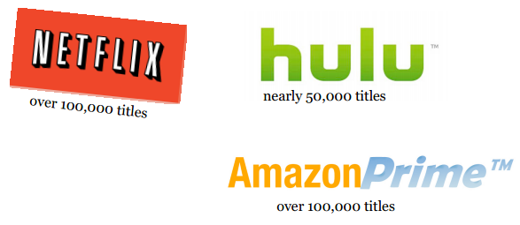

想买一台笔记本电脑？在亚马逊可以搜索到3811条结果。

搜索电饭煲则可以得到1000条结果。

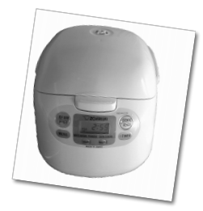

相信在不久的将来会有更多的商品可供选择——上十亿的在线音乐，各种各样的视频节目，以及能够用3D打印机定制的产品。

### 寻找相关产品

现在的问题在于——如何寻找相关的产品。在那1100万首iTunes曲目中，肯定有一部分音乐是我特别喜爱的，我该如何找到它们？我想在Netflix上观看一段视频，应该看什么呢？我想用P2P下载一部电影，哪部比较好呢？而且问题会越来越严重——每分钟都有数以万记的媒体数据被发布到互联网上；共享群组里每分钟都会新增100个文件；YouTube上每分钟都会有24个小时时长的新视频被上传；每小时会有180本新书发布。每天都有新的东西可以购买，要想找到自己感兴趣的产品变得越来越难。

如果你是一位音乐人——比如马来西亚的季小薇——真正的威胁并不来自于你的专辑被他人非法下载，而是大众根本找不到你的专辑。

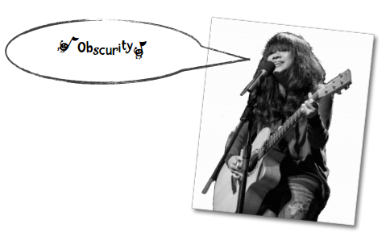

### 那要如何寻找商品呢？

很久以前，在那个小镇里，**朋友** 会帮助我们寻找商品——那块布料很适合我；那本新书我很喜欢；那台迷你留声机很棒。即便在今天，我们也非常看重朋友的推荐。

我们还会请 **专家** 帮助我们寻找商品。过去，消费者周刊能够对所有的洗衣机（20种）和电饭煲（10种）做出评测，并进行推荐；但如今，亚马逊上有上百种电饭煲，不是一个专家就能评测完全的。过去，影评家艾伯特几乎能够对所有的电影进行评判；但如今，每年都有两万五千部电影在世界各地上映。此外，我们还能通过各种途径获取到视频节目。艾伯特也好，其他影评家也罢，是不可能对所有的电影做出评价的。

此外，我们还会通过 **商品本身** 来寻找。比如，我有一台用了三十年的希尔士洗衣机，所以我会再去购买一台同品牌的洗衣机；我喜欢披头士的一张专辑，所以会认为他们的另一张专辑也很有吸引力。

**这些寻找商品的方式可以沿用至今，但是我们需要用电算化的手段让这些方法能够适用于21世纪的商品数量。** 本书将会探索这些方法，将人们的喜恶收集起来，分析他们的购买历史，发掘社会网络（朋友）的数据价值，从而帮助我们找到相关的商品。比方说，我喜欢Phoenix乐队，那系统会使用这个乐队的一些特点——重金属、朋克、和声——来推荐其他的乐队给我，如The Strokes乐队。

### 不仅仅是寻找商品

数据挖掘不仅仅是用来推荐商品，或是单单给商人增加销量的。看看下面的示例。

回到一百年前的那个小镇，镇长在竞选演讲上可以针对每个选民来给出承诺：玛莎，我知道你对教育事业非常在意，我会尽一切努力去招募另一名教师到我们小镇来；约翰，你的面包房经营得如何？我会在你的商店周围建造更多的停车场的。

我父亲是联合汽车工会的成员。在选举期间，工会的代表曾来到我家，游说我父亲要投票给谁：

> 赛尔，你好。你的家人和孩子都好吧？……现在让我来告诉你为什么要投票给赛德勒，让这位社会学家当选市长。

赛德勒是1968至1960年密尔沃基市的市长。

随着电视的普及，这类个性化的推广信息逐渐转变为广告形式，每个人得到的信息都是一样的，其中一个著名的示例是为支持约翰逊竞选的黛西广告（一个小女孩在雏菊花田里骑着单车，此时一枚核弹从天而降）。现在，随着得票率相差得越来越小，以及数据挖掘技术的应用推广，个性化的竞选广告又回来了。比如你对女权主义很在意，也许就会接听到一个关于这方面信息的语音电话。

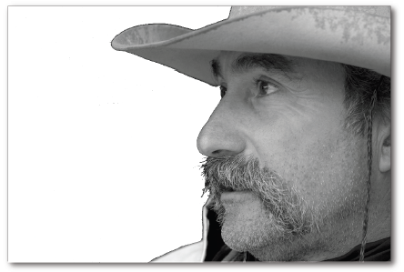

那个小镇的警官非常清楚谁是制造麻烦的人。而如今，各类威胁是隐秘起来的，恐怖主义随处可能发生。2001年10月11日，政府通过了《美国爱国者法案》（USA Patriot Act，意为提供合适的工具来截获恐怖主义的相关信息，从而保护美国公民）。这项法案的条款之一是调查者能够通过各种渠道来获得信息，比如图书馆借阅记录、旅馆出入记录、信用卡信息、公路收费站记录等等。美国政府通过和某些私营企业合作，收集我们的各项信息。比如赛新公司持有几乎所有人的记录，我们的照片、住址、座驾、收入、消费习惯、朋友等。赛新拥有的超级计算机系统能够通过数据挖掘来预测人们的行为。他们的产品有一个响亮的名字：

**矩阵**

### 数据挖掘扩展了我们的能力

贝克在他的作品《数学奇才》中写道：

> 想象你正在一家咖啡馆，可能十分嘈杂。一位年轻的女士坐在你的右侧，正在操作笔记本电脑。你转过头去，看着她的屏幕。她正在上网。你开始观察。

> 几个小时过去了，她先是阅读了一篇在线论文，然后读了三篇关于中国的文章；她浏览了周五晚上会上映的电影，还看了一篇功夫熊猫的影评；她点击了一个广告，说是能帮助用户找到自己的老同学。你在那里看着她操作，并记录下来。每过一分钟，你对她的了解就多一分。好，现在想象一下你可以同时看着1500万人的电脑屏幕，记录他们的操作。

数据挖掘的重点在于找到数据中的模式。对于少量的数据，我们非常擅长在大脑中构建模型，搜寻模式。比如，今晚我想和妻子看一部电影，我很清楚她喜欢什么类型的电影。我知道她不喜欢含有暴力元素的电影（这就是她不喜欢第九区的原因），她喜欢卡夫曼的电影。我可以利用这些信息来预测她会对什么电影感兴趣。

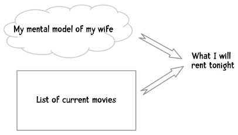

一位欧洲的朋友远道而来，我知道她是一位素食主义者，所以我能猜到她一定不会喜欢我们当地的烤肋排。人们非常善于利用已有信息来进行预测。数据挖掘则扩展了我们的能力，让我们能够处理海量的数据，比如我上文提到的1500万人的示例。数据挖掘能让潘多拉音乐站提供个性化的音乐列表；它能让Netflix将你最感兴趣的视频推荐给你。

### 海量数据挖掘不是星际争霸II才有的东西

20世纪末，百万单词的数据已经是很大的量了。我于1990年代毕业（没错，我已经很老了），有一年我作为程序员在研究新约圣经，虽然只有20万字，但仍无法完整地放入主机内存，所以只能将计算结果不断地写入磁带中，而磁带的装卸是需要经过批准的。

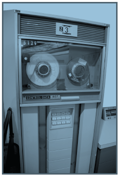

这次的研究成果汇集成了一本书，名为[《Analytical Greek New Testament》](http://www.amazon.com/Analytical-Testament-Including-Analysis-Library/dp/0801034965) ，由T.福利伯格和B.福利伯格编写。我是当时的三名程序员之一，在明尼苏达大学完成的研究。

如今，在TB级别的数据量上做挖掘已经很常见了。谷歌有超过5PB的页面数据（即5000TB）。2006年，谷歌向研究者社区开放了一万亿单词量的数据集。美国国家安全局有着上万亿的电话录音数据。Acxiom，这家做数据采集的公司（信用卡消费记录、电话通信记录、医疗记录、车辆登记等），有着全美两亿成年人的信息，共计超过1PB的数据。

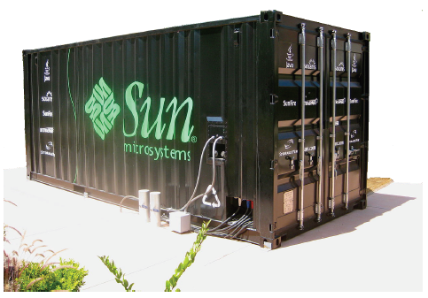

图为包含了1PB数据的服务器集装箱。

《无处可藏》的作者欧哈罗曾试图帮助我们理解1PB的数据是什么样的概念，说这些数据相当于5万公里的钦定版圣经的长度。我经常往返于新墨西哥州和弗吉尼亚州，两地相距两万公里，于是我便可以想象一路上看到的全是这些书籍，数据量可见之大。

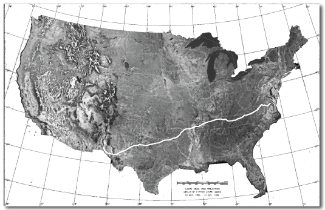

美国国会图书馆有大学20TB的文字，你可以将这些文字全部放入仅需几千美金的硬盘中。相对地，沃尔玛则有超过570TB的数据。这些数据不只是存放在那儿，而是不断有人对其进行挖掘，找到新的关联、新的模式。这就是海量数据挖掘！

本书中我们只会处理很小量的数据，这是好事，因为我们不希望自己的代码运行了一整周后发现其中有一个逻辑错误。我们会处理的最大数据量也在百兆以下，最小的数据集则只有几十行。

## 本书的结构

这本书按照边学边做的原则编写。与其被动地接受书中的内容，我建议读者使用书中提供的Python代码来进行实践。尝试各种算法，做一些修改，使用不同的数据集查看效果，从而真正地掌握这些知识和技术。

我会尝试在简单易懂的Python代码和其背后的算法逻辑之间找到平衡点。为了避免读者们为各种理论、数学公式、以及Python代码绞尽脑汁，我会增加图表和插画来做调剂。

谷歌研究院总监诺维格曾在他的Udacity课程《计算机程序设计》中写道：

> 我会向你展示和讨论我的解决方案。但需要注意的是，解决问题的方案不止一个。并不是说我的方案是 *唯一的* 或 *最好的* 。我的方案不过是帮助你学习编程的一种风格和技术。如果你用另一种方式解决了问题，那会非常好。

> 所有的学习过程都是在你的头脑中发生的，而不是我的。所以你需要非常了解你的代码和我的代码之间的关系——你需要自己编写出答案，然后从我的代码中挑选出有用的部分来学习和借鉴。

**我非常赞同这个观点**

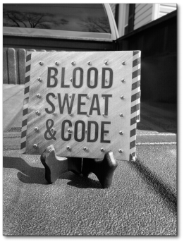

图文：用血和汗水来编程！

这本书并不是一本完整论述数据挖掘技术的教科书。市面上有一些这样的教科书，如由谭恩、
斯坦巴克、以及库马合著的[《数据挖掘导论》](http://www.amazon.com/Introduction-Data-Mining-Pang-Ning-Tan/dp/0321321367/)，就很全面地讲解了数据挖掘的各种理论，及其背后的数学知识。而你正在阅读的这本书，只是帮助你快速了解数据挖掘的基础理论，并进行实践。读完本书后，你可以再找一本完整的教科书来填补空白。

这本书另一个比较实用的地方是它所提供的Python代码和数据集。我认为这可以帮助读者更快速地掌握数据挖掘的核心思想，而又不会陷得太深，事倍功半。

### 读完本书后你将能够做些什么事？

读完本书后，你将有能力使用Python或其它编程语言，为一个网站设计和实现一套推荐系统。例如，你在亚马逊上浏览一件商品，或者在潘多拉上聆听一首音乐，你可得到一组相关产品的列表（也就是“猜你喜欢”）。你会学到如何开发出这样一套系统。此外，这部分书提到的相关术语可以让你能够顺畅地与数据挖掘团队作沟通。

作为目标的一部分，本书还将为你揭开推荐系统的神秘面纱，包括那些恐怖分子识别系统及其他数据挖掘系统，至少你将知道这些系统是怎么运作的。

**为什么这点很重要？**

为什么你需要花时间来阅读本书呢？在本章的开始，我给出了很多示例来说明数据挖掘的重要性。那段文字可以转述如下：市场上有很多商品（电影、音乐、书籍、烹饪器具），而且数量在不断增加，随之而来的问题便是如何在这么多商品中找到我们最感兴趣的——那么多电影我该看哪部？我接下来应该读哪本书？数据挖掘就是用来解决这类问题的。大多数网站都会提供查找商品的功能，除了上面提到的商品，你还会考虑该关注哪位好友；是否能够有一份报纸只刊登你感兴趣的文章？如果你是一名Web开发者，就非常需要了解数据挖掘方面的知识了。

好，现在你应该了解为什么要花时间来学习数据挖掘了，但为何要选择这本书呢？市面上有些书籍是非技术类的，描述了数据挖掘的大致情况。这些书可以快速翻阅，十分有趣，而且不贵，很适合深夜阅读（因为没有繁杂的技术细节）。这类书籍的最佳代表是贝克的《数学奇才》，我非常推荐这本书。在我往来弗吉尼亚和新墨西哥时就听的是这本书的语音版。另一个极端则是数据挖掘教学中使用的教科书。这些书籍涵盖面广，将数据挖掘的理论和实践讲解得非常透彻，所以我也推荐阅读这类书籍。至于这本书，则是用来填补这两者之间的空白的。本书的目标读者是那些喜欢编程的骇客们。

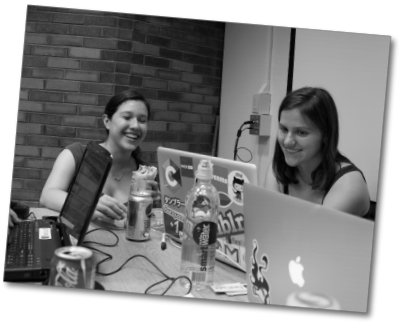

*这本书应该在电脑前阅读，这样读者就可以立刻编写代码参与其中。*

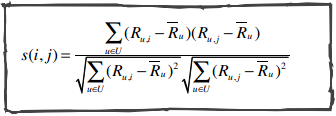

*天呐，这是什么？这本书会包含一些数学公式，不过我会用一种简明的方式表述，相信普通的程序员都能了解，即便你已经忘记了大学中学习数学知识。*

如果以上这些都不能说服你，那还有一点：这本书是免费的，你可以随意分享它。

### 标题中的“数学奇才的古老艺术”有什么含义？

2010年6月，我曾尝试给这本书起一个合适的标题。我喜欢有趣的标题，但很可惜我不太擅长起名字。近期，我发表了篇关于数据挖掘的论文，名为《扎入文字堆：阿拉伯文字的地域化分类》。我喜欢这个标题，不过我得承认这是我的太太帮我取的。我曾和马克肖恩合著了一篇论文，名为《情绪与模式：从理论到争辩》，这个标题也是我的搭档取的。总之，六月时我取的那些标题很难一眼看出这本书讲的是什么，所以我最后用了《面向程序员的数据挖掘指南》作为标题的一部分，因为这个标题和本书的内容非常契合——这本书是提供给正在从事编程工作的人员阅读的。也许你会疑惑子标题究竟是什么意思：

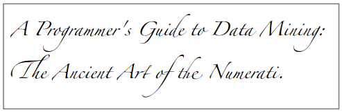

数学奇才（Numerati）是贝克自己创造的一个词语。如今，我们每个人无时无刻不在创造着新的数据，信用卡购物记录、推特、格瓦拉上的博客、Foursquare上的签到、手机通话记录、电子邮件、文字短信等。

当你一早醒来，“矩阵”就知道你会乘坐雾谷站7:10的地铁，并于7:32在西站下车；矩阵知道7:45分你会去第五大街的星巴克买上一杯大杯拿铁和一份蓝莓饼；8:05分，你用格瓦拉在上班地点签到；9:35分，你在亚马逊上购买了一套瘦身教程DVD和一副门上单杠；你在Golden Falafel吃的午餐。

贝克在书中这样写道：

> 只有那些数学家、计算机科学家、以及工程师们才能从这些庞大的数据集中获得有用的信息。这些数学奇才会从这些数据中了解到什么？首先，他们能够准确地定位到我们。比如你是纽约北部市郊的一个潜在的SUV客户，或是一个经常去教堂做礼拜的人，或是阿尔伯克基市的一名反堕胎的民主党人士；也许你是一个即将被调任到海得拉巴市的一名Java工程师，或是一个热爱爵士乐的人；你是射手座的，喜欢喝勤地酒，想在乡野间漫步，最后在斯德哥尔摩的篝火旁酣睡；更夸张的，也许你腰绑炸弹，正乘上一部公交车。无论你是谁，处在茫茫人海中，那些公司或政府机构都能掌握你的行踪。

你可能猜到了，起这个标题是因为我喜欢贝克的这段描述。

