## 你喜欢的东西我也喜欢

我们将从推荐系统开始，开启数据挖掘之旅。推荐系统无处不在，如亚马逊网站的“看过这件商品的顾客还购买过”板块：

last.fm上对音乐和演唱会的推荐（相似歌手）：

在亚马逊的例子里，它用了两个元素来进行推荐：一是我浏览了里维斯翻译的《法华经》一书；二是其他浏览过该书的顾客还浏览过的译作。

本章我们讲述的推荐方法称为协同过滤。顾名思义，这个方法是利用他人的喜好来进行推荐，也就是说，是大家一起产生的推荐。

他的工作原理是这样的：如果要推荐一本书给你，我会在网站上查找一个和你类似的用户，然后将他喜欢的书籍推荐给你——比如巴奇加卢比的《发条女孩》。

### 如何找到相似的用户？

所以首先要做的工作是找到相似的用户。这里用最简单的二维模型来描述。

假设用户会在网站用五颗星来评价一本书——没有星表示书写得很糟，五颗星表示很好。因为我们用的是二维模型，所以仅对两本书进行评价：史蒂芬森的《雪崩》（纵轴）和拉尔森的《龙纹身的女孩》（横轴）。

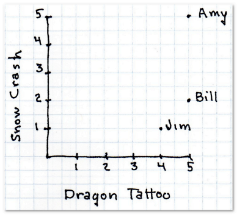

首先，下表显示有三位用户对这两本书做了评价：

现在我想为神秘的X先生推荐一本书，他给《雪崩》打了四星，《龙纹身的女孩》两星。第一个任务是找出哪个用户和他最为相似。我们用距离来表示。

### 曼哈顿距离

最简单的距离计算方式是曼哈顿距离。在二维模型中，每个人都可以用(x, y)的点来表示，这里我用下标来表示不同的人，(x1, y1)表示艾米，(x2, y2)表示那位神秘的X先生，那么他们之间的曼哈顿距离就是：

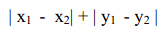

也就是x之差的绝对值加上y之差的绝对值，这样他们的距离就是4。

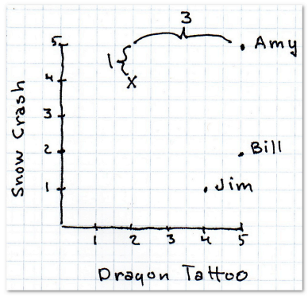

完整的计算结果如下：

艾米的距离最近，在她的浏览历史中可以看到她曾给巴奇加卢比的《发条女孩》打过五星，于是我们就可以把这本书推荐给X先生。

### 欧几里得距离

曼哈顿距离的优点之一是计算速度快，对于Facebook这样需要计算百万用户之间的相似度时就非常有利。

**勾股定理**

也许你还隐约记得勾股定理。另一种计算距离的方式就是看两点之间的直线距离：

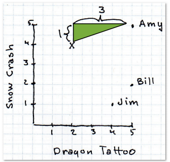

利用勾股定理，我们可以如下计算距离：

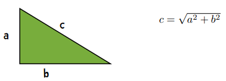

这条斜线就是欧几里得距离，公式是：

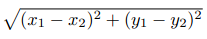

回顾一下，这里的x1表示用户1喜欢《龙纹身》的程度，x2是用户2喜欢这本书的程度；y1则是用户1喜欢《雪崩》的程度，y2是用户2喜欢这本书的程度。

艾米给《龙纹身》和《雪崩》都打了五颗星，神秘的X先生分别打了两星和四星，这样他们之间的欧几里得距离就是：

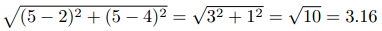

以下是全部用户的计算结果：

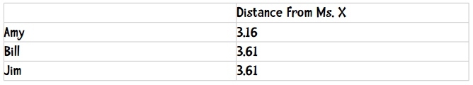

### N维模型

刚才我们仅仅对两本书进行评价（二维模型），下面让我们扩展一下，尝试更复杂的模型。

假设我们现在要为一个在线音乐网站的用户推荐乐队。用户可以用1至5星来评价一个乐队，其中包含半星（如2.5星）。下表展示了8位用户对8支乐队的评价：

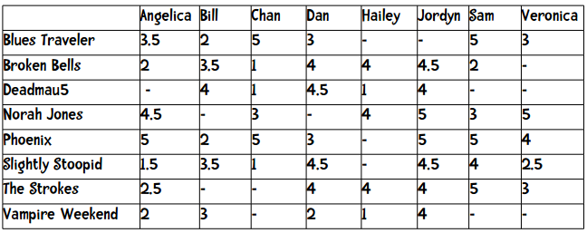

表中的短横表示这位用户没有给这支乐队打分。我们在计算两个用户的距离时，只采用他们都评价过的乐队，比如要计算Angelica和Bill的距离，我们只会用到5支乐队。这两个用户的曼哈顿距离为：

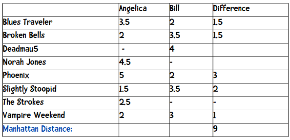

最后距离即是上方数据的加和：(1.5 + 1.5 + 3 + 2 + 1)。

计算欧几里得距离的方法也是类似的，我们也只取双方都评价过的乐队。

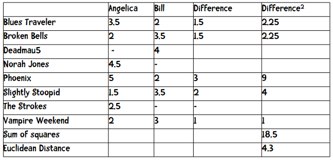

用公式来描述即：

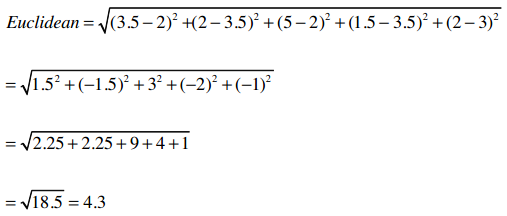

**掌握了吗？** 那就试试计算其他几个用户之间的距离吧。

**有个瑕疵**

当我们计算Hailey和Veronica的距离时会发现一个问题：他们共同评价的乐队只有两支（Norah Jones和The Strokes），而Hailey和Jordyn共同评价了五支乐队，这似乎会影响我们的计算结果，因为Hailey和Veronica之间是二维的，而Haily和Veronica之间是五维的。

曼哈顿距离和欧几里得距离在数据完整的情况下效果最好。如何处理缺失数据，这在研究领域仍是一个活跃的话题。本书的后续内容会进行一些讨论，这里先不展开。现在，让我们开始构建一个推荐系统吧。

### 推广：闵可夫斯基距离

我们可以将曼哈顿距离和欧几里得距离归纳成一个公式，这个公式称为闵可夫斯基距离：

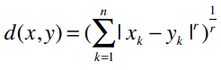

其中：

* `r = 1` 该公式即曼哈顿距离
* `r = 2` 该公式即欧几里得距离
* `r = ∞` 极大距离

当你在书中看到这些数学公式，你可以选择快速略过它，继续读下面的文字，过去我就是这样；你也可以停下来，好好分析一下这些公式，会发现其实它们并不难理解。

比如上面的公式，当r = 1时，可以简化成如下形式：

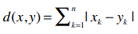

仍用上文的音乐站点为例，x和y分别表示两个用户，d(x, y)表示他们之间的距离，n表示他们共同评价过的乐队数量，我们之前已经做过计算：

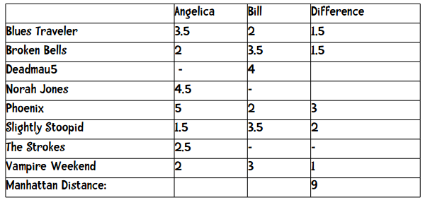

其中Difference一栏表示两者评分之差的绝对值，加起来等于9，也就是他们之间的距离。

当r = 2时，我们得到欧几里得距离的计算公式：

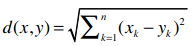

**提前预告一下：r值越大，单个维度的差值大小会对整体距离有更大的影响。**

