## 最后一个公式：余弦相似度

这里我将奉上最后一个公式：余弦相似度。它在文本挖掘中应用得较多，在协同过滤中也会使用到。为了演示如何使用该公式，我们换一个示例。这里记录了每个用户播放歌曲的次数，我们用这些数据进行推荐：

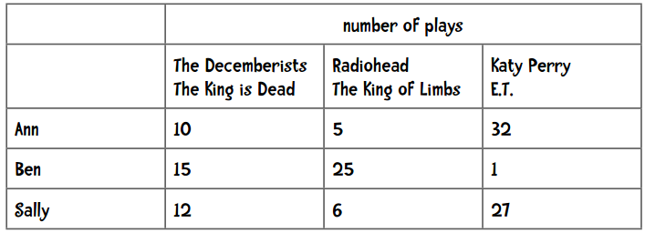

简单扫一眼上面的数据（或者用之前讲过的距离计算公式），我们可以发现Ann的偏好和Sally更为相似。

**问题在哪儿？**

我在iTunes上有大约4000首歌曲，下面是我最常听的音乐：

可以看到，Moonlight Sonata这首歌我播放了25次，但很有可能你一次都没有听过。事实上，上面列出的这些歌曲可能你一首都没听过。此外，iTunes上有1500万首音乐，而我只听过4000首。所以说单个用户的数据是 *稀疏* 的，因为非零值较总体要少得多。当我们用1500万首歌曲来比较两个用户时，很有可能他们之间没有任何交集，这样一来就无从计算他们之间的距离了。

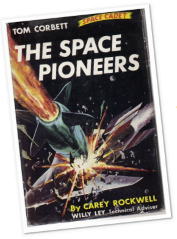

类似的情况是在计算两篇文章的相似度时。比如说我们想找一本和《The Space Pioneers》相类似的书，方法之一是利用单词出现的频率，即统计每个单词在书中出现的次数占全书单词的比例，如“the”出现频率为6.13%，“Tom” 0.89%，“space” 0.25%。我们可以用这些数据来寻找一本相近的书。但是，这里同样有数据的稀疏性问题。《The Space Pioneers》中有6629个不同的单词，但英语语言中有超过100万个单词，这样一来非零值就很稀少了，也就不能计算两本书之间的距离。

余弦相似度的计算中会略过这些非零值。它的计算公式是：

其中，“·”号表示数量积。“||x||”表示向量x的模，计算公式是：

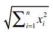

我们用上文中“偏好完全一致”的示例：

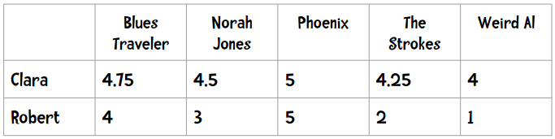

所以两个向量为：

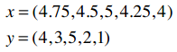

它们的模是：

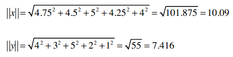

数量积的计算：

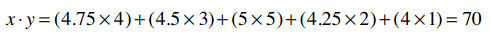

因此余弦相似度是：

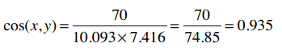

余弦相似度的范围从1到-1，1表示完全匹配，-1表示完全相悖。所以0.935表示匹配度很高。

**作业：尝试计算Angelica和Veronica的余弦相似度**

### 应该使用哪种相似度？

我们整本书都会探索这个问题，以下是一些提示：

* 如果数据存在“分数膨胀”问题，就使用皮尔逊相关系数。
* 如果数据比较“密集”，变量之间基本都存在公有值，且这些距离数据是非常重要的，那就使用欧几里得或曼哈顿距离。
* 如果数据是稀疏的，则使用余弦相似度。

所以，如果数据是密集的，曼哈顿距离和欧几里得距离都是适用的。那么稀疏的数据可以使用吗？我们来看一个也和音乐有关的示例：假设有三个人，每人都给100首音乐评过分。

* Jake（左）：乡村音乐的忠实听众。
* Linda和Eric（右）：我们爱六十年代的摇滚乐！

Linda和Eric喜欢相同的音乐，他们的评分列表中有20首相同的的歌曲，且评分均值相差不到0.5！所以他们之间的曼哈顿距离为20 x 0.5 = 10，欧几里得距离则为：

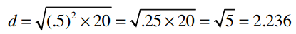

Linda和Jake只共同评分了一首歌曲：Chris Cagle的 *What a Beautiful Day* 。Linda打了3分，Jake打了5分，所以他们之间的曼哈顿距离为2，欧几里得距离为：

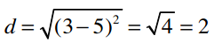

所以不管是曼哈顿距离还是欧几里得距离，Jake都要比Eric离Linda近，这不符合实际情况。

> 嘿，我想到一个办法。人们给音乐打分是从1到5分，那些没有打分的音乐就统一给0分好了，这样就能解决数据稀疏的问题了！

想法不错，但是这样做也不行。为了解释这一问题，我们再引入两个人到例子里来：Cooper和Kelsey。他们和Jake都有着非常相似的音乐偏好，其中Jake在我们网站上评价了25首歌曲。

Cooper评价了26首歌曲，其中25首和Jake是一样的。他们对每首歌曲的评价差值只有0.25！

Kelsey在我们网站上评价了150首歌曲，其中25首和Jake相同。和Cooper一样，她和Jake之间的评价差值也只有0.25！

所以我们从直觉上看Cooper和Keylsey离Jake的距离应该相似。但是，当我们计算他们之间的曼哈顿距离和欧几里得距离时（代入0值），会发现Cooper要比Keylsey离Jake近得多。

**为什么呢？**

我们来看下面的数据：

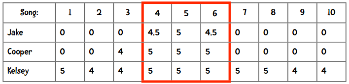

从4、5、6这三首歌来看，两人离Jake的距离是相同的，但计算出的曼哈顿距离却不这么显示：

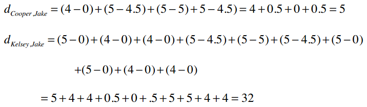

问题就在于数据中的0值对结果的影响很大，所以用0代替空值的方法并不比原来的方程好。还有一种变通的方式是计算“平均值”——将两人共同评价过的歌曲分数除以歌曲数量。

总之，曼哈顿距离和欧几里得距离在数据完整的情况下会运作得非常好，如果数据比较稀疏，则要考虑使用余弦距离。

### 古怪的现象

假设我们要为Amy推荐乐队，她喜欢Phoenix、Passion Pit、以及Vampire Weekend。和她最相似的用户是Bob，他也喜欢这三支乐队。他的父亲为Walter Ostanek乐队演奏手风琴，所以受此影响，他给了这支乐队5星评价。按照我们现在的推荐逻辑，我们会将这支乐队推荐给Amy，但有可能她并不喜欢。

或者试想一下，Billy Bob Olivera教授喜欢阅读数据挖掘方面的书籍以及科幻小说，他最邻近的用户是我，因为我也喜欢这两种书。然而，我又是一个贵宾犬的爱好者，所以给《贵宾犬的隐秘生活》这本书打了很高的分。这样一来，现有的推荐方法会将这本书介绍给Olivera教授。

问题就在于我们只依靠最相似的 **一个** 用户来做推荐，如果这个用户有些特殊的偏好，就会直接反映在推荐内容里。解决方法之一是找寻多个相似的用户，这里就要用到K最邻近算法了。

### K最邻近算法

在协同过滤中可以使用K最邻近算法来找出K个最相似的用户，以此作为推荐的基础。不同的应用有不同的K值，需要做一些实验来得出。以下给到读者一个基本的思路。

假设我要为Ann做推荐，并令K=3。使用皮尔逊相关系数得到的结果是：

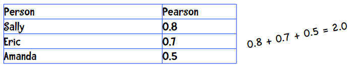

这三个人都会对推荐结果有所贡献，问题在于我们如何确定他们的比重呢？我们直接用相关系数的比重来描述，Sally的比重是0.8/2=40%，Eric是0.7/2=35%，Amanda则是25%：

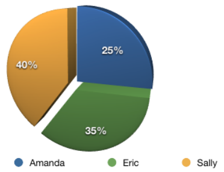

假设他们三人对Grey Wardens的评分以及加权后的结果如下：

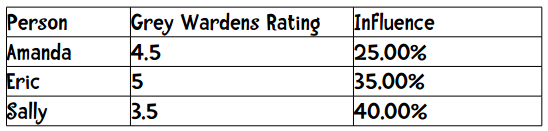

最后计算得到的分数为：

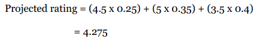

