第四章：分类
============

原文：http://guidetodatamining.com/chapter-4

在上几章中我们使用用户对物品的评价来进行推荐，这一章我们将使用物品本身的特征来进行推荐。这也是潘多拉音乐站所使用的方法。

内容：

* 潘多拉推荐系统简介
* 特征值选择的重要性
* 示例：音乐特征值和邻域算法
* 数据标准化
* 修正的标准分数
* Python代码：音乐，特征，以及简单的邻域算法实现
* 一个和体育相关的示例
* 特征值抽取方式一览

## 根据物品特征进行分类

前几章我们讨论了如何使用协同过滤来进行推荐，由于使用的是用户产生的各种数据，因此又称为社会化过滤算法。比如你购买了Phoenix专辑，我们网站上其他购买过这张专辑的用户还会去购买Vampire的专辑，因此会把它推荐给你；我在Netflix上观看了Doctor Who，网站会向我推荐Quantum Leap，用的是同样的原理。我们同时也讨论了协同过滤会遇到的种种问题，包括数据的稀疏性和算法的可扩展性。此外，协同过滤算法倾向于推荐那些已经很流行的物品。试想一个极端的例子：一个新乐队发布了专辑，这张专辑还没有被任何用户评价或购买过，那它将永远不会出现在推荐列表中。

> **这类推荐系统会让流行的物品更为流行，冷门的物品更无人问津。**

> -- Daniel Fleder & Kartik Hosanagar 2009 《推荐系统对商品分类的影响》

这一章我们来看另一种推荐方法。以潘多拉音乐站举例，在这个站点上你可以设立各种音乐频道，只需为这个频道添加一个歌手，潘多拉就会播放和这个歌手风格相类似的歌曲。比如我添加了Phoenix乐队，潘多拉便会播放El Ten Eleven的歌曲。它并没有使用协同过滤，而是通过计算得到这两个歌手的音乐风格是相似的。其实在播放界面上可以看到推荐理由：


“根据你目前告知的信息，我们播放的这首歌曲有着相似的旋律，使用了声响和电音的组合，即兴的吉他伴奏。”在我的Hiromi音乐站上，潘多拉会播放E.S.T.的歌曲，因为“它有着古典爵士乐风，一段高水准的钢琴独奏，轻盈的打击乐，以及有趣的歌曲结构。”


潘多拉网站的推荐系统是基于一个名为音乐基因的项目。他们雇佣了专业的音乐家对歌曲进行分类（提取它们的“基因”）。这些音乐家会接受超过150小时的训练，之后便可用20到30分钟的时间来分析一首歌曲。这些乐曲特征是很专业的：

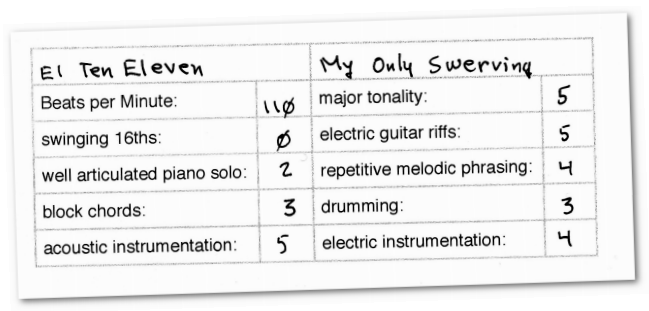

这些专家要甄别400多种特征，平均每个月会有15000首新歌曲，因此这是一项非常消耗人力的工程。

> 注意：潘多拉的音乐基因项目是商业机密，我不曾了解它的任何信息。下文讲述的是如何构造一个类似的系统。

### 特征值选取的重要性

假设潘多拉会用曲风和情绪作为歌曲特征，分值如下：

* 曲风：乡村1分，爵士2分，摇滚3分，圣歌4分，饶舌5分
* 情绪：悲伤的1分，欢快的2分，热情的3分，愤怒的4分，不确定的5分

比如James Blunt的那首You're Beautiful是悲伤的摇滚乐，用图表来展示它的位置便是：

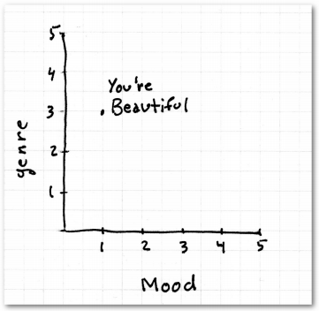

比如一个叫Tex的用户喜欢You're Beautiful这首歌，我们想要为他推荐歌曲。

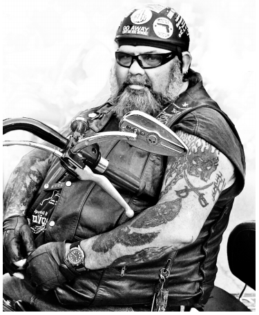

我们的歌曲库中有另外三首歌：歌曲1是悲伤的爵士乐；歌曲2是愤怒的圣歌；歌曲3是愤怒的摇滚乐。你会推荐哪一首？

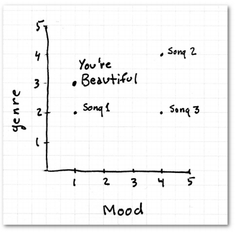

图中歌曲1看起来是最相近的。也许你已经看出了这种算法中的不足，因为不管用何种计算距离的公式，爵士乐和摇滚乐是相近的，悲伤的乐曲和快乐的乐曲是相近的等等。即使调整了分值的分配，也不能解决问题。这就是没有选取好特征值的例子。不过解决的方法也很简单，我们将每种歌曲类型拆分成单独的特征，并对此进行打分：

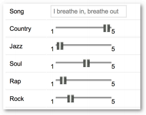

“乡村音乐”一栏的1分表示完全不是这个乐曲风格，5分则表示很相符。这样一来，评分值就显得有意义了。如果一首歌的“乡村音乐”特征是4分，另一首是5分，那我们可以认为它们是相似的歌曲。

其实这就是潘多拉所使用的特征抽取方法。每个特征都是1到5分的尺度，0.5分为一档。特征会被分到不同的大类中。通过这种方式，潘多拉将每首歌曲都抽象成一个包含400个数值元素的向量，并结合我们之前学过的距离计算公式进行推荐。

### 一个简单的示例

我们先来构建一个数据集，我选取了以下这些特征（可能比较随意），使用5分制来评分（0.5分一档）：

* 使用钢琴的程度（Piano）：1分表示没有使用钢琴，5分表示整首歌曲由钢琴曲贯穿；
* 使用美声的程度（Vocals）：标准同上
* 节奏（Driving beat）：整首歌曲是否有强烈的节奏感
* 蓝调（Blues infl.）
* 电音吉他（Dirty elec. Guitar）
* 幕后和声（Backup vocals）
* 饶舌（Rap infl.）

使用以上标准对一些歌曲进行评分：

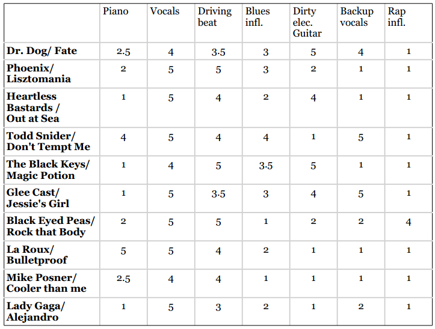

然后我们便可以使用距离计算公式了，比如要计算Dr. Dog的Fate歌曲和Phoenix的Lisztomania之间的曼哈顿距离：

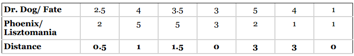

相加得到两首歌曲的曼哈顿距离为9。

### 使用Python实现推荐逻辑

回忆一下，我们在协同过滤中使用的用户评价数据是这样的：

```python
users = {"Angelica": {"Blues Traveler": 3.5, "Broken Bells": 2.0, "Norah Jones": 4.5, "Phoenix": 5.0, "Slightly Stoopid": 1.5, "The Strokes": 2.5, "Vampire Weekend": 2.0},
         "Bill":{"Blues Traveler": 2.0, "Broken Bells": 3.5, "Deadmau5": 4.0, "Phoenix": 2.0, "Slightly Stoopid": 3.5, "Vampire Weekend": 3.0}}
```

我们将上文中的歌曲特征数据也用类似的格式储存起来：

```python
music = {"Dr Dog/Fate": {"piano": 2.5, "vocals": 4, "beat": 3.5, "blues": 3, "guitar": 5, "backup vocals": 4, "rap": 1},
         "Phoenix/Lisztomania": {"piano": 2, "vocals": 5, "beat": 5, "blues": 3, "guitar": 2, "backup vocals": 1, "rap": 1},
         "Heartless Bastards/Out at Sea": {"piano": 1, "vocals": 5, "beat": 4, "blues": 2, "guitar": 4, "backup vocals": 1, "rap": 1},
         "Todd Snider/Don't Tempt Me": {"piano": 4, "vocals": 5, "beat": 4, "blues": 4, "guitar": 1, "backup vocals": 5, "rap": 1},
         "The Black Keys/Magic Potion": {"piano": 1, "vocals": 4, "beat": 5, "blues": 3.5, "guitar": 5, "backup vocals": 1, "rap": 1},
         "Glee Cast/Jessie's Girl": {"piano": 1, "vocals": 5, "beat": 3.5, "blues": 3, "guitar":4, "backup vocals": 5, "rap": 1},
         "La Roux/Bulletproof": {"piano": 5, "vocals": 5, "beat": 4, "blues": 2, "guitar": 1, "backup vocals": 1, "rap": 1},
         "Mike Posner": {"piano": 2.5, "vocals": 4, "beat": 4, "blues": 1, "guitar": 1, "backup vocals": 1, "rap": 1},
         "Black Eyed Peas/Rock That Body": {"piano": 2, "vocals": 5, "beat": 5, "blues": 1, "guitar": 2, "backup vocals": 2, "rap": 4},
         "Lady Gaga/Alejandro": {"piano": 1, "vocals": 5, "beat": 3, "blues": 2, "guitar": 1, "backup vocals": 2, "rap": 1}}
```

假设我有一个朋友喜欢Black Keys Magic Potion，我便可根据曼哈顿距离来进行推荐：

```python
>>> computeNearestNeighbor('The Black Keys/Magic Potion', music)
[(4.5, 'Heartless Bastards/Out at Sea'), (5.5, 'Phoenix/Lisztomania'), (6.5, 'Dr Dog/Fate'), (8.0, "Glee Cast/Jessie's Girl"), (9.0, 'Mike Posner'), (9.5, 'Lady Gaga/Alejandro'), (11.5, 'Black Eyed Peas/Rock That Body'), (11.5, 'La Roux/Bulletproof'), (13.5, "Todd Snider/Don't Tempt Me")]
```

这里我推荐的是Heartless Bastard的Out as Sea，还是很合乎逻辑的。当然，由于我们的数据集比较小，特征和歌曲都不够丰富，因此有些推荐结果并不太好。

这段代码可以[点此浏览](code/chapter-4/filteringdata.py)。

### 如何显示“推荐理由”？

潘多拉在推荐歌曲时会显示推荐理由，我们也可以做到这一点。比如在上面的例子中，我们可以将Magic Potion和Out at Sea的音乐特征做一个比较，找出高度相符的点：

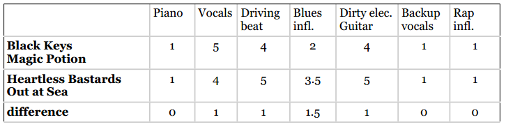

可以看到，两首歌曲最相似的地方是钢琴、和声、以及饶舌，这些特征的差异都是0。但是，这些特征的评分都很低，我们不能告诉用户“因为这首歌曲没有钢琴伴奏，所以我们推荐给你”。因此，我们需要使用那些相似的且评分较高的特征。


**我们推荐歌曲是因为它有着强烈的节奏感，美声片段，以及电音吉他的演奏。**

### 评分标准的问题

假如我想增加一种音乐特征——每分钟的鼓点数（bpm），用来判断这是一首快歌还是慢歌。以下是扩充后的数据集：

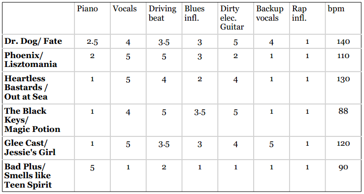

没有bpm时，Magic Potion和Out at Sea距离最近，和Smells Like Teen Spirit距离最远。但引入bpm后，我们的结果就乱套了，因为bpm基本上就决定了两首歌的距离。现在Bad Plus和The Black Keys距离最近就是因为bpm数据相近。

再举个有趣的例子。在婚恋网站上，我通过用户的年龄和收入来进行匹配：

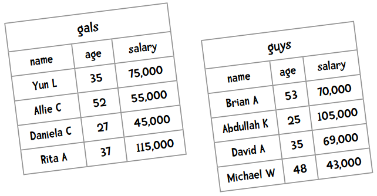

这样一来，年龄的最大差异是28，而薪资的最大差异则是72,000。因为差距悬殊，薪水的高低基本决定了匹配程度。如果单单目测，我们会将David推荐给Yun，因为他们年龄相近，工资也差不多。但如果使用距离计算公式，那么53岁的Brian就会被匹配给Yun，这就不太妙了。


**事实上，评分标准不一是所有推荐系统的大敌！**

### 标准化

**不用担心，我们可以使用标准化。**


要让数据变得可用我们可以对其进行标准化，最常用的方法是将所有数据都转化为0到1之间的值。

拿上面的薪酬数据举例，最大值115,000和最小值43,000相差72,000，要让所有值落到0到1之间，可以将每个值减去最小值，并除以范围（72,000）。所以，Yun标准化之后的薪水是：

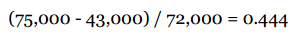

对一些数据集，这种简单的方法效果是不错的。

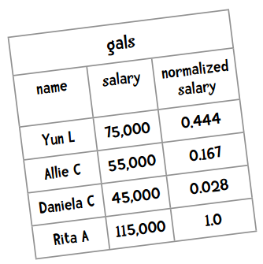

如果你学过统计学，会知道还有其他的标准化方法。比如说标准分（z-score）——分值偏离均值的程度：

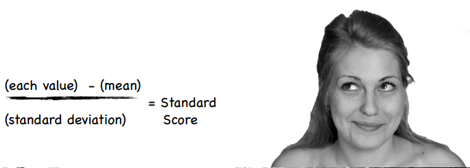

标准差的计算公式是：


card(x)表示集合x中的元素个数。

> 如果你对统计学有兴趣，可以读一读《[漫话统计学](http://www.amazon.com/Manga-Guide-Statistics-Shin-Takahashi/dp/1593271891)》。

我们用上文中交友网站的数据举例。所有人薪水的总和是577,000，一共有8人，所以均值为72,125。代入标准差的计算公式：

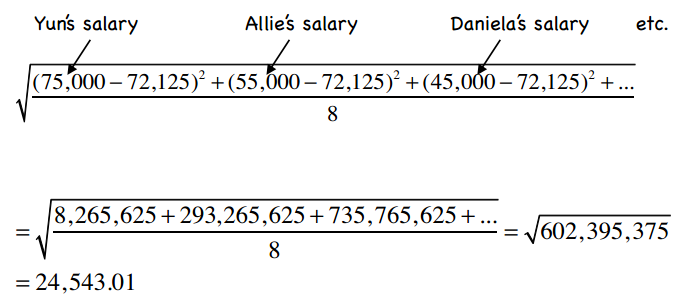

那Yun的标准分则是：

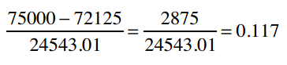

**练习题：计算Allie、Daniela、Rita的标准分**

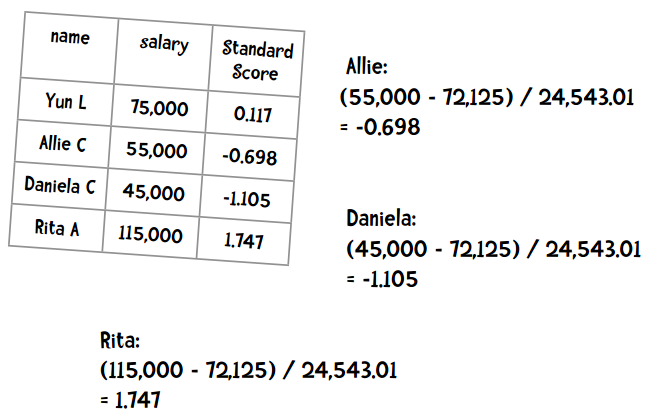

### 标准分带来的问题

标准分的问题在于它会受异常值的影响。比如说一家公司有100名员工，普通员工每小时赚10美元，而CEO一年能赚600万，那全公司的平均时薪为：

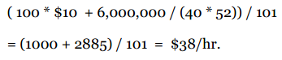

结果是每小时38美元，看起来很美好，但其实并不真实。鉴于这个原因，标准分的计算公式会稍作变化。

### 修正的标准分

计算方法：将标准分公式中的均值改为中位数，将标准差改为绝对偏差。以下是绝对偏差的计算公式：

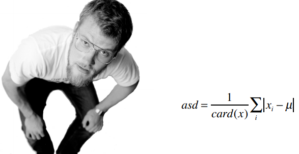

中位数指的是将所有数据进行排序，取中间的那个值。如果数据量是偶数，则取中间两个数值的均值。

下面就让我们试试吧。首先将所有人按薪水排序，找到中位数，然后计算绝对偏差：

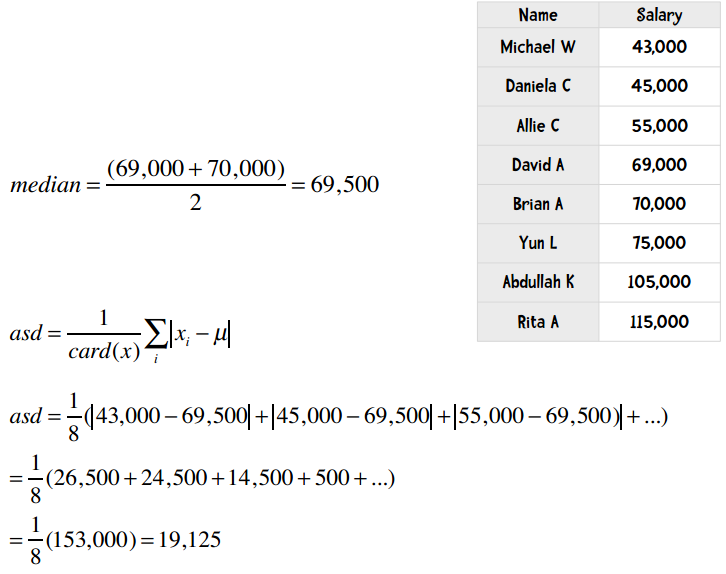

最后，我们便可以计算得出Yun的修正标准分：

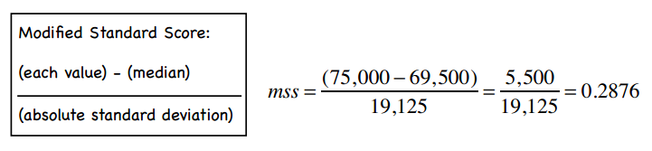

### 是否需要标准化？

当物品的特征数值尺度不一时，就有必要进行标准化。比如上文中音乐特征里大部分是1到5分，鼓点数却是60到180；交友网站中薪水和年龄这两个尺度也有很大差别。

再比如我想在新墨西哥圣达菲买一处宅子，下表是一些选择：

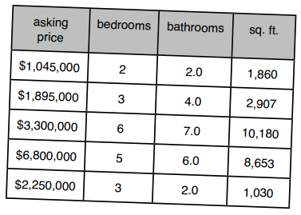

可以看到，价格的范围是最广的，在计算距离时会起到决定性作用；同样，有两间卧室和有二十间卧室，在距离的影响下作用也会很小。

**需要进行标准化的情形：**

1. 我们需要通过物品特性来计算距离；
2. 不同特性之间的尺度相差很大。

但对于那种“赞一下”、“踩一脚”的评分数据，就没有必要做标准化了：

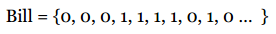

在潘多拉的例子中，如果所有的音乐特征都是在1到5分之间浮动的，是否还需要标准化呢？虽然即使做了也不会影响计算结果，但是任何运算都是有性能消耗的，这时我们可以通过比较两种方式的性能和效果来做进一步选择。在下文中，我们会看到标准化反而会降低结果正确性的示例。


## 回到潘多拉

在潘多拉网站的示例中，我们用一个特征向量来表示一首歌曲，用以计算歌曲的相似度。潘多拉网站同样允许用户对歌曲“赞”和“踩”，那我们要如何利用这些数据呢？

假设我们的歌曲有两个特征，重金属吉他（Dirty Guitar）和强烈的节奏感（Driving Beat），两种特征都在1到5分之间。一位用户对5首歌曲做了“赞”的操作（图中的L），另外五首则“踩”了一下（图中的D）：

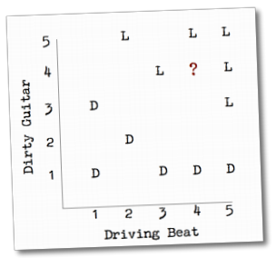

图中多了一个问号所表示的歌曲，你觉得用户会喜欢它还是不喜欢呢？想必你也猜到了，因为这个问号离用户喜欢的歌曲距离较近。这一章接下来的篇幅都会用来讲述这种计算方法。最明显的方式是找到问号歌曲最邻近的歌曲，因为它们之间相似度比较高，再根据用户是否喜欢这些邻近歌曲来判断他对问号歌曲的喜好。

### 使用Python实现最邻近分类算法

我们仍使用上文中的歌曲示例，用7个特征来标识10首歌曲：


使用Python代码来表示这些数据：

```python
music = {"Dr Dog/Fate": {"piano": 2.5, "vocals": 4, "beat": 3.5, "blues": 3, "guitar": 5, "backup vocals": 4, "rap": 1},
         "Phoenix/Lisztomania": {"piano": 2, "vocals": 5, "beat": 5, "blues": 3, "guitar": 2, "backup vocals": 1, "rap": 1},
         "Heartless Bastards/Out at Sea": {"piano": 1, "vocals": 5, "beat": 4, "blues": 2, "guitar": 4, "backup vocals": 1, "rap": 1},
         "Todd Snider/Don't Tempt Me": {"piano": 4, "vocals": 5, "beat": 4, "blues": 4, "guitar": 1, "backup vocals": 5, "rap": 1},
         "The Black Keys/Magic Potion": {"piano": 1, "vocals": 4, "beat": 5, "blues": 3.5, "guitar": 5, "backup vocals": 1, "rap": 1},
         "Glee Cast/Jessie's Girl": {"piano": 1, "vocals": 5, "beat": 3.5, "blues": 3, "guitar":4, "backup vocals": 5, "rap": 1},
         "La Roux/Bulletproof": {"piano": 5, "vocals": 5, "beat": 4, "blues": 2, "guitar": 1, "backup vocals": 1, "rap": 1},
         "Mike Posner": {"piano": 2.5, "vocals": 4, "beat": 4, "blues": 1, "guitar": 1, "backup vocals": 1, "rap": 1},
         "Black Eyed Peas/Rock That Body": {"piano": 2, "vocals": 5, "beat": 5, "blues": 1, "guitar": 2, "backup vocals": 2, "rap": 4},
         "Lady Gaga/Alejandro": {"piano": 1, "vocals": 5, "beat": 3, "blues": 2, "guitar": 1, "backup vocals": 2, "rap": 1}}
```

这样做虽然可行，但却比较繁琐，piano、vocals这样的键名需要重复很多次。我们可以将其简化为向量，即Python中的数组类型：

```python
#
# 物品向量中的特征依次为：piano, vocals, beat, blues, guitar, backup vocals, rap
#
items = {"Dr Dog/Fate": [2.5, 4, 3.5, 3, 5, 4, 1],
         "Phoenix/Lisztomania": [2, 5, 5, 3, 2, 1, 1],
         "Heartless Bastards/Out": [1, 5, 4, 2, 4, 1, 1],
         "Todd Snider/Don't Tempt Me": [4, 5, 4, 4, 1, 5, 1],
         "The Black Keys/Magic Potion": [1, 4, 5, 3.5, 5, 1, 1],
         "Glee Cast/Jessie's Girl": [1, 5, 3.5, 3, 4, 5, 1],
         "La Roux/Bulletproof": [5, 5, 4, 2, 1, 1, 1],
         "Mike Posner": [2.5, 4, 4, 1, 1, 1, 1],
         "Black Eyed Peas/Rock That Body": [2, 5, 5, 1, 2, 2, 4],
         "Lady Gaga/Alejandro": [1, 5, 3, 2, 1, 2, 1]}
```


接下来我还需要将用户“赞”和“踩”的数据也用Python代码表示出来。由于用户并不会对所有的歌曲都做这些操作，所以我用嵌套的字典来表示：

```python
users = {"Angelica": {"Dr Dog/Fate": "L",
                      "Phoenix/Lisztomania": "L",
                      "Heartless Bastards/Out at Sea": "D",
                      "Todd Snider/Don't Tempt Me": "D",
                      "The Black Keys/Magic Potion": "D",
                      "Glee Cast/Jessie's Girl": "L",
                      "La Roux/Bulletproof": "D",
                      "Mike Posner": "D",
                      "Black Eyed Peas/Rock That Body": "D",
                      "Lady Gaga/Alejandro": "L"},
         "Bill": {"Dr Dog/Fate": "L",
                  "Phoenix/Lisztomania": "L",
                  "Heartless Bastards/Out at Sea": "L",
                  "Todd Snider/Don't Tempt Me": "D",
                  "The Black Keys/Magic Potion": "L",
                  "Glee Cast/Jessie's Girl": "D",
                  "La Roux/Bulletproof": "D",
                  "Mike Posner": "D",
                  "Black Eyed Peas/Rock That Body": "D",
                  "Lady Gaga/Alejandro": "D"}}
```

这里使用L和D两个字母来表示喜欢和不喜欢，当然你也可以用其他方式，比如0和1等。

对于新的向量格式，我们需要对曼哈顿距离函数和邻近物品函数做一些调整：

```python
def manhattan(vector1, vector2):
    distance = 0
    total = 0
    n = len(vector1)
    for i in range(n):
        distance += abs(vector1[i] - vector2[i])
    return distance
    
def computeNearestNeighbor(itemName, itemVector, items):
    """按照距离排序，返回邻近物品列表"""
    distances = []
    for otherItem in items:
        if otherItem != itemName:
            distance = manhattan(itemVector, items[otherItem])
            distances.append((distance, otherItem))
    # 最近的排在前面
    distances.sort()
    return distances
```

最后，我需要建立一个分类函数，用来预测用户对一个新物品的喜好，如：

```
"Chris Cagle/I Breathe In. I Breathe Out" [1, 5, 2.5, 1, 1, 5, 1]
```

这个函数会先计算出与这个物品距离最近的物品，然后找到用户对这个最近物品的评价，以此作为新物品的预测值。下面是一个最简单的分类函数：

```python
def classify(user, itemName, itemVector):
    nearest = computeNearestNeighbor(itemName, itemVector, items)[0][1]
    rating = users[user][nearest]
    return rating
````

让我们试用一下：

```python
>>> classify('Angelica', 'Chris Cagle/I Breathe In. I Breathe Out', [1, 5, 2.5, 1, 1, 5, 1])
'L'
```

我们认为她会喜欢这首歌曲！为什么呢？

```python
>>> computeNearestNeighbor('Chris Cagle/I Breathe In. I Breathe Out', [1, 5, 2.5, 1, 1, 5, 1], items)
[(4.5, 'Lady Gaga/Alejandro'), (6.0, "Glee Cast/Jessie's Girl"), (7.5, "Todd Snider/Don't Tempt Me"), (8.0, 'Mike Posner'), (9.5, 'Heartless Bastards/Out'), (10.5, 'Black Eyed Peas/Rock That Body'), (10.5, 'Dr Dog/Fate'), (10.5, 'La Roux/Bulletproof'), (10.5, 'Phoenix/Lisztomania'), (14.0, 'The Black Keys/Magic Potion')]
```

可以看到，距离I Breathe In最近的歌曲是Alejandro，并且Angelica是喜欢这首歌曲的，所以我们预测她也会喜欢I Breathe In。

其实我们做的是一个分类器，将歌曲分为了用户喜欢和不喜欢两个类别。

**号外，号外！我们编写了一个分类器！**

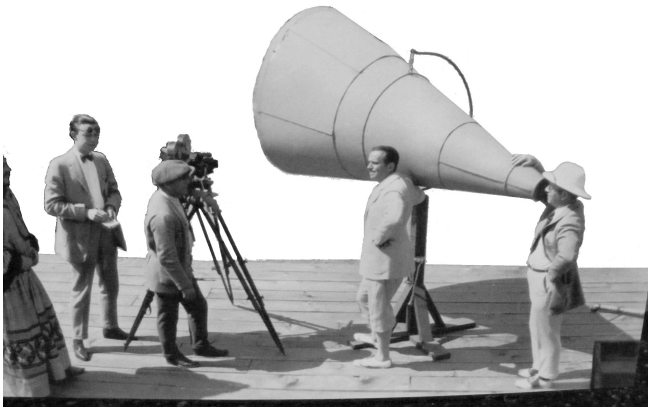

**分类器是指通过物品特征来判断它应该属于哪个组或类别的程序！**

分类器程序会基于一组已经做过分类的物品进行学习，从而判断新物品的所属类别。在上面的例子中，我们知道Angelica喜欢和不喜欢的歌曲，然后据此判断她是否会喜欢Chris Cagle的歌。

1. 在Angelica评价过的歌曲中找到距离Chris Cagle最近的歌曲，即Laydy Gaga的Alejandro；
2. 由于Angelica是喜欢Alejandro这首歌的，所以我们预测她也会喜欢Chris Cagle的Breathe In, Breathe Out。

分类器的应用范围很广，以下是一些示例：

**推特情感分类**

很多人在对推特中的文字消息进行情感分类（积极的、消极的），可以有很多用途，如Axe发布了一款新的腋下除臭剂，通过推文就能知道用户是否满意。这里用到的物品特征是文字信息。

**人脸识别**

现在有些手机应用可以识别出照片里你的朋友们，这项技术也可用于监控录像中的人脸识别。不同的识别技术细节可能不同，但都会用到诸如五官的大小和相对距离等信息。

**政治拉票**

通过将目标选民分为“爱凑热闹”、“很有主见”、“家庭为重”等类型，来进行有针对性的拉票活动。

**市场细分**

这和上个例子有点像，与其花费巨额广告费向不可能购买维加斯公寓的人进行宣传，不如从人群中识别出潜在客户，缩小宣传范围。最好能再对目标群体进行细分，进一步定制广告内容。

**个人健康助理**

如今人们越来越关注自身，我们可以购买到像Nike健身手环这样的产品，而Intel等公司也在研制一种智能家居，可以在你行走时称出你的重量，记录你的行动轨迹，并给出健康提示。有些专家还预言未来我们会穿戴各种便携式设备，收集我们的生活信息，并加以分类。

**其他**

* 识别恐怖分子
* 来信分类（重要的、一般的、垃圾邮件）
* 预测医疗费用
* 识别金融诈骗

## 她是从事什么运动的？

让我们来为之后的几章做一个预热，先看一个较为简单的例子——根据女运动员的身高和体重来判断她们是从事什么运动项目的。下表是原始数据：

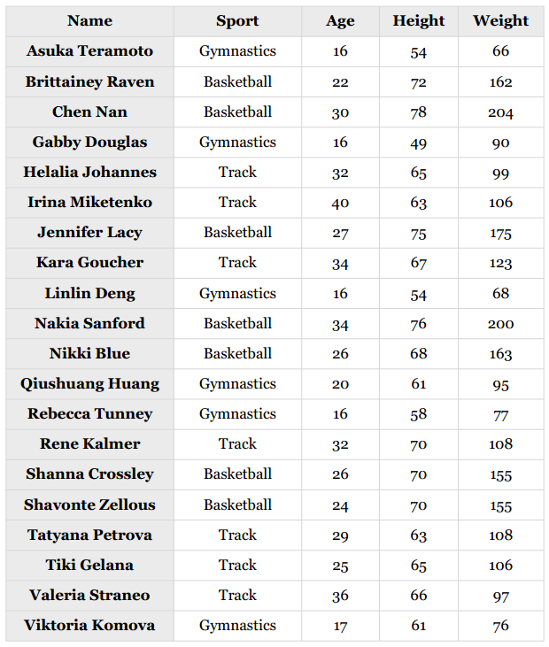

这里列出的是2008和2012奥运会上排名靠前的二十位女运动员。篮球运动员参加了WNBA；田径运动员则完成了2012年奥运会的马拉松赛。虽然数据量很小，但我们仍可以对其应用一些数据挖掘算法。

你可以看到上表中列出了运动员的年龄，光凭这一信息就能进行一些预测了。比如，以下运动员会是哪个项目的呢？

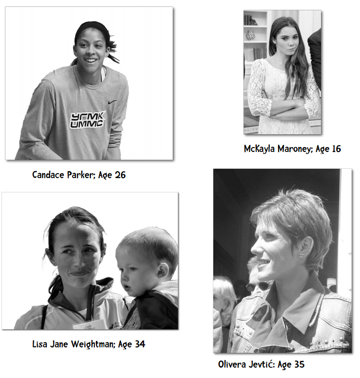

### 答案

Candace Parker是篮球运动员，McKayla Maroney是美国女子体操队的一员，Olivera Jevtic是塞尔维亚的一名长跑运动员，Lisa Jane Weightman则是澳大利亚的长跑运动员。

看，我们刚刚就进行了一次分类——通过运动员的年龄特征来识别她们参与的体育项目。

**头脑风暴**

假设我想通过运动员的身高和体重来预测她所从事的运动，数据集只有两人：Nakia Sanford是篮球运动员，身高6尺4寸（76英寸，1.93米），体重200磅（90公斤）；Sarah Beale是橄榄球运动员，身高5尺10寸（70英寸，1.78米），体重190磅（86公斤）。我想知道Catherine Spencer是从事哪项运动的，她的身高是5尺10寸，重200磅，如何预测呢？

如果你认为她是橄榄球运动员，那么你猜对了。但是，如果用曼哈顿距离来进行计算，Catherine和Nakia的距离是6，和Sarah的距离是10，那应该预测她是篮球运动员才对。我们之前是否学过一个方法，能让距离计算更为准确呢？

*没错，就是修正的标准分！*

### 测试数据

下表是我们需要进行预测的运动员列表，一起来做分类器吧！

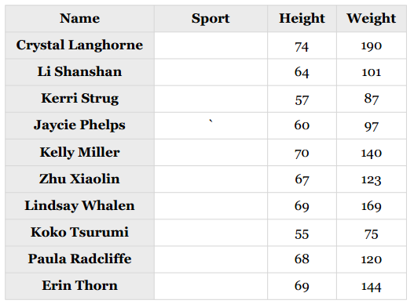

## Python编码

这次我们不将数据直接写在Python代码中，而是放到两个文本文件里：athletesTrainingSet.txt和athletesTestSet.txt。我会使用第一个文件中的数据来训练分类器，然后使用测试文件里的数据来进行评价。

文件格式大致如下：

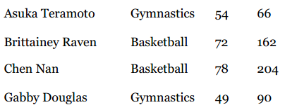

文件中的每一行是一条完整的记录，字段使用制表符分隔。我要使用运动员的身高体重数据来预测她所从事的运动项目，也就是用第三、四列的数据来预测第二列的数据。运动员的姓名不会使用到，我们既不能通过运动员的姓名得知她参与的项目，也不会通过身高体重来预测运动员的姓名。


> 你好，你有五英尺高，150磅重，莫非你的名字是Clara Coleman？

当然，名字也有它的用处，我们可以用它来解释分类器的预测结果：“我们认为Amelia Pond是一名体操运动员，因为她的身高体重和另一名体操运动员Gabby Douglas很接近。”

为了让我们的Python代码更具一般性，并不只适用于这一种数据集，我会为每一列数据增加一个列名，如：

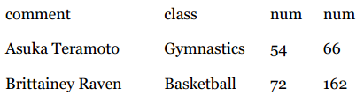

所有被标记为comment的列都会被分类器忽略；标记为class的列表示物品所属分类；不定个数的num列则表示物品的特征。

**头脑风暴**

我们在Python中应该如何表示这些数据呢？以下是一些可能性：

```python
# 1
{'Asuka Termoto': ('Gymnastics', [54, 66]),
 'Brittainey Raven': ('Basketball', [72, 162]), ...
```

这种方式使用了运动员的姓名作为键，而我们说过分类器程序根本不会使用到姓名，所以不合理。

```python
# 2
[['Asuka Termoto', 'Gymnastics', 54, 66],
 ['Brittainey Raven', 'Basketball', 72, 162], ...
```

这种方式看起来不错，它直接反映了文件的格式。由于我们需要遍历文件的数据，所以使用列表类型（list）是合理的。

```python
# 3
[('Gymnastics', [54, 66], ['Asuka Termoto']),
 ('Basketball', [72, 162], ['Brittainey Raven']), ...
```

这是我最认同的表示方式，因为它将不同类型的数据区别开来了，依次是分类、特征、备注。这里备注可能有多个，所以也用了一个列表来表示。以下是读取数据文件并转换成上述格式的函数：

```python
class Classifier:

    def __init__(self, filename):

        self.medianAndDeviation = []
        
        # 读取文件
        f = open(filename)
        lines = f.readlines()
        f.close()
        self.format = lines[0].strip().split('\t')
        self.data = []
        for line in lines[1:]:
            fields = line.strip().split('\t')
            ignore = []
            vector = []
            for i in range(len(fields)):
                if self.format[i] == 'num':
                    vector.append(int(fields[i]))
                elif self.format[i] == 'comment':
                    ignore.append(fields[i])
                elif self.format[i] == 'class':
                    classification = fields[i]
            self.data.append((classification, vector, ignore))
```

**动手实践**

在计算修正的标准分之前，我们需要编写获取中位数和计算绝对偏差的函数，尝试实现这两个函数：

```python
>>> heights = [54, 72, 78, 49, 65, 63, 75, 67, 54]
>>> median = classifier.getMedian(heights)
>>> median
65
>>> asd = classifier.getAbsoluteStandardDeviation(heights, median)
>>> asd
8.0
```

### 关于断言

通常我们会将一个大的算法拆分成几个小的组件，并为每个组件编写一些单元测试，从而确保它能正常工作。很多时候，我们会先写单元测试，再写正式的代码。在我提供的[模板代码](code/chapter-4/testMedianAndASD.py)中已经编写了一些单元测试，摘录如下：

```python
def unitTest():
    list1 = [54, 72, 78, 49, 65, 63, 75, 67, 54]
    classifier = Classifier('athletesTrainingSet.txt')
    m1 = classifier.getMedian(list1)
    assert(round(m1, 3) == 65)
    ...
    print("getMedian和getAbsoluteStandardDeviation均能正常工作")
```

你需要完成的geMedian函数的模板是：

```python
def getMedian(self, alist):
    """返回中位数"""
    
    """请在此处编写代码"""
    return 0
```

这个模板函数返回的是0，你需要编写代码来返回列表的中位数。比如单元测试中我传入了以下列表：

```python
[54, 72, 78, 49, 65, 63, 75, 67, 54]
```

assert（断言）表示函数的返回值应该是65。如果所有的单元测试都能通过，则报告以下信息：

```
getMedian和getAbsoluteStandardDeviation均能正常工作
```

否则，则抛出以下异常：

```
File "testMedianAndASD.py", line 78, in unitTest
    assert(round(m1, 3) == 65)
AssertError
```

断言在单元测试中是很常用的。

> 将大型代码拆分成一个个小的部分，并为每个部分编写单元测试，这一点是很重要的。如果没有单元测试，你将无法知道自己是否正确完成了所有任务，以及未来的某个修改是否会导致你的程序不可用。--- Peter Norvig


### 答案

```python
def getMedian(self, alist):
    """返回中位数"""
    if alist == []:
        return []
    blist = sorted(alist)
    length = len(alist)
    if length % 2 == 1:
        # 列表有奇数个元素，返回中间的元素
        return blist[int(((length + 1) / 2) -  1)]
    else:
        # 列表有偶数个元素，返回中间两个元素的均值
        v1 = blist[int(length / 2)]
        v2 =blist[(int(length / 2) - 1)]
        return (v1 + v2) / 2.0

def getAbsoluteStandardDeviation(self, alist, median):
    """计算绝对偏差"""
    sum = 0
    for item in alist:
        sum += abs(item - median)
    return sum / len(alist)
```

可以看到，getMedian函数对列表进行了排序，由于数据量并不大，所以这种方式是可以接受的。如果要对代码进行优化，我们可以使用[选择算法](http://en.wikipedia.org/wiki/Selection_algorithm)。

现在，我们已经将数据从athletesTrainingSet.txt读取出来，并保存为以下形式：

```python
[('Gymnastics', [54, 66], ['Asuka Teramoto']),
 ('Basketball', [72, 162], ['Brittainey Raven']),
 ('Basketball', [78, 204], ['Chen Nan']),
 ('Gymnastics', [49, 90], ['Gabby Douglas']), ...
```

我们需要对向量中的数据进行标准化，变成以下结果：

```python
[('Gymnastics', [-1.93277, -1.21842], ['Asuka Teramoto']),
 ('Basketball', [1.09243, 1.63447], ['Brittainey Raven']),
 ('Basketball', [2.10084, 2.88261], ['Chen Nan']),
 ('Gymnastics', [-2.7731, -0.50520],
 ('Track', [-0.08403, -0.23774], ['Helalia Johannes']),
 ('Track', [-0.42017, -0.02972], ['Irina Miketenko']), ...
```

在init方法中，添加标准化过程：

```python
    # 获取向量的长度
    self.vlen = len(self.data[0][1])
    # 标准化
    for i in range(self.vlen):
        self.normalizeColumn(i)
```

在for循环中逐列进行标准化，即第一次会标准化身高，第二次标准化体重。

**动手实践** 下载[normalizeColumnTemplate.py](code/chapter-4/normalizeColumnTemplate.py)文件，编写normalizeColumn方法。

### 答案

```python
def normalizeColumn(self, columnNumber):
    """标准化self.data中的第columnNumber列"""
    # 将该列的所有值提取到一个列表中
    col = [v[1][columnNumber] for v in self.data]
    median = self.getMedian(col)
    asd = self.getAbsoluteStandardDeviation(col, median)
    #print("Median: %f   ASD = %f" % (median, asd))
    self.medianAndDeviation.append((median, asd))
    for v in self.data:
        v[1][columnNumber] = (v[1][columnNumber] - median) / asd
```

可以看到，我将计算得到的中位数和绝对偏差保存在了medianAndDeviation变量中，因为我们会用它来标准化需要预测的向量。比如，我要预测Kelly Miller的运动项目，她身高5尺10寸（70英寸），重140磅，即原始向量为[70, 140]，需要先进行标准化。

我们计算得到的meanAndDeviation为：

```python
[(65.5, 5.95), (107.0, 33.65)]
```

它表示向量中第一元素的中位数为65.5，绝对偏差为5.95；第二个元素的中位数为107.0，绝对偏差33.65。

现在我们就利用这组数据将[70, 140]进行标准化。第一个元素的标准分数是：

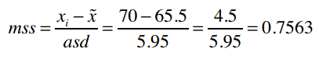

第二个元素为：

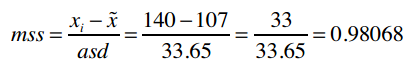

以下是实现它的Python代码：

```python
def normalizeVector(self, v):
    """我们已保存了每列的中位数和绝对偏差，现用它来标准化向量v"""
    vector = list(v)
    for i in range(len(vector)):
        (median, asd) = self.medianAndDeviation[i]
        vector[i] = (vector[i] - median) / asd
    return vector
```

最后，我们要编写分类函数，用来预测运动员的项目：

```python
classifier.classify([70, 140])
```

在我们的实现中，classify函数只是nearestNeighbor的一层包装：

```python
def classify(self, itemVector):
    """预测itemVector的分类"""
    return self.nearestNeighbor(self.normalizeVector(itemVector))[1][0]
```

**动手实践** 实现nearestNeighbor函数。

### 答案

```python
def manhattan(self, vector1, vector2):
    """计算曼哈顿距离"""
    return sum(map(lambda v1, v2: abs(v1 - v2), vector1, vector2))

def nearestNeighbor(self, itemVector):
    """返回itemVector的近邻"""
    return min([(self.manhattan(itemVector, item[1]), item)
                for item in self.data])
```

**好了，我们用200多行代码实现了近邻分类器！**


在完整的[示例代码](code/chapter-4/nearestNeighborClassifier.py#L188)中，我提供了一个test函数，它可以对分类器程序的准确性做一个评价。比如用它来评价上面实现的分类器：

```
-         Track  Aly Raisman	Gymnastics	62	115
+    Basketball  Crystal Langhorne	Basketball	74	190
+    Basketball  Diana Taurasi	Basketball	72	163
...
+         Track  Xueqin Wang	Track	64	110
+         Track  Zhu Xiaolin	Track	67	123

80.00% correct
```

可以看到，这个分类器的准确率是80%。它对篮球运动员的预测很准确，但在预测田径和体操运动员时出现了4个失误。

### 鸢尾花数据集

我们可以用鸢尾花数据集做测试，这个数据集在数据挖掘领域是比较有名的。它是20世纪30年代Ronald Fisher对三种鸢尾花的50个样本做的测量数据（萼片和花瓣）。

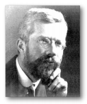

> Ronald Fisher是一名伟大的科学家。他对统计学做出了革命性的改进，Richard Dawkins称他为“继达尔文后最伟大生物学家。”

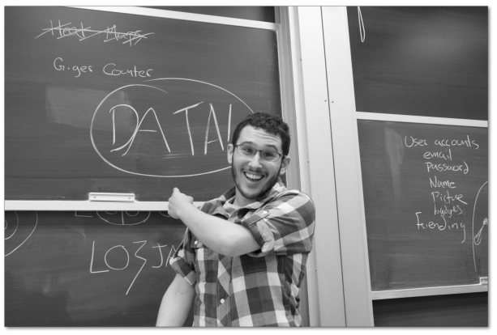

鸢尾花数据集可以在[这里](code/chapter-4/irisTrainingSet.data)找到，你可以测试你的算法，并问自己一些问题：标准化让结果更正确了吗？训练集中的数据量越多越好吗？用欧几里得距离来算会怎样？

*记住* 所有的学习过程都是在你自己的脑中进行的，你付出的努力越多，学到的也就越多。

鸢尾花数据集的格式如下，我们要预测的是Species这一列：


训练集中有120条数据，测试集中有30条，两者没有交集。

测试结果如何呢？

```python
>>> test('irisTrainingSet.data', 'iristestSet.data')
93.33% correct
```

这又一次证明我们的分类算法是简单有效的。有趣的是，如果不对数据进行标准化，它的准确率将达到100%。这个现象我们会在后续的章节中讨论。

## 每加仑燃油可以跑多少公里？

最后，我们再来测试另一个广泛使用的数据集，卡内基梅隆大学统计的汽车燃油消耗和公里数数据。它在1983年的美国统计联合会展中使用过，大致格式如下：

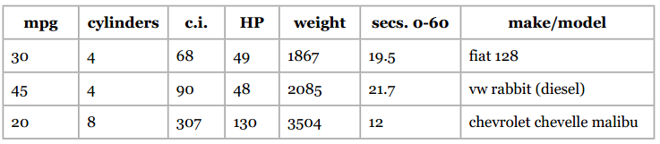

这个数据集做过一些修改。我们要预测的是加仑燃油公里数（mpg），使用的数据包括汽缸数、排气量、马力、重量、加速度等。

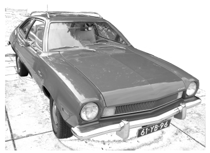

数据集中有342条记录，50条测试记录，运行结果如下：

```python
>>> test('mpgTrainingSet.txt', 'mpgTestSet.txt')
56.00% correct
```

如果不进行标准化，准确率将只有32%。


> 我们应该如何提高预测的准确率呢？改进分类算法？增加训练集？还是增加特征的数量？我们将在下一章揭晓！

## 番外篇：关于标准化

这一章我们讲解了标准化的重要性，即当不同特征的评分尺度不一致时，为了得到更准确的距离结果，就需要将这些特征进行标准化，使他们在同一个尺度内波动。


虽然大多数数据挖掘工程师对标准化的理解是一致的，但也有一些人要将这种做法区分为“正规化”和“标准化”两种。其中，“正规化”表示将值的范围缩小到0和1之间；“标准化”则是将特征值转换为均值为0的一组数，其中每个数表示偏离均值的程度（即标准偏差或绝对偏差）。我们使用的修正的标准分就是属于后者。

回忆一下，我们上文中有讲解过如何将特征值缩小到0到1之间：找出最大最小值，并做如下计算：

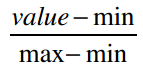

我们来比较一下使用不同的标准化方法得到的准确度：

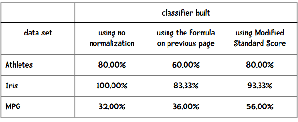

看来还是使用修正的标准分结果会好些。


用不同的数据集来测试我们的算法是不是很有趣？这些数据集是从[UCI机器学习仓库](http://archive.ics.uci.edu/ml)中获得的。去下载一些新的数据集，调整一下格式，测试我们学过的算法吧！
