第五章：进一步探索分类
======================

原文：http://guidetodatamining.com/chapter-5

## 效果评估算法和kNN

让我们回到上一章中运动项目的例子。


在那个例子中，我们编写了一个分类器程序，通过运动员的身高和体重来判断她参与的运动项目——体操、田径、篮球等。

上图中的Marissa Coleman，身高6尺1寸，重160磅，我们的分类器可以正确的进行预测：

```python
>>> cl = Classifier('athletesTrainingSet.txt')
>>> cl.classify([73, 160])
'Basketball'
```

对于身高4尺9寸，90磅重的人：

```python
>>> cl.classify([59, 90])
'Gymnastics'
```

当我们构建完一个分类器后，应该问以下问题：

* 分类器的准确度如何？
* 结果理想吗？
* 如何与其它分类器做比较？


### 训练集和测试集

上一章我们一共引入了三个数据集，分别是女运动员、鸢尾花、加仑公里数。我们将这些数据集分为了两个部分，第一部分用来构造分类器，因此称为训练集；另一部分用来评估分类器的结果，因此称为测试集。训练集和测试集在数据挖掘中很常用。

*数据挖掘工程师不会用同一个数据集去训练和测试程序。*

因为如果使用训练集去测试分类器，得到的结果肯定是百分之百准确的。换种说法，在评价一个数据挖掘算法的效果时，如果用来测试的数据集是训练集本身的一个子集，那结果会极大程度趋向于好，所以这种做法不可取。

将数据集拆分成一大一小两个部分的做法就产生了，前者用来训练，后者用来测试。不过，这种做法似乎也有问题：如果分割的时候不凑巧，就会引发异常。比如，若测试集中的篮球运动员恰巧都很矮，她们就会被归为马拉松运动员；如果又矮又轻，则会被归为体操运动员。使用这样的测试集会造成评分结果非常低。相反的情况也有可能出现，使评分结果趋于100%准确。无论哪种情况发生，都不是一种真实的评价。

解决方法之一是将数据集按不同的方式拆分，测试多次，取结果的平均值。比如，我们将数据集拆为均等的两份：

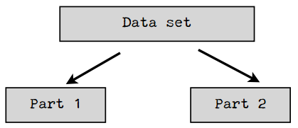

我们可以先用第一部分做训练集，第二部分做测试集，然后再反过来，取两次测试的平均结果。我们还可以将数据集分成三份，用两个部分来做训练集，一个部分来做测试集，迭代三次：

1. 使用Part 1和Part 2训练，使用Part 3测试；
2. 使用Part 1和Part 3训练，使用Part 2测试；
3. 使用Part 2和Part 3训练，使用Part 1测试；

最后取三次测试的平均结果。

在数据挖掘中，通常的做法是将数据集拆分成十份，并按上述方式进行迭代测试。因此这种方式也称为——

### 十折交叉验证

将数据集随机分割成十个等份，每次用9份数据做训练集，1份数据做测试集，如此迭代10次。

我们来看一个示例：假设我有一个分类器能判断某个人是否是篮球运动员。我的数据集包含500个运动员和500个普通人。

**第一步：将数据分成10份**

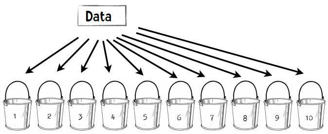

每个桶中会放50个篮球运动员，50个普通人，一共100人。

**第二步：重复以下步骤10次**

1. 每次迭代我们保留一个桶，比如第一次迭代保留木桶1，第二次保留木桶2。
2. 我们使用剩余的9个桶来训练分类器，比如第一次迭代使用木桶2至10来训练。
3. 我们用刚才保留的一个桶来进行测试，并记录结果，比如：35个篮球运动员分类正确，29个普通人分类正确。

**第三步：合并结果**

我们可以用一张表格来展示结果：

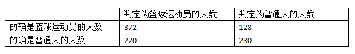

500个篮球运动员中有372个人判断正确，500个普通人中有280个人判断正确，所以我们可以认为1000人中有652个人判断正确，准确率就是65.2%。通过十折交叉验证得到的评价结果肯定会比二折或者三折来得准确，毕竟我们使用了90%的数据进行训练，而非二折验证中的50%。

> 好，既然十折交叉验证效果那么好，我们为何不做一个N折交叉验证？N即数据集中的数据量。

> 如果我们有1000个数据，我们就用999个数据来训练分类器，再用它去判定剩下的一个数据。这样得到的验证效果应该是最好的。


## 留一法

在数据挖掘领域，N折交叉验证又称为留一法。上面已经提到了留一法的优点之一：我们用几乎所有的数据进行训练，然后用一个数据进行测试。留一法的另一个优点是：确定性。

### 什么是确定性？

试想Lucy花了一整周的时间编写了一个分类器。周五的时候她请两位同事（Emily和Li）来对这个分类器进行测试，并给了他们相同的数据集。这两位同事都使用十折交叉验证，结果是：


> Emily：这个分类器的准确率是73.69%，很不错！

> Li：它的准确率只有71.27%。

为什么她们的结果不一样？是某个人计算发生错误了吗？其实不是。在十折交叉验证中，我们需要将数据随机等分成十份，因此Emily和Li的分法很有可能是不一样的。这样一来，她们的训练集和测试集也都不相同了，得到的结果自然不同。即使是同一个人进行检验，如果两次使用了不同的分法，得到的结果也会有差异。因此，十折交叉验证是一种不确定的验证。相反，留一法得到的结果总是相同的，这是它的一个优点。

### 留一法的缺点

最大的缺点是计算时间很长。假设我们有一个包含1000条记录的数据集，使用十折交叉验证需要运行10分钟，而使用留一法则需要16个小时。如果我们的数据集更大，达到百万级，那检验的时间就更长了。


> 我两年后再给你检验结果！

留一法的另一个缺点是分层问题。

### 分层问题

让我们回到运动员分类的例子——判断女运动员参与的项目是篮球、体操、还是田径。在训练分类器的时候，我们会试图让训练集包含全部三种类别。如果我们完全随机分配，训练集中有可能会不包含篮球运动员，在测试的时候就会影响结果。比如说，我们来构建一个包含100个运动员的数据集：从女子NBA网站上获取33名篮球运动员的信息，到Wikipedia上获取33个参加过2012奥运会体操项目的运动员，以及34名田径运动员的信息。这个数据集看起来是这样的：

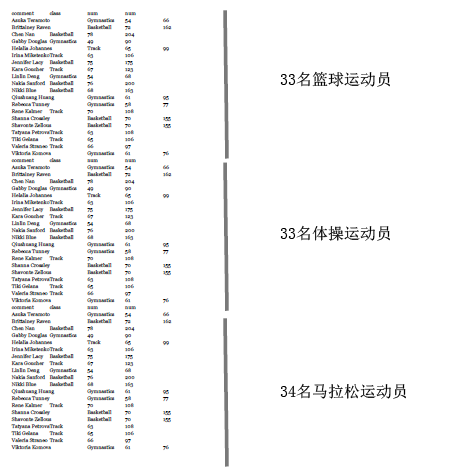

现在我们来做十折交叉验证。我们按顺序将这些运动员放到10个桶中，所以前三个桶放的都是篮球运动员，第四个桶有篮球运动员也有体操运动员，以此类推。这样一来，没有一个桶能真正代表这个数据集的全貌。最好的方法是将不同类别的运动员按比例分发到各个桶中，这样每个桶都会包含三分之一篮球运动员、三分之一体操运动员、以及三分之一田径运动员。这种做法叫做分层。而在留一法中，所有的测试集都只包含一个数据。所以说，留一法对小数据集是合适的，但大多数情况下我们会选择十折交叉验证。

## 混淆矩阵


目前我们衡量分类器准确率的方式是使用以下公式：正确分类的记录数÷记录总数。有时我们会需要一个更为详细的评价结果，这时就会用到一个称为混淆矩阵的可视化表格。表格的行表示测试用例实际所属的类别，列则表示分类器的判断结果。

混淆矩阵可以帮助我们快速识别出分类器到底在哪些类别上发生了混淆，因此得名。让我们看看运动员的示例，这个数据集中有300人，使用十折交叉验证，其混淆矩阵如下：

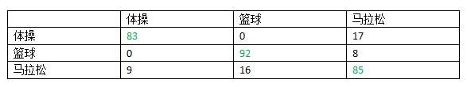

可以看到，100个体操运动员中有83人分类正确，17人被错误地分到了马拉松一列；92个篮球运动员分类正确，8人被分到了马拉松；85个马拉松运动员分类正确，9人被分到了体操，16人被分到了篮球。

混淆矩阵的对角线（绿色字体）表示分类正确的人数，因此求得的准确率是：

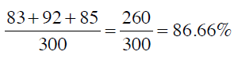

从混淆矩阵中可以看出分类器的主要问题。在这个示例中，我们的分类器可以很好地区分体操运动员和篮球运动员，而马拉松运动员则比较容易和其他两个类别发生混淆。


> 怎样，是不是觉得混淆矩阵其实并不混淆呢？

## 代码示例

让我们使用加仑公里数这个数据集，格式如下：

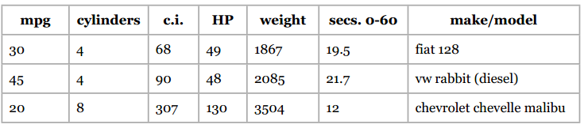

我会通过汽车的以下属性来判断它的加仑公里数：汽缸数、排气量、马力、重量、加速度。我将392条数据都存放在mpgData.txt文件中，并用下面这段[Python代码](code/chapter-5/divide.py)将这些数据按层次等分成十份：

```python
# -*- coding: utf-8 -*-

# 将数据等分成十份的示例代码

import random

def buckets(filename, bucketName, separator, classColumn):
    """filename是源文件名
    bucketName是十个目标文件的前缀名
    separator是分隔符，如制表符、逗号等
    classColumn是表示数据所属分类的那一列的序号"""

    # 将数据分为10份
    numberOfBuckets = 10
    data = {}
    # 读取数据，并按分类放置
    with open(filename) as f:
        lines = f.readlines()
    for line in lines:
        if separator != '\t':
            line = line.replace(separator, '\t')
        # 获取分类
        category = line.split()[classColumn]
        data.setdefault(category, [])
        data[category].append(line)
    # 初始化分桶
    buckets = []
    for i in range(numberOfBuckets):
        buckets.append([])       
    # 将各个类别的数据均匀地放置到桶中
    for k in data.keys():
        # 打乱分类顺序
        random.shuffle(data[k])
        bNum = 0
        # 分桶
        for item in data[k]:
            buckets[bNum].append(item)
            bNum = (bNum + 1) % numberOfBuckets

    # 写入文件
    for bNum in range(numberOfBuckets):
        f = open("%s-%02i" % (bucketName, bNum + 1), 'w')
        for item in buckets[bNum]:
            f.write(item)
        f.close()

# 调用示例      
buckets("pimaSmall.txt", 'pimaSmall',',',8)
```

执行这个程序后会生成10个文件：mpgData01、mpgData02等。

**编程实践**

你能否修改上一章的[近邻算法程序](code/chapter-4/nearestNeighborClassifier.py#L188)，让`test`函数能够执行十折交叉验证？输出的结果应该是这样的：

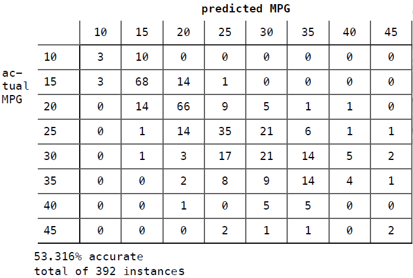

**解决方案**

我们需要进行以下几步：

* 修改初始化方法，只读取九个桶中的数据作为训练集；
* 增加一个方法，从第十个桶中读取测试集；
* 执行十折交叉验证。

下面我们分步来看：

* 初始化方法`__init__`

`__init__`方法的签名会修改成以下形式：

```python
def __init__(self, bucketPrefix, testBucketNumber, dataFormat):
```

每个桶的文件名是mpgData-01、mpgData-02这样的形式，所以`bucketPrefix`就是“mpgData”。`testBucketNumber`是测试集所用的桶，如果是3，则分类器会使用1、2、4-9的桶进行训练。`dataFormat`用来指定数据集的格式，如：

```
class    num    num    num    num    num    comment
```

意味着第一列是所属分类，后五列是特征值，最后一列是备注信息。

以下是初始化方法的示例代码：

```python
class Classifier:

    def __init__(self, bucketPrefix, testBucketNumber, dataFormat):
        """该分类器程序将从bucketPrefix指定的一系列文件中读取数据，
        并留出testBucketNumber指定的桶来做测试集，其余的做训练集。
        dataFormat用来表示数据的格式，如：
        "class    num    num    num    num    num    comment"
	"""
   
        self.medianAndDeviation = []
        
        # 从文件中读取文件
 
        self.format = dataFormat.strip().split('\t')
        self.data = []
        # 用1-10来标记桶
        for i in range(1, 11):
            # 判断该桶是否包含在训练集中
            if i != testBucketNumber:
                filename = "%s-%02i" % (bucketPrefix, i)
                f = open(filename)
                lines = f.readlines()
                f.close()
                for line in lines[1:]:
                    fields = line.strip().split('\t')
                    ignore = []
                    vector = []
                    for i in range(len(fields)):
                        if self.format[i] == 'num':
                            vector.append(float(fields[i]))
                        elif self.format[i] == 'comment':
                            ignore.append(fields[i])
                        elif self.format[i] == 'class':
                            classification = fields[i]
                    self.data.append((classification, vector, ignore))
        self.rawData = list(self.data)
        # 获取特征向量的长度
        self.vlen = len(self.data[0][1])
        # 标准化数据
        for i in range(self.vlen):
            self.normalizeColumn(i)
```

* testBucket方法

下面的方法会使用一个桶的数据进行测试：

```python
def testBucket(self, bucketPrefix, bucketNumber):
	"""读取bucketPrefix-bucketNumber所指定的文件作为测试集"""
	
	filename = "%s-%02i" % (bucketPrefix, bucketNumber)
	f = open(filename)
	lines = f.readlines()
	totals = {}
	f.close()
	for line in lines:
		data = line.strip().split('\t')
		vector = []
		classInColumn = -1
		for i in range(len(self.format)):
			  if self.format[i] == 'num':
				  vector.append(float(data[i]))
			  elif self.format[i] == 'class':
				  classInColumn = i
		theRealClass = data[classInColumn]
		classifiedAs = self.classify(vector)
		totals.setdefault(theRealClass, {})
		totals[theRealClass].setdefault(classifiedAs, 0)
		totals[theRealClass][classifiedAs] += 1
	return totals
```

比如说bucketPrefix是mpgData，bucketNumber是3，那么程序会从mpgData-03中读取内容，作为测试集。这个方法会返回如下形式的结果：

```python
{'35': {'35': 1, '20': 1, '30': 1},
 '40': {'30': 1},
 '30': {'35': 3, '30': 1, '45': 1, '25': 1},
 '15': {'20': 3, '15': 4, '10': 1},
 '10': {'15': 1},
 '20': {'15': 2, '20': 4, '30': 2, '25': 1},
 '25': {'30': 5, '25': 3}}
```

这个字段的键表示真实类别。如第一行的35表示该行数据的真实类别是35加仑公里。这个键又对应一个字典，这个字典表示的是分类器所判断的类别，如：

```
'15': {'20': 3, '15': 4, '10': 1},
```

其中的3表示有3条记录真实类别是15加仑公里，但被分类到了20加仑公里；4表示分类正确的记录数；1表示被分到10加仑公里的记录数。

* 执行十折交叉验证

最后我们需要编写一段程序来执行十折交叉验证，也就是说要用不同的训练集和测试集来构建10个分类器。

```python
def tenfold(bucketPrefix, dataFormat):
    results = {}
    for i in range(1, 11):
        c = Classifier(bucketPrefix, i, dataFormat)
        t = c.testBucket(bucketPrefix, i)
        for (key, value) in t.items():
            results.setdefault(key, {})
            for (ckey, cvalue) in value.items():
                results[key].setdefault(ckey, 0)
                results[key][ckey] += cvalue
                
    # 输出结果
    categories = list(results.keys())
    categories.sort()
    print(   "\n       Classified as: ")
    header =    "        "
    subheader = "      +"
    for category in categories:
        header += category + "   "
        subheader += "----+"
    print (header)
    print (subheader)
    total = 0.0
    correct = 0.0
    for category in categories:
        row = category + "    |"
        for c2 in categories:
            if c2 in results[category]:
                count = results[category][c2]
            else:
                count = 0
            row += " %2i |" % count
            total += count
            if c2 == category:
                correct += count
        print(row)
    print(subheader)
    print("\n%5.3f percent correct" %((correct * 100) / total))
    print("total of %i instances" % total)

# 调用方法
tenfold("mpgData/mpgData",        "class	num	num	num	num	num	comment")
```

执行结果如下：

```
       Classified as: 
        10   15   20   25   30   35   40   45   
      +----+----+----+----+----+----+----+----+
10    |  3 | 10 |  0 |  0 |  0 |  0 |  0 |  0 |
15    |  3 | 68 | 14 |  1 |  0 |  0 |  0 |  0 |
20    |  0 | 14 | 66 |  9 |  5 |  1 |  1 |  0 |
25    |  0 |  1 | 14 | 35 | 21 |  6 |  1 |  1 |
30    |  0 |  1 |  3 | 17 | 21 | 14 |  5 |  2 |
35    |  0 |  0 |  2 |  8 |  9 | 14 |  4 |  1 |
40    |  0 |  0 |  1 |  0 |  5 |  5 |  0 |  0 |
45    |  0 |  0 |  0 |  2 |  1 |  1 |  0 |  2 |
      +----+----+----+----+----+----+----+----+

53.316 percent correct
total of 392 instances
```

可以在这里下载[代码](code/chapter-5/crossValidation.py)和[数据集](code/chapter-5/mpgData.zip)。

## Kappa指标

本章的开头我们对分类器的效果提了几个问题，并在此之后使用十折交叉验证和混淆矩阵来对分类器进行评估。上一节中我们对加仑公里数分类器的评价结果是53.316%的正确率，那这个结果是好是坏呢？我们就需要使用一个新的指标：Kappa指标。


Kappa指标可以用来评价分类器的效果比随机分类要好多少。我们仍用运动员的例子来说明，以下是它的混淆矩阵：

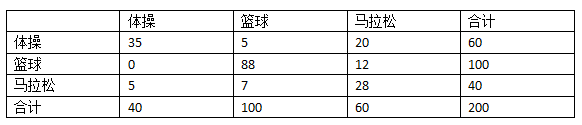

我增加了“合计”一列，因此在计算正确率时，我们只需将对角线相加（35 + 88 + 28 = 151）除以合计（200）就可以了，结果是0.755。

现在，我们建造另一个混淆矩阵，用来表示随机分类的结果。首先，我们将上表中的数据抹去一部分，只留下合计：


从最后一行可以看到，我们之前构造的分类器将50%的运动员分类到篮球运动员中（200中的100人），20%分到了体操，剩余30%分到了马拉松。即：

* 体操 20%
* 篮球 50%
* 田径 30%

我们会用这个百分比来构造随机分类器的混淆矩阵。比如，真实的体操运动员一共有60人，随机分类器会将其中的20%（12人）分类为体操，50%（30人）分类为篮球，30%（18人）分类为马拉松，填入表格：

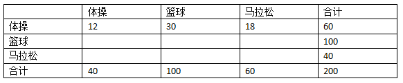

继续用这种方法填充空白。100个真实的篮球运动员，20%（20人）分到体操，50%（50人）分到篮球，30%（30人）分到马拉松。


从而得到随机分类器的准确率是：

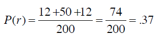

Kappa指标可以用来衡量我们之前构造的分类器和随机分类器的差异，公式为：

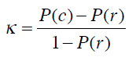

P(c)表示分类器的准确率，P(r)表示随机分类器的准确率。将之前的结果代入公式：

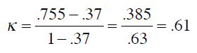

0.61要如何解释呢？可以参考下列经验结果：

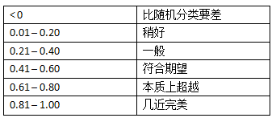

*来源：Landis, JR, Koch, GG. 1977 分类效果评估 生物测量学*

**动手实践**

假设我们开发了一个效果不太好的分类器，用来判断600名大学生所读专业，使用的数据是他们对10部电影的评价。这些大学生的专业类别有计算机科学（cs）、教育学（ed）、英语（eng）、心理学（psych）。以下是该分类器的混淆矩阵，尝试计算出它的Kappa指标并予以解释。

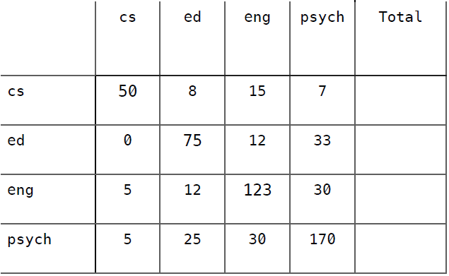

准确率 = 0.697

**解答**

首先，计算列合计和百分比：

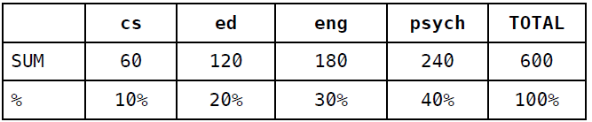

然后根据百分比来填充随机分类器的混淆矩阵：

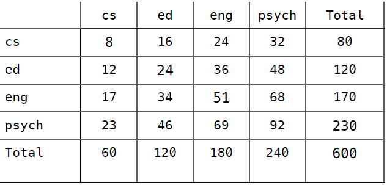

准确率 = (8 + 24 + 51 + 92) / 600 = (175 / 600) = 0.292

最后，计算Kappa指标：


这说明分类器的效果还是要好过预期的。


## 优化近邻算法

有一种分类器叫“机械记忆分类器（Rote Classifer）”，它会将数据集完整地保存下来，并用来判断某条记录是否存在于数据集中。所以，如果我们只对数据集中的数据进行分类，准确率将是100%。而在现实应用中，这种分类器并不可用，因为我们需要判定某条新的记录属于哪个分类。你可以认为我们上一章中构建的分类器是机械记忆分类器的一种扩展，只是我们不要求新的记录完全对应到数据集中的某一条记录，只要距离最近就可以了。PangNing Tan等人在其机器学习的教科书中写过这样一段话：如果一只动物走起来像鸭子、叫起来像鸭子、而且看起来也像鸭子，那它很有可能就是一只鸭子。


近邻算法的问题之一是异常数据。还是拿运动员分类举例，不过只看体操和马拉松。假设有一个比较矮也比较轻的人，她是马拉松运动员，这样就会形成以下这张图，横轴是体重，纵轴是身高，其中m表示马拉松，g表示体操：

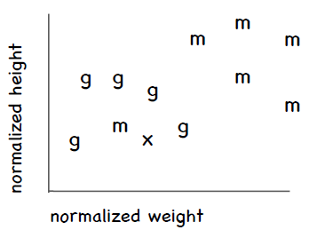

可以看到这名特别的马拉松运动员处于体操运动员的群组中。假设我们要对一名新的运动员进行分类，用图中的x表示，可以看到离她最近的运动员是那名特别的马拉松运动员，这样一来这名新的运动员就会被归到马拉松，但实际上她更有可能是一名体操运动员。

### kNN算法

优化方法之一是考察这条新记录周围距离最近的k条记录，而不是只看一条，因此这种方法称为k近邻算法（kNN）。每个近邻都有投票权，程序会将新记录判定为得票数最多的分类。比如说，我们使用三个近邻（k = 3），其中两条记录属于体操，一条记录属于马拉松，那我们会判定x为体操。

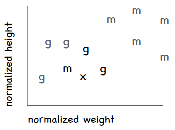


因此，我们在判定一条记录的具体分类时可以用这种投票的方法。如果两个分类的票数相等，就随机选取一个。但对于需要预测具体数值的情形，比如一个人对Funky Meters乐队的评分，我们可以计算k个近邻的距离加权平均值。举个例子，我们需要预测Ben对Funky Meters的喜好程度，他的三个近邻分别是Sally、Tara、和Jade。下表是这三个人离Ben的距离，以及他们对Funky Meters的评分：

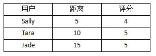

可以看到，Sally离Ben最近，她给Funky Meters的评分是4。在计算平均值的时候，我希望距离越近的用户影响越大，因此可以对距离取倒数，从而得到下表：

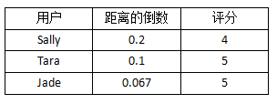

下面，我们把所有的距离倒数除以距离倒数的和（0.2 + 0.1 + 0.067 = 0.367），从而得到评分的权重：

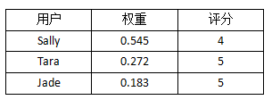

我们可以注意到两件事情：权重之和是1；原始数据中，Sally的距离是Tara的二分之一，这点在权重中体现出来了。最后，我们求得平均值，也即预测Ben对Funky Meters的评分：

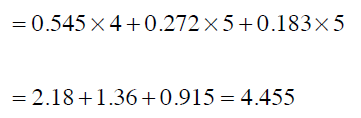

**动手实践**

我们想要预测Sofia对爵士钢琴手Hiromi的评分，以下是她三个近邻的距离和评分：

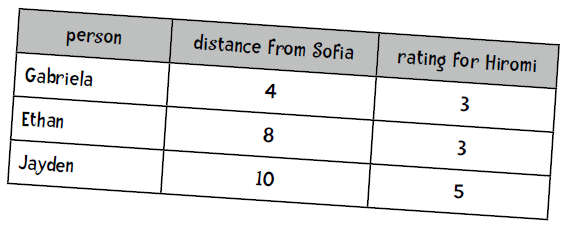

**解答**

第一步，计算距离的倒数：

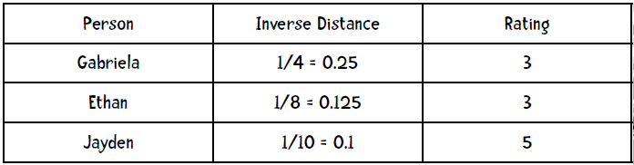

第二步，计算权重（距离倒数之和为0.475）：

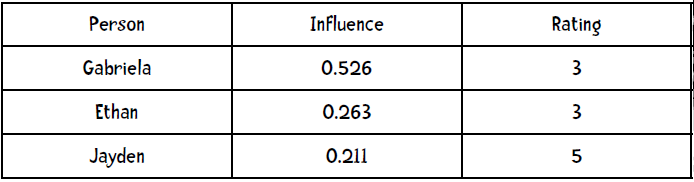

第三步，预测评分：

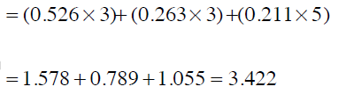

## 新的数据集，新的挑战！

是时候使用新的数据集了——比马印第安人糖尿病数据集，由美国国家糖尿病、消化和肾脏疾病研究所提供。


令人惊讶的是，超过30%的比马人患有糖尿病，而全美的糖尿病患者比例是8.3%，中国只有4.2%。

数据集中的一条记录代表一名21岁以上的比马女性，她们分类两类：五年内查出患有糖尿病，以及没有得病。共选取了8个特征：

1. 怀孕次数；
2. 口服葡萄糖耐量实验两小时后的血浆葡萄糖浓度；
3. 舒张压（mm Hg）；
4. 三头肌皮褶厚度（mm）；
5. 血清胰岛素（mu U/ml）；
6. 身体质量指数（BMI）：体重（公斤）除以身高（米）的平方；
7. 糖尿病家谱；
8. 年龄（岁）。

以下是示例数据，最后一列的0表示没有糖尿病，1表示患有糖尿病：

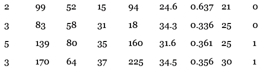

比如说，第一条记录表示一名生过两次小孩的女性，她的血糖浓度是99，舒张压是52，等等。


**实践[1]**

本书提供了两份数据集：[pimaSmall.zip](code/chapter-5/pimaSmall.zip)和[pima.zip](code/chapter-5/pima.zip)。前者包含100条记录，后者包含393条记录，都已经等分成了10个文件（10个桶）。我用前面实现的近邻算法计算了pimaSmall数据集，得到的结果如下：

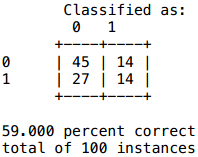

*提示：代码中的heapq.nsmallest(n, list)会返回n个最小的项。[heapq](https://docs.python.org/2/library/heapq.html)是Python内置的优先队列类库。*

你的任务是实现kNN算法。首先在类的init函数中添加参数k：

```python
def __init__(self, bucketPrefix, testBucketNumber, dataFormat, k):
```

knn函数的签名应该是：

```python
def knn(self, itemVector):
```

它会使用到`self.k`（记得在init函数中保存这个值），它的返回值是0或1。此外，在进行十折交叉验证（tenFold函数）时也要传入k参数。

**解答**

init函数的修改很简单：

```python
def __init__(self, bucketPrefix, testBucketNumber, dataFormat, k):
    self.k = k
    ...
```

knn函数的实现是：

```python
def knn(self, itemVector):
    """使用kNN算法判断itemVector所属类别"""
    # 使用heapq.nsmallest来获得k个近邻
    neighbors = heapq.nsmallest(self.k,
                                [(self.manhattan(itemVector, item[1]), item)
                                 for item in self.data])
    # 每个近邻都有投票权
    results = {}
    for neighbor in neighbors: 
        theClass = neighbor[1][0]
        results.setdefault(theClass, 0)
        results[theClass] += 1
    resultList = sorted([(i[1], i[0]) for i in results.items()], reverse=True)
    # 获取得票最高的分类
    maxVotes = resultList[0][0]
    possibleAnswers = [i[1] for i in resultList if i[0] == maxVotes]
    # 若得票相等则随机选取一个
    answer = random.choice(possibleAnswers)
    return(answer)
```

对tenFold函数的改动如下：

```python
def tenfold(bucketPrefix, dataFormat, k):
    results = {}
    for i in range(1, 11):
        c = Classifier(bucketPrefix, i, dataFormat, k)
        ...
```

你可以从网站上[下载这些代码](code/chapter-5/pimaKNN.py)，不过我的代码并不一定是最优的，仅供参考。

**实践[2]**

在分类效果上，究竟是数据量的多少比较重要（即使用pimaSmall和pima数据集的效果），还是更好的算法比较重要（k=1和k=3）？

**解答**

以下是比较结果：

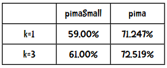

看来增加数据量要比使用更好的算法带来的效果好。


**实践[3]**

72.519%的准确率看起来不错，但还是用Kappa指数来检验一下吧：

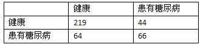

**解答**

计算合计和比例：

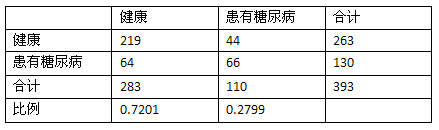

随机分类器的混淆矩阵：

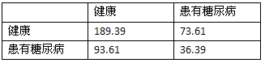

随机分类器的正确率：

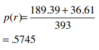

Kappa指标：

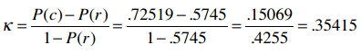

**效果一般**

### 更多数据，更好的算法，还有抛锚的巴士


几年前我去参加一个墨西哥城的研讨会，比较特别的是会议的第二天是坐观光巴士旅游，观看黑脉金斑蝶等。这辆巴士比较破旧，中途抛锚了好几次，所以我们一群有着博士学位的人就站在路边一边谈笑，一边等着司机修理巴士。而事实证明这段经历是这次会议最大的收获。其间，我有幸与Eric Brill做了交流，他在词性分类方面有着很高的成就，他的算法比前人要优秀很多，从而使他成为自然语言处理界的名人。我和他谈论了分类器的效果问题，他说实验证明增加数据所带来的效果要比改进算法来得大。事实上，如果仍沿用老的词性分类算法，而仅仅增加训练集的数据量，效果很有可能比他现有的算法更好。当然，他不可能通过收集更多的数据来获得一个博士学位，但如果如果你的算法能够取得哪怕一点点改进，也足够了。

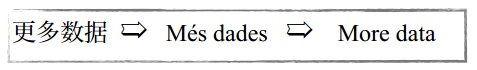

当然，这并不是说你就不需要挑选出更好的算法了，我们之前也看到了好的算法所带来的效果也是惊人的。但是如果你只是想解决一个问题，而非发表一篇论文，那增加数据量会更经济一些。

所以，在认同数据量多寡的重要影响后，我们仍将继续学习各种算法。

**人们使用kNN算法来做以下事情：**

* 在亚马逊上推荐商品
* 评估用户的信用
* 通过图像分析来分类路虎车型
* 人像识别
* 分析照片中人物的性别
* 推荐网页
* 推荐旅游套餐
