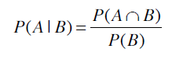
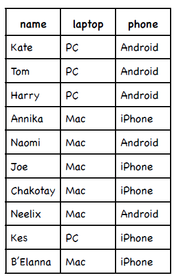
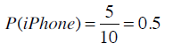
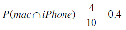
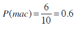
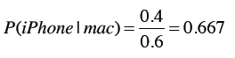
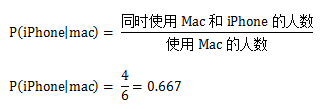
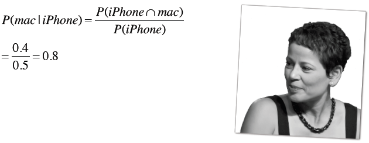

## 朴素贝叶斯

还是让我们回到运动员的例子。如果我问你Brittney Griner的运动项目是什么，她有6尺8寸高，207磅重，你会说“篮球”；我再问你对此分类的准确度有多少信心，你会回答“非常有信心”。

我再问你Heather Zurich，6尺1寸高，重176磅，你可能就不能确定地说她是打篮球的了，至少不会像之前判定Brittney那样肯定。因为从Heather的身高体重来看她也有可能是跑马拉松的。

最后，我再问你Yumiko Hara的运动项目，她5尺4寸高，95磅重，你也许会说她是跳体操的，但也不太敢肯定，因为有些马拉松运动员也是类似的身高体重。

使用近邻算法时，我们很难对分类结果的置信度进行量化。但如果使用的是基于概率的分类算法——贝叶斯算法——那就可以给出分类结果的可能性了：这名运动员有80%的几率是篮球运动员；这位病人有40%的几率患有糖尿病；拉斯克鲁塞斯24小时内有雨的概率是10%。

近邻算法又称为**被动学习**算法。这种算法只是将训练集的数据保存起来，在收到测试数据时才会进行计算。如果我们有10万首音乐，那每进行一次分类，都需要遍历这10万条记录才行。

贝叶斯算法则是一种**主动学习**算法。它会根据训练集构建起一个模型，并用这个模型来对新的记录进行分类，因此速度会快很多。

所以说，贝叶斯算法的两个优点即：能够给出分类结果的置信度；以及它是一种主动学习算法。

### 概率

相信大多数人对概率并不陌生。比如投掷一个硬币，正面出现的概率是50%；掷骰子，出现1点的概率是16.7%；从一群19岁的青少年中随机挑出一个，让你说出她是女生的可能性，你会回答50%。

以上这些我们用符号P(h)来表示，即事件h发生的概率：

* 投掷硬币：P(正面) = 0.5
* 掷骰子：P(1) = 1/6
* 青少年：P(女生) = 0.5

如果我再告诉你一些额外的信息，比如这群19岁的青少年都是弗兰科学院建筑专业的学生，于是你到Google上搜索后发现这所大学的女生占86%，这时你就会改变你的答案——女生的可能性是86%。

这一情形我们用P(h|D)来表示，即D条件下事件h发生的概率。比如：

P(女生|弗兰克学院的学生) = 0.86

计算的公式是：

再举一个例子，下表是一些人使用笔记本电脑和手机的品牌：

使用iPhone的概率是多少？

如果已知这个人使用的是Mac笔记本，那他使用iPhone的概率是？

首先计算出同时使用Mac和iPhone的概率：

使用Mac的概率则是：

从而计算得到Mac用户中使用iPhone的概率：

以上是正规的解法，不过为了简单起见，我们可以直接通过计数得到：

**练习**

iPhone用户中使用Mac的概率是？

**术语**

P(h)表示事件h发生的概率，称为h的**先验概率**。在我们进行任何计算之前就已经得知人们使用Mac的概率是0.6。计算之后我们可能会得知使用Mac的人同时会使用iPhone。

P(h|d)称为**后验概率**，表示在观察了数据集d之后，h事件发生的概率是多少。比如说，我们在观察了使用iPhone的用户后可以得出他们使用Mac的概率是多少。后验概率又称为**条件概率**。

在构建一个贝叶斯分类器前，我们还需要两个概率：P(D)和P(D|h)，请看下面的示例。

