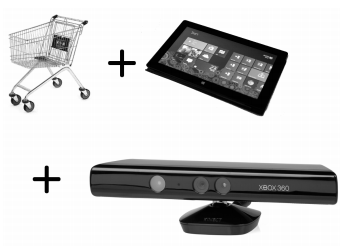
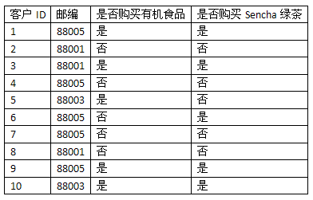
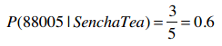
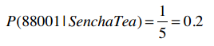
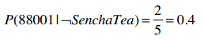

## 微软购物车

你听说过微软的智能购物车吗？没错，他们真有这样的产品。这个产品是微软和一个名为Chaotic Moon的公司合作开发的。

这家公司的标语是“我们比你聪明，我们比你有创造力。”你可以会觉得这样的标语有些狂妄自大，这里暂且不谈。

这种购物车由以下几个部分组成：Windows 8平板电脑、Kinect体感设备、蓝牙耳机（购物车可以和你说话）、以及电动装置（购物车可以跟着你走）。

你走进一家超市，持有一张会员卡，智能购物车会识别出你，它会记录你的购物记录（当然也包括其他人的）。

智能购物车也会显示广告（比如日本的Sensha绿茶），不过它只会向那些有可能购买此物品的用户进行展示。

以下是一些数据示例：

**P(D)**表示从训练集数据中计算得到的概率，比如上表中邮编为88005的概率是：

P(88005) = 0.5

**P(D|h)**表示在一定条件下的观察结果。比如说购买过Sencha绿茶的人中邮编为88005的概率为：

**练习**

没有买Sencha的人中邮编为88005的概率是？

*上式中的“┐”表示取反*

邮编为88001的概率是？

P(88001) = 0.3

购买了Sencha的人中邮编为88001的概率？

没有购买Sencha的人中邮编为88001的概率？

