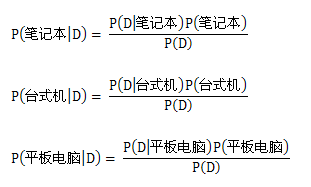
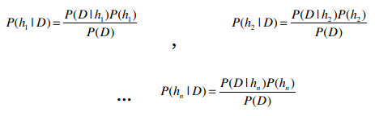
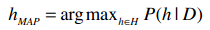
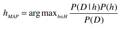
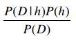
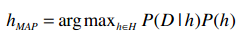
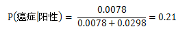
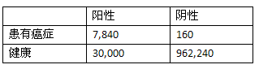

## 贝叶斯法则

贝叶斯法则描述了P(h)、P(h|D)、P(D)、以及P(D|h)这四个概率之间的关系：

这个公式是贝叶斯方法论的基石。在数据挖掘中，我们通常会使用这个公式去判别不同事件之间的关系。

我们可以计算得到在某些条件下这位运动员是从事体操、马拉松、还是篮球项目的；也可以计算得到某些条件下这位客户是否会购买Sencha绿茶等。我们会通过计算不同事件的概率来得出结论。

比如说我们要决定是否给一位客户展示Sencha绿茶的广告，已知他所在的地区邮编是88005。我们有两个相反的假设：

* 这位用户会购买Sencha绿茶的概率，即：P(购买|88005)；
* 不会购买的概率：P(┐购买|88005)。

假设我们计算得到P(购买|88005) = 0.6，而P(┐购买|88005) = 0.4，则可以认为用户会购买，从而显示相应的广告。

再比如我们要为一家销售电子产品的公司发送宣传邮件，共有笔记本、台式机、平板电脑三种产品。我们需要根据目标用户的类型来分别派送这三种宣传邮件。

比如我们有一位居住在88005地区的女士，她的女儿在读大学，并居住在家中，而且她还会参加瑜伽课程。那我应该派发哪种邮件呢？

让我们用D来表示这位客户的特征：

* 居住在88005地区
* 有一个正在读大学的女儿
* 练习瑜伽

因此我们需要计算以下三个概率：

并选择概率最大的结果。

再抽象一点，如果我们有h1, h2, ...hn等事件，它们就相当于不同的类别（篮球、体操、或是有没有患糖尿病等）。

在计算出以上这些概率后，选取最大的结果，就能用作分类了。这种方法叫最大后验估计，记为hMAP。

我们可以用以下公式来表示最大后验估计：

H表示所有的事件，所以h∈H表示“对于集合中的每一个事件”。整个公式的含义就是：对于集合中的每一个事件，计算出P(h|D)的值，并取最大的结果。

使用贝叶斯法则进行替换：

所以我们需要计算的就是以下这个部分：

可以发现对于所有的事件，公式中的分母都是P(D)，因此即便只计算P(D|h)P(h)，也可以判断出最大的结果。那么这个公式就可以简化为：

作为演示，我们选取Tom M. Mitchell《机器学习》中的例子。Tom是卡耐基梅隆大学机器学习部的首席，也是非常友好的一个人。

这个例子是通过一次血液检验来判断某人是否患有某种癌症。已知这种癌症在美国的感染率是0.8%。血液检验的结果有阳性和阴性两种，且存在准确性的问题：如果这个人患有癌症，则有98%的几率测出阳性；如果他没有癌症，会有97%的几率测出阴性。

我们来尝试将这些描述语言用公式来表示：

* 美国有0.8%的人患有这种癌症：P(癌症) = 0.008
* 99.2%的人没有患有这种癌症：P(┐癌症) = 0.992
* 对于患有癌症的人，他的血液检测结果返回阳性的概率是98%：P(阳性|癌症) = 0.98
* 对于患有癌症的人，检测结果返回阴性的概率是2%：P(阴性|癌症) = 0.02
* 对于没有癌症的人，返回阴性的概率是97%：P(阴性|┐癌症) = 0.97
* 对于没有癌症的人，返回阳性的概率是3%：P(阳性|┐癌症) = 0.03

Ann到医院做了血液检测，呈阳性。初看结果并不乐观，毕竟这种血液检测的准确率高达98%。那让我们用贝叶斯法则来计算看看：

* P(阳性|癌症)P(癌症) = 0.98 * 0.008 = 0.0078
* P(阳性|┐癌症)P(┐癌症) = 0.03 * 0.992 = 0.0298

分类的结果是她不会患有癌症。

如果想得到确切的概率，我们可以使用标准化的方法：

可以看到，血液检测为阳性的人患有这种癌症的概率是21%。

可能你会觉得这并不合情理，毕竟血液检测的准确率有98%，而结果却说Ann很可能并没有这种癌症。事实上，很多人都会有这样的 疑问。

我来说明一下为什么会是这样的结果。很多人只看到了血液检测的准确率是98%，但没有考虑到全美只有0.8%的人患有这种癌症。

假设我们给一个有着一百万人口的城市做血液检测，也就是说其中有8,000人患有癌症，992,000人没有。首先，对于那8,000个癌症病人，有7,840个人的血液检测结果会呈阳性，160人会呈阴性。

对于992,000人，有962,240人会呈阴性，30,000人呈阳性。将这些数字总结到下表中：

Ann的测试结果呈阳性，从上表看阳性中有30,000人其实是健康的，只有7,840人确实患有癌症，所以我们才会认为Ann很有可能是健康的。

> 还是没弄明白？没关系，在接触了更多练习后就会慢慢理解了。

