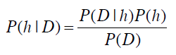
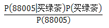

## 为什么我们需要贝叶斯法则？

首先回顾一下贝叶斯公式：

再看看微软购物车的数据：

比如，我们为居住在邮编为88005地区的客户设置两个事件：买或不买Sencha绿茶，即：

P(h1|D) = P(买绿茶|88005)

P(h2|D) = P(┐买绿茶|88005)

你也许会问，这两个概率我们都可以直接从数据中计算得到，为什么还要计算下面这个公式呢？

那是因为在现实问题中要计算P(h|D)往往是很困难的。

以上一节中的医学示例来说，我们想要根据血液测试结果来判断该人是否患有癌症：

P(癌症|阳性) ≈ P(阳性|癌症)P(癌症)

P(┐癌症|阳性) ≈ P(阳性|┐癌症)P(┐癌症)

上面两个式子中，我们更容易计算约等号右边的结果。

比如，要计算P(阳性|癌症)，我们可以对一部分已经确诊有癌症的人做血液测试；计算P(阳性|┐癌症)时则可对确定健康的人做测试。

而P(癌症)则可直接从政府公布的官方数据中获得，P(┐癌症)更是简单的1 - P(癌症)。

但若要计算P(癌症|阳性）的话就非常有挑战性了，也就是计算出整个人群中血液测试结果呈阳性且确诊为癌症患者的概率。

如果采用抽样法，对1000个人进行抽样测试，只有8个人患有这种癌症，这样得出的结果显然不具有代表性，除非进一步加大抽样数量。而贝叶斯法则提供了更为简便的方法。

### 朴素贝叶斯

很多时候我们会用到不止一个前提条件，比如判断一个人是否会购买Sencha绿茶时可以用到顾客所在地以及是否买过有机食品这两个条件。计算这样的概率时只需将各个条件概率相乘即可：

P(买绿茶|88005 & 买有机食品) = P(88005|买绿茶)P(买有机食品|买绿茶)P(买绿茶) = 0.6 * 0.8 * 0.5 = 0.24

P(┐买绿茶|88005 & 买有机食品) = P(88005|┐买绿茶)P(买有机食品|┐买绿茶)P(┐买绿茶) = 0.4 * 0.25 * 0.5 = 0.05

所以得到的结论是居住在88005地区且买过有机食品的客户更有可能购买Sencha绿茶。这样就让我们在智能购物车上显示广告吧！

以下是史提芬贝克对智能购物车的评价：

> 这种购物车的使用体验是：你取走一辆购物车，刷了会员卡，屏幕上会显示一份购物列表，里面的内容都是基于你平时的购物习惯进行推荐的，牛奶、鸡蛋、西葫芦等等。
> 智能系统会提示出购买这些物品的最佳路径。另外，它还允许你修改列表中的商品，比如你可以让它不要再提示菜花和盐焗花生。
> Accenture的研究表明，人们在购物时会忘记11%的原本打算购买的商品，如果有了这样的智能购物车，就可以省去客户的来回路程，也能为超市增加销量。

