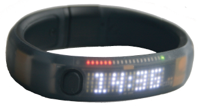
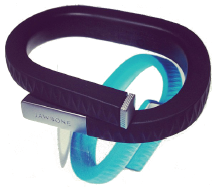
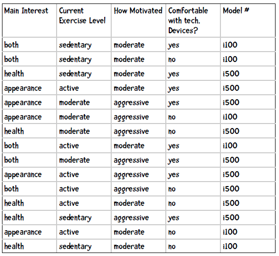

## i100、i500健康手环

现在我们要为iHealth公司销售健康手环产品，从而和Nike Fuel、Fitbit Flex竞争。iHealth新出产了两件商品：i100和i500：



**iHealth 100**

能够监测心率，使用GPS导航（从而计算每小时运动公里数等），带WiFi无线，可随时上传数据到iHealth网站上。



**iHealth 500**

除了提供i100的功能外，还能监测血液含氧量等指标，且提供免费的3G网络连接到iHealth网站。

这些产品通过网络平台销售，所以iHealth雇佣我们开发一套推荐系统。我通过让购买的用户填写调查问卷来收集数据，每个问题都对应一个特征。比如，我们会问客户为什么要开始运动，有三个选项：健康（health）、外表（appearance）、两者皆是（both）；我们会问他目前的运动水平：很少运动（sedentary）、一般（moderate）、经常运动（active）；我们会问他对健身的热情是高（aggressive）还是一般（moderate）；最后，我们会问他是否适应使用高科技产品。整理后的数据如下：



**实践**

已知一位客户的运动目的是健康、当前水平是中等、热情一般、能适应高科技产品，请用朴素贝叶斯来推荐手环型号。

我们需要计算以下两个概率，并选取较大的结果：

```
P(i100|健康，中等水平、热情一般，适应）
P(i500|健康，中等水平，热情一般，适应）
```

我们先来看第一个概率：

```
P(i100|健康，中等水平、热情一般，适应） = P(健康|i100)P(中等水平|i100)P(热情一般|i100)P(适应|i100)
```

其中：

```
P(健康|i100) = 1/6
P(中等水平|i100) = 1/6
P(热情一般|i100) = 5/6
P(适应|i100) = 2/6
P(i100) = 6/15
```

因此：

```
P(i100|满足条件) = 0.167 * 0.167 * 0.833 * 0.333 * 0.4 = 0.00309
```

再计算另一个模型的概率：

```
P(i500|满足条件) = P(健康|i500)P(中等水平|i500)P(热情一般|i500)P(适应|i500)
    = 4/9 * 3/9 * 3/9 * 6/9 * 9/15
    = 0.444 * 0.333 * 0.333 * 0.667 * 0.6
    = 0.01975
```

