## 共和党还是民主党

我们来看另一个数据集——美国国会投票数据，可以从 [机器学习仓库](http://archive.ics.uci.edu/ml/index.html) 获得。

每条记录代表一个选民，第一列是分类名称（democrat, republican），之后是16条法案，用y和n表示该人是否支持。

1. 残疾婴儿法案
2. 用水成本分摊
3. 预算改革
4. 医疗费用
5. 萨瓦尔多援助
6. 校园宗教组织
7. 反卫星武器
8. 尼加拉瓜援助
9. MX导弹
10. 移民法案
11. 合成燃料缩减
12. 教育支出法案
13. 有毒废物基金
14. 犯罪
15. 出口免税
16. 南非出口管控

文件格式如下：

```
democrat  y n y n n y y y y y n n y n n y
democrat  y y y n n y y y y n n n n n y y
republican  y y n y y y n n n y n y y y n n
```

在调用上一节编写的朴素贝叶斯分类器时使用以下dataFormat参数就可以了：

```python
"class\tattr\tattr\tattr\tattr\tattr\tattr\tattr\tattr\tattr\tattr\tattr\tattr\tattr\tattr\tattr\tattr"
```

十折交叉验证的结果是：

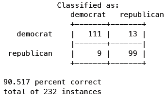

看起来不错。

**但是，这个方法有一些问题。**


首先我们来模拟一个数据集，其中包含100个民主党派和100个共和党派。下表是他们对四个法案的投票情况：

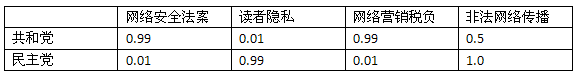

从表中可以看到，共和党人中，99%赞成网络安全法案，只有1%的人赞成读者隐私。下面我们再选取一位议会代表——X先生，对他进行分类：

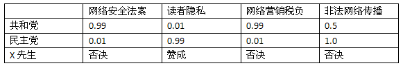

*你觉得X先生是民主党还是共和党呢？*


我会猜测民主党。我们用朴素贝叶斯来进行分类。首先，先验概率P(民主党)和P(共和党)都是0.5，因为样本中两党分别有100人。X先生对网络安全法案投了否决票，并且：

```
P(共和党|C=no) = 0.01
P(民主党|C=no) = 0.99
```

为了表示方便，我们用字母来表示这四个法案：

1. 网络安全：C
2. 读者隐私：R
3. 网销税负：T
4. 非法传播：S

记到表格里就是：

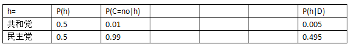

我们将X先生对读者隐私和网络营销税负法案的投票记到表格中：

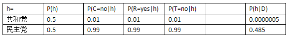

对这些概率进行标准化后可以得到：

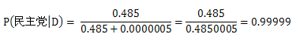

也就是说到目前为止我们有99.99%的信心认为X先生是民主党的。

最后，我们将X先生对非法传播法案的投票记入表格：

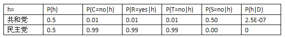

你会惊讶地发现，X先生是民主党的可能性从99%降至0了！这是因为我们的数据集中没有一个民主党人对网络非法传播法案投了否决票。

### 概率估计

使用朴素贝叶斯计算得到的概率其实是真实概率的一种**估计**，而真实概率是对全量数据做统计得到的。

比如说，我们需要对所有人都做血液测试，才能得到健康人返回阴性结果的真实概率。显然，对全量数据做统计是不现实的，所以我们会选取一个样本，如1000人，对他们进行测试并计算概率。

大部分情况下，这种估计都是接近于真实概率的。但当真实概率非常小时，这种抽样统计的做法就会有问题了。

比如说，民主党对网络非法传播法案的否决率是0.03，即P(S=no|民主党) = 0.03。如果我们分别选取十个民主党和共和党人，看他们对该法案的投票情况，你觉得得到的概率会是什么？答案很可能是0。

从上一节的例子中也看到了，在朴素贝叶斯中，概率为0的影响是很大的，甚至会不顾其他概率的大小。此外，抽样统计的另一个问题是会低估真实概率。

### 如何解决

我们计算P(S=no|民主党)的公式是这样的：

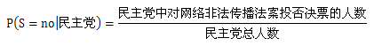

为了表示方便，我们采用以下公式：

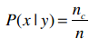

其中，n表示训练集中y类别的记录数；n<sub>c</sub>表示y类别中值为x的记录数。

我们的问题是上式中的n<sub>c</sub>可能为0，解决方法是将公式变为以下形式：

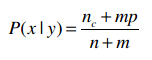

*这个公式摘自Tom Mitchell《机器学习》的第179页。*

m是一个常数，表示等效样本大小。决定常数m的方法有很多，我们这里使用值的类别来作为m，比如投票有赞成和否决两种类别，所以m就为2。p则是相应的先验概率，比如说赞成和否决的概率分别是0.5，那p就是0.5。

我们回到上面的例子，看看要如何应用这个方法。下表是投票的情况：

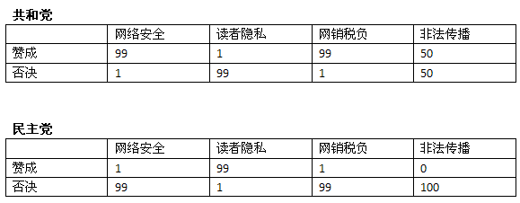

X先生对网络安全法案投了否决票，我们先来计算共和党对安全法案投否决票的概率。新的公式是：


其中n是共和党的人数100，n<sub>c</sub>是共和党对安全法案投否决票的人数1，m是2，p是0.5，因此：

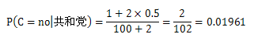

再计算民主党：

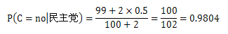

代入之前用到的表格中：

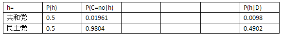

对剩余三条法案进行计算，得到的结果是：

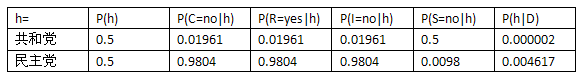

因此，X先生的党派是民主党，这和我们的直觉一致。

### 一点说明

在这个例子中，所有公式里的m都是2，但这并不表示其他数据集也是这样。比如我们之前做的健康手环问卷调查，运动目的有三个选项，是否适应高科技则有两个选项，所以在计算运动目的概率时m=3、p=1/3，代入公式即：

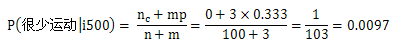
