##  数值型数据

你可能已经注意到，在讨论近邻算法时，我们使用的都是数值型的数据，而在学习朴素贝叶斯算法时，用的是分类型的数据。比如，人们对法案的投票有赞成和否决两类；音乐家可以用他们演奏的乐器来分类等等。这些分类之间是没有距离的，萨克斯手和钢琴家的距离并不会比鼓手近。而数值型数据则有这种远近之分。

在贝叶斯方法中，我们会对事物进行计数，这种计数则是可以度量的。对于数值型的数据要如何计数呢？通常有两种做法：

### 方法一：区分类别

我们可以划定几个范围作为分类，如：

* 年龄
    * < 18
    * 18 - 22
    * 23 - 30
    * 31 - 40
    * > 40
* 年薪
    * > $200,000
    * 150,000 - 200,000
    * 100,000 - 150,000
    * 60,000 - 100,000
    * 40,000 - 60,000

划分类别后，进行可以应用朴素贝叶斯方法了。

### 方法二：高斯分布


> 我想将收入数据进行分类，然后应用朴素贝叶斯算法。

> 你的做法已经过时了，我会使用高斯分布和概率密度函数来做。

高斯分布和概率密度函数这两个词听起来很酷，他们的作用也非常大。下面我们将学习如何在朴素贝叶斯算法中使用高斯分布。

首先，我们为健康手环的例子增加一列收入属性：

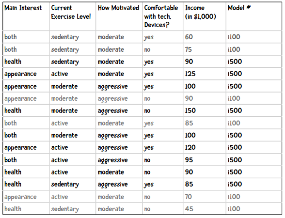

我们来看购买i500的用户的收入情况，比如取平均值：

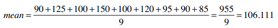

还可以求出标准差：

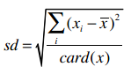

标准差是用来衡量数据的离散程度的，如果所有数据都接近于平均值，那标准差也会比较小。通过公式我们可以计算得到i500用户的收入标准差是20.108。

### 总体标准差和样本标准差

上面的标准差公式是总体标准差，我们需要对所有的数据进行统计才能得出，比如统计500名学生的成绩，就能计算出总体标准差。但通常我们无法获取总体的数据，比如要统计新墨西哥北部鹿鼠的重量，我们不可能对所有的鹿鼠进行称重，只能选取一部分样本，这时计算得到的就是样本标准差。


样本标准差的公式是：

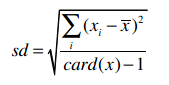

所以计算得到i500用户收入的样本标准差是21.327。下面的内容都会使用样本标准差。

你可能听说过正态分布、钟型曲线、高斯分布等术语，他们指的是同一件事：68%的数据会落在标准差为1的范围内，95%的数据会落在标准差为2的范围内：

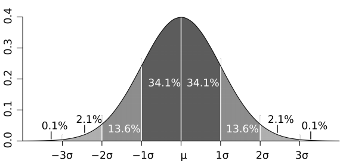

在我们的示例中，平均值是106.111，样本标准差是21.327，因此购买i500的用户中有95%的人收入在42,660美元至149,770美元之间。如果我问你P(100k|i500)的概率有多大，你可以回答非常大；如果问你P(20k|i500)的概率有多大，你可以回答基本不可能。

用公式来表示是：

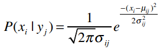


> 每次出现这些公式时我都想提醒读者千万不要紧张，其实他们只是看起来比较复杂，只需一步一步拆解开就能理解了。数据挖掘学到后面会遇到各种复杂的公式，千万不要被他们的外表吓到。

让我们逐步拆解这个公式。假设我们要计算P(100k|i500)的概率，即购买i500的用户中收入是100,000美元的概率。之前我们计算过购买i500的用户平均收入以及样本标准差，我们用希腊字母μ（读“谬”）来表示平均值，σ（读“西格玛”）来表示标准差。

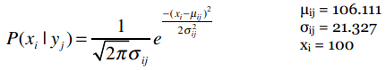

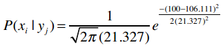

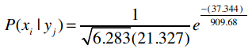

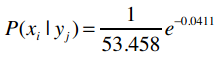

e是自然常数，约等于2.718。

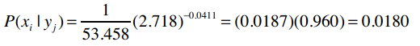

**练习**

下表中列出了加仑公里数为35的车型的马力（HP），现在我想知道同样是35加仑公里的Datsun 280z马力为132的概率。

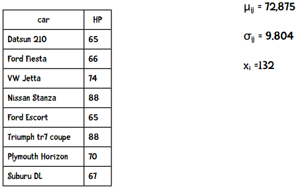

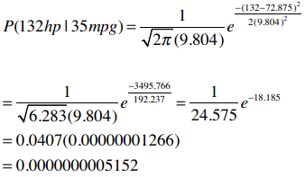

结果表明这个概率非常低，而事实上这辆车就是132马力。

### 代码实现提示

在训练朴素贝叶斯分类器时，可以讲所有属性的平均值和样本标准差计算出来，而分类阶段使用下面这段代码就能实现了：

```python
import math

def pdf(mean, ssd, x):
    """概率密度函数，计算P(x|y)"""
    ePart = math.pow(math.e, -(x - mean) ** 2 / (2 * ssd ** 2))
    return (1.0 / (math.sqrt(2 * math.pi) * ssd)) * ePart
```

测试一下：

```python
>>> pdf(106.111, 21.327, 100)
0.017953602706962717
>>> pdf(72.875, 9.804, 132)
5.152283971078022e-10
```


> 休息一下吧
