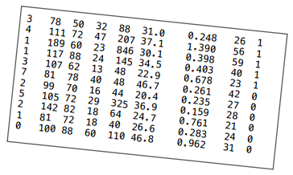
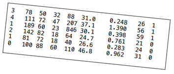
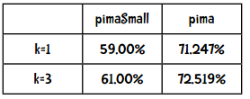
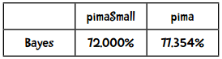
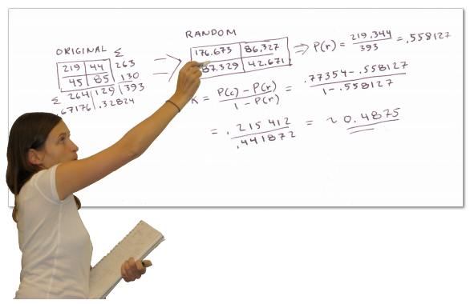
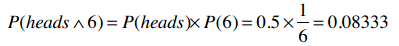
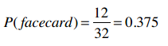
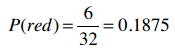
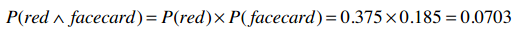

## 使用Python实现

### 训练阶段

朴素贝叶斯需要用到先验概率和条件概率。让我们回顾一下民主党和共和党的例子：先验概率指的是我们已经掌握的概率，比如美国议会中有233名共和党人，200名民主党人，那共和党人出现的概率就是：

P(共和党) = 233 / 433 = 0.54

我们用P(h)来表示先验概率。而条件概率P(h|D)则表示在已知D的情况下，事件h出现的概率。比如说P(民主党|法案1=yes)。朴素贝叶斯公式中，我们计算的是P(D|h)，如P(法案1=yes|民主党)。

在之前的Python代码中，我们用字典来表示这些概率：

```python
{'democrat': {'bill 1': {'yes': 0.333, 'no': 0.667},
              'bill 2': {'yes': 0.778, 'moderate': 0.222}},
 'republican': {'bill 1': {'yes': 0.811, 'no': 0.189},
                'bill 2': {'yes': 0.250, 'no': 0.750}}}
```

所以民主党中对法案1投赞成票的概率是：P(bill 1=yes|民主党) = 0.667。

对于分类型的数据，我们用上面的方法来保存概率，而对连续性的数据，我们要使用概率密度函数，因此需要保存平均值和样本标准差。如：

```python
mean = {'democrat': {'age': 57, 'years served': 12},
        'republican': {'age': 53, 'years served': 7}}
ssd = {'democrat': {'age': 7, 'years served': 3},
       'republican': {'age': 5, 'years served': 5}}
```

和之前一样，数据文件中的每一行表示一条记录，不同的特征值使用制表符分隔，比如下面是比马印第安人糖尿病的数据：



前八列是特征，最后一列是分类（1-患病，0-健康）。

我们同样需要一个格式字符串来表示每一行记录：

* `attr`表示这一列是分类型的特征
* `num` 表示这一列是数值型的特征
* `class` 表示这一列是分类

对于比马数据集，格式化字符串是：

```python
"num    num    num    num    num    num    num    num    class"
```

我们需要一个数据结构来存储平均值和样本标准差，看下面这几行数据：



为计算每一个分类的平均值，我们需要保存合计值，可以用字典来实现：

```python
totals = {'1': {1: 8, 2: 378, 3: 182, 4: 102, 5: 1141,
                6: 98.2, 7: 2.036, 8: 141},
          '0': {1: 3, 2: 323, 3: 242, 4: 96, 5: 214,
                6: 98.1, 7: 2.006, 8: 76}}
```

对于分类1，第一列的合计是8（3 + 4 + 1），第二列的合计是378。

对于分类0，第一列的合计是3（2 + 1 + 0），第二列的合计是323，以此类推。

在计算标准差时，我们还需要保留原始的值：

```python
numericValues = {'1': {1: [3, 4, 1], 2: [78, 111, 189], ...},
                 '0': {1: [2, 1, 0], 2: [142, 81, 100], ...}}
```

将这些逻辑添加到分类器的`__init__`方法中：

```python
import math

class Classifier:
    def __init__(self, bucketPrefix, testBucketNumber, dataFormat):
        """bucketPrefix 分桶数据集文件前缀
        testBucketNumber 测试桶编号
        dataFormat 数据格式，形如：attr attr attr attr class
        """
        total = 0
        classes = {}
        # 对分类型数据进行计数
        counts = {}
        # 对数值型数据进行求和
        # 我们会使用下面两个变量来计算每个分类各个特征的平均值和样本标准差
        totals = {}
        numericValues = {}
        
        # 从文件中读取数据
        self.format = dataFormat.strip().split('\t')
        self.prior = {}
        self.conditional = {}
 
        # 遍历1-10号桶
        for i in range(1, 11):
            # 判断是否跳过
            if i != testBucketNumber:
                filename = "%s-%02i" % (bucketPrefix, i)
                f = open(filename)
                lines = f.readlines()
                f.close()
                for line in lines:
                    fields = line.strip().split('\t')
                    ignore = []
                    vector = []
                    nums = []
                    for i in range(len(fields)):
                        if self.format[i] == 'num':
                            nums.append(float(fields[i]))
                        elif self.format[i] == 'attr':
                            vector.append(fields[i])                           
                        elif self.format[i] == 'comment':
                            ignore.append(fields[i])
                        elif self.format[i] == 'class':
                            category = fields[i]
                    # 处理这条记录
                    total += 1
                    classes.setdefault(category, 0)
                    counts.setdefault(category, {})
                    totals.setdefault(category, {})
                    numericValues.setdefault(category, {})
                    classes[category] += 1
                    # 处理分类型数据
                    col = 0
                    for columnValue in vector:
                        col += 1
                        counts[category].setdefault(col, {})
                        counts[category][col].setdefault(columnValue, 0)
                        counts[category][col][columnValue] += 1
                    # 处理数值型数据
                    col = 0
                    for columnValue in nums:
                        col += 1
                        totals[category].setdefault(col, 0)
                        #totals[category][col].setdefault(columnValue, 0)
                        totals[category][col] += columnValue
                        numericValues[category].setdefault(col, [])
                        numericValues[category][col].append(columnValue)

        # 计算先验概率P(h)
        for (category, count) in classes.items():
            self.prior[category] = count / total
        
        # 计算条件概率P(h|D)
        for (category, columns) in counts.items():
              self.conditional.setdefault(category, {})
              for (col, valueCounts) in columns.items():
                  self.conditional[category].setdefault(col, {})
                  for (attrValue, count) in valueCounts.items():
                      self.conditional[category][col][attrValue] = (
                          count / classes[category])
        self.tmp =  counts               
        
        # 计算平均值和样本标准差
        self.means = {}
        self.ssd = {}
        # 动手实践
```

**动手实践[1]**

为上述代码实现计算平均值和样本标准差的逻辑，输出的结果如下：

```python
>>> c = Classifier('pimaSmall/pimaSmall', 1, 'num\tnum\tnum\tnum\tnum\tnum\tnum\tnum\tclass')
>>> c.ssd
{'1': {1: 4.21137914295475, 2: 29.52281872377408, ...},
 '0': {1: 2.54694671925252, 2: 23.454755259159146, ...}}
>>> c.means
{'1': {1: 5.25, 2: 146.05555555555554, ...},
 '0': {1: 2.8867924528301887, 2: 111.90566037735849, ...}}
```

**解答**

```python
        # 计算平均值和样本标准差
        self.means = {}
        self.ssd = {}

        for (category, columns) in totals.items():
            self.means.setdefault(category, {})
            for (col, cTotal) in columns.items():
                self.means[category][col] = cTotal / classes[category]

        for (category, columns) in numericValues.items():
            self.ssd.setdefault(category, {})
            for (col, values) in columns.items():
                SumOfSquareDifferences = 0
                theMean = self.means[category][col]
                for value in values:
                    SumOfSquareDifferences += (value - theMean)**2
                columns[col] = 0
                self.ssd[category][col] = math.sqrt(SumOfSquareDifferences / (classes[category]  - 1))
```

**动手实践[2]**

修改分类函数`classify()`，使其能够使用概率密度函数进行分类。


```python
    def classify(self, itemVector, numVector):
        """返回itemVector所属分类"""
        results = []
        sqrt2pi = math.sqrt(2 * math.pi)
        for (category, prior) in self.prior.items():
            prob = prior
            col = 1
            for attrValue in itemVector:
                if not attrValue in self.conditional[category][col]:
                    # 该特征值没有出现过，因此概率给0
                    prob = 0
                else:
                    prob = prob * self.conditional[category][col][attrValue]
                col += 1
            col = 1
            for x in  numVector:
                mean = self.means[category][col]
                ssd = self.ssd[category][col]
                ePart = math.pow(math.e, -(x - mean)**2/(2*ssd**2))
                prob = prob * ((1.0 / (sqrt2pi*ssd)) * ePart)
                col += 1
            results.append((prob, category))
        # 返回概率最高的分类
        #print(results)
        return(max(results)[1])
```

### 朴素贝叶斯的效果要比近邻算法好吗？

上一章中我们对近邻算法做了统计：



以下是贝叶斯算法的结果：




> 哇，看来贝叶斯的效果要比近邻算法来得好呢！

> kNN算法中，k=3时的Kappa指标是0.35415，效果一般。那朴素贝叶斯的Kappa指标是多少呢？



> 贝叶斯的Kappa指标是0.4875，符合期望。

**因此在这个例子中，朴素贝叶斯的效果要比近邻算法好。**

贝叶斯方法的优点：

* 实现简单（只需计数即可）
* 需要的训练集较少
* 运算效率高

贝叶斯方法的主要缺点是无法学习特征之间的相互影响。比如我喜欢奶酪，也喜欢米饭，但是不喜欢两者一起吃。

kNN算法的优点：

* 实现也比较简单
* 不需要按特定形式准备数据
* 需要大量内存保存训练集数据

当我们的训练集较大时，kNN算法是一个不错的选择。这个算法的用途很广，包括推荐系统、蛋白质分析、图片分类等。


> 为什么要叫“朴素贝叶斯”呢？

我们之所以能将多个概率进行相乘是因为这些概率都是具有独立性的。比如说，有一个游戏是同时抛硬币和掷骰子，骰子的点数并不依赖于硬币是正面还是反面，所以在计算联合概率时可以直接相乘。如果我们要计算同时抛出正面（heads）以及掷出6点的概率：



再比如我们有一副扑克牌，保留所有黑色牌（26张），以及红色牌中的人头牌（6张），一共32张。那么，选出一张人头牌（facecard）的概率就是：



选出红色牌（red）的概率是：



那么，选出一张即是红色牌又是人头牌的概率是多少呢？直觉告诉我们**不能**这样计算：



因为红色牌的概率是0.1875，但这张红色牌100%是人头牌，所以红色人头牌的概率应该是0.1875。

这里不能做乘法就是因为这两个事件不是互相独立的，在选择红色牌时，人头牌的概率就变了，反之亦然。

在现实数据挖掘场景中，这种特征变量之间不独立的情况还是很多的。

* 运动员例子中，身高和体重不是互相独立的，因为高的人体重也会较高。
* 地区邮编、收入、年龄，这些特征也不完全独立，一些地区的房屋都很昂贵，一些地区则只有房车：加州帕罗奥图大多是20岁的年轻人，而亚利桑那州则多是退休人员。
* 在音乐基因工程中，很多特征也是不独立的，如果音乐中有很多变音吉他，那小提琴的概率就降低了。
* 血液检验的结果中，T4和TSH这两个指标通常是呈反比的。

再从你身边找找例子，比如你的车，它的各种特征之间有相关性吗？一部电影呢？亚马逊上的购买记录又如何？

所以，在使用贝叶斯方法时，我们需要互相独立的特征，但现实生活中很难找到这样的应用，因此我们只能假设他们是独立的了！我们完全忽略了这个问题，因此才称为“朴素的”（天真的）贝叶斯方法。不过事实证明朴素贝叶斯的效果还是很不错的。

**动手实践**

你能将朴素贝叶斯方法应用到其他数据集上吗？比如加仑公里数的例子，kNN算法的正确率是53%，尝试用贝叶斯方法来实现吧。

```python
>>> tenfold('mpgData/mpgData', 'class\tattr\tnum\tnum\tnum\tnum\tcomment')
```
