第七章：朴素贝叶斯和文本数据
============================

原文：http://guidetodatamining.com/chapter-7/

## 非结构化文本的分类算法

在前几个章节中，我们学习了如何使用人们对物品的评价（五星、顶和踩）来进行推荐；还使用了他们的隐式评价——买过什么，点击过什么；我们利用特征来进行分类，如身高、体重、对法案的投票等。这些数据有一个共性——能用表格来展现：

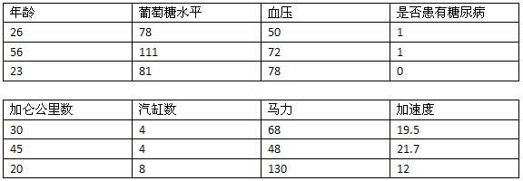

因此这类数据我们称为“结构化数据”——数据集中的每条数据（上表中的一行）由多个特征进行描述（上表中的列）。而非结构化的数据指的是诸如电子邮件文本、推特信息、博客、新闻等。这些数据至少第一眼看起来是无法用一张表格来展现的。

举个例子，我们想从推特信息中获取用户对各种电影的评价：

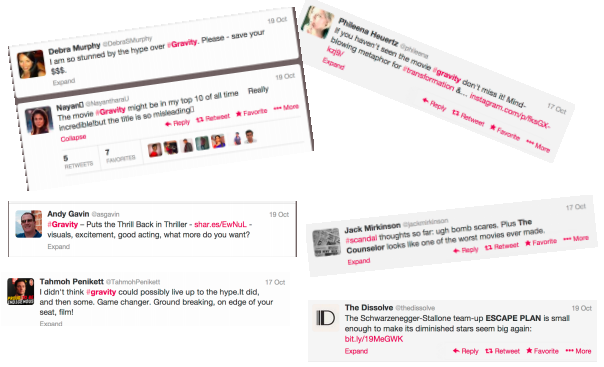

可以看到，Andy Gavin喜欢看地心引力，因为他的消息中有“不寒而栗”、“演的太棒了”之类的文本。而Debra Murphy则不太喜欢这部电影，因为她说“还是省下看这部电影的钱吧”。如果有人说“我太想看这部电影了，都兴奋坏了！”，我们可以看出她是喜欢这部电影的，即使信息中有“坏”这个字。

我在逛超市时看到一种叫Chobani的酸奶，名字挺有趣的，但真的好吃吗？于是我掏出iPhone，谷歌了一把，看到一篇名为“女人不能只吃面包”的博客：

> **无糖酸奶品评**

> 你喝过Chobani酸奶吗？如果没有，就赶紧拿起钥匙出门去买吧！虽然它是脱脂原味的，但喝起来和酸奶的口感很像，致使我每次喝都有负罪感，因为这分明就是在喝全脂酸奶啊！原味的感觉很酸很够味，你也可以尝试一下蜂蜜口味的。我承认，虽然我在减肥期间不该吃蜂蜜的，但如果我有一天心情很糟想吃甜食，我就会在原味酸奶里舀一勺蜂蜜，太值得了！至于那些水果味的，应该都有糖分在里面，但其实酸奶本身就已经很美味了，水果只是点缀。如果你家附近没有Chobani，也可以试试Fage，同样好吃。

> 虽然需要花上一美元不到，而且还会增加20卡路里，但还是很值得的，毕竟我已经一下午没吃东西了！

> *http://womandoesnotliveonbreadalone.blogspot.com/2009/03/sugar-free-yogurt-reviews.html*

这是一篇正面评价吗？从第二句就可以看出，作者非常鼓励我去买。她还用了“够味”、“美味”等词汇，这些都是正面的评价。所以，让我先去吃会儿……


### 自动判别文本中的感情色彩


> 约翰，这条推文应该是称赞地心引力的！

假设我们要构建一个自动判别文本感情色彩的系统，它有什么作用呢？比如说有家公司是售卖健康检测设备的，他们想要知道人们对这款产品的反响如何。他们投放了很多广告，顾客是喜欢（我好想买一台）还是讨厌（看起来很糟糕）呢？再比如苹果公司召开了一次新闻发布会，讨论iPhone现有的问题，结果是正面的还是负面的呢？一位参议会议员对某个法案做了一次公开演讲，那些政治评论家的反应如何？看来这个系统还是有些作用的。


> 那要怎样构建一套这样的系统呢？

假设我要从文本中区分顾客对某些食品的喜好，可能就会列出一些表达喜欢的词语，以及表达厌恶的词：

* 表达喜欢的词：美味、好吃、不错、喜欢、可口
* 表达厌恶的词：糟糕、难吃、不好、讨厌、恶心

比如我们想知道某篇评论对Chobani酸奶的评价是正面的还是负面的，我们可以去统计评论中表达喜欢和厌恶的词的数量，看哪种类型出现的频率高。这种方法也可以应用到其他分类中，比如判断某个人是否支持堕胎，如果他的言论中经常出现“未出生的小孩”，那他很可能是反堕胎的；如果言论中出现“胎儿”这个词比较多，那有可能是支持堕胎的。其实，用词语出现的数量来进行分类还是很容易想到的。


我们可以使用朴素贝叶斯算法来进行分类，而不是一般的计数。先来回忆一下公式：

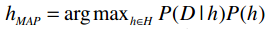

argmax表示选取概率最大的分类；h∈H表示计算每个事件的概率；P(D|h)表示在给定h的条件下，D发生的概率（如给定某类文章，这类文章中特定单词出现的概率）；P(h)则指事件h发生的概率。

我们的训练集是一组文本，又称为**语料库**。每个文本（即每条记录）是一则140字左右的推文，并被标记为喜欢和讨厌两类。P(h)表示的就是喜欢和讨厌出现的概率。我们的训练集中有1000条记录，喜欢和讨厌各有500条，因此它们的概率是：

```
P(喜欢) = 0.5
P(讨厌) = 0.5
```


> 当我们使用已经标记好分类的数据集进行训练时，这种类型的机器学习称为“监督式学习”。文本分类就是监督式学习的一种。

> 如果训练集没有标好分类，那就称为“非监督式学习”，聚类就是一种非监督式学习，我们将在下一章讲解。

> 还有一些算法结合了监督式和非监督式，通常是在初始化阶段使用分类好的数据，之后再使用未分类的数据进行学习。

让我们回到上面的公式，首先来看P(D|h)要如何计算——在正面评价中，单词D出现的概率。比如说“Puts the Thrill back in Trhiller”这句话，我们可以统计所有表达“喜欢”的文章中第一个单词是“Puts”的概率，第二个单词是“the”的概率，以此类推。接着我们再计算表达“讨厌”的文章中第一个单词是“Puts”的概率，第二个单词是“the”的概率等等。


> 谷歌曾统计过英语中大约有一百万的词汇，如果一条推文中有14个单词，那我们就需要计算1,000,000<sup>14</sup>个概率了，显然是不现实的。

的确，这种方法并不可行。我们可以简化一下，不考虑文本中单词的顺序，仅统计表达“喜欢”的文章中某个单词出现的概率。以下是统计方法。

## 训练阶段

首先，我们统计所有文本中一共出现了多少个不同的单词，记作“|Vocabulary|”（总词汇表）。对于每个单词w<sub>k</sub>，我们将计算P(w<sub>k</sub>|h<sub>i</sub>)，每个h<sub>i</sub>（喜欢和讨厌两种）的计算步骤如下：

1. 将该分类下的所有文章合并到一起；
2. 统计每个单词出现的数量，记为n；
3. 对于总词汇表中的单词w<sub>k</sub>，统计他们在本类文章中出现的次数n<sub>k</sub>：
4. 最后应用下方的公式：

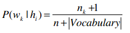

## 使用朴素贝叶斯进行分类

分类阶段比较简单，直接应用贝叶斯公式就可以了，让我们试试吧！


通过训练，我们得到以下概率结果：

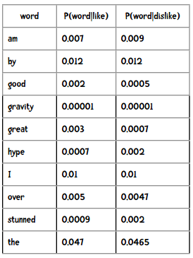

比如下面这句话，要如何判断它是正面还是负面的呢？

> I am stunned by the hype over gravity.

我们需要计算的是下面两个概率，并选取较高的结果：

```
P(like)×P(I|like)×P(am|like)×P(stunned|like)×...
P(dislike)×P(I|dislike)×P(am|dislike)×P(stunned|dislike)×...
```

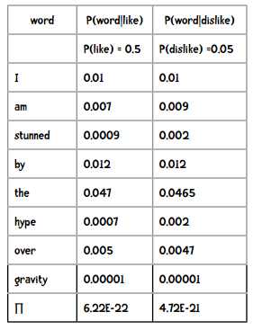

因此分类的结果是“讨厌”。

**提示** 结果中的6.22E-22是科学计数法，等价于6.22×10<sup>-22</sup>。


> 哇，这个概率也太小了吧！

> 是的，如果文本中有100个单词，那乘出来的概率就会更小。

> 但是Python不能处理那么小的小数，最后都会变成零的。

> 没错，因此我们要用对数来算——将每个概率的对数相加！

假设一个包含100字的文本中，每个单词的概率是0.0001，那么计算结果是：

```python
>>> 0.0001 ** 100
0.0
```

如果我们用对数相加来运算的话：

```python
>>> import math
>>> p = 0
>>> for i in range(100):
...     p += math.log(0.0001)
... 
>>> p
-921.034037197617
```

**提示**

* b<sup>n</sup> = x 可以转换为 log<sub>b</sub>x = n
* log<sub>10</sub>(ab) = log<sub>10</sub>(a) + log<sub>10</sub>(b)

## 新闻组语料库

我们下面要处理的数据集是新闻，这些新闻可以分为不同的新闻组，我们会构造一个分类器来判断某则新闻是属于哪个新闻组的：

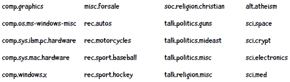

比如下面这则新闻是属于rec.motorcycles组的：

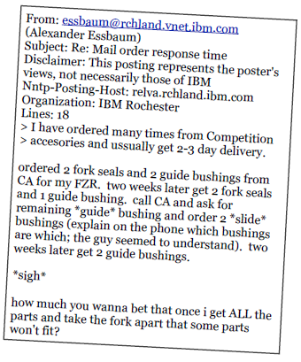

注意到这则新闻中还有一些拼写错误（如accesories、ussually等），这对分类器是一个不小的挑战。

这些数据集都来自 http://qwone.com/~jason/20Newsgroups/ （我们使用的是20news-bydate数据集），你也可以从 [这里](http://guidetodatamining.com/guide/data/20news-bydate.zip) 获得。这个数据集包含18,846个文档，并将训练集（60%）和测试集放在了不同的目录中，每个子目录都是一个新闻组，目录中的文件即新闻文本。

### 把不要的东西丢掉！

比如我们要对下面这篇新闻做分类：

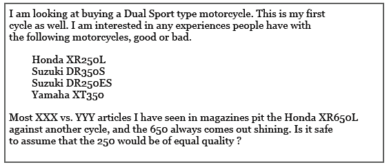

让我们看看哪些单词是比较重要的：

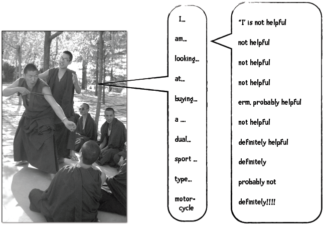

(helpful - 重要，not helpful - 不重要）

如果我们将英语中最常用的200个单词剔除掉，这篇新闻就成了这样：


去除掉这些单词后，新闻就只剩下一半大小了。而且，这些单词看上去并不会对分类结果产生影响。H.P. Luhn在他的论文中说“这些组成语法结构的单词是没有意义的，反而会产生很多噪音”。也就是说，将这些“噪音”单词去除后是会提升分类正确率的。我们将这些单词称为“停词”，有专门的停词表可供使用。去除这些词的理由是：

1. 能够减少需要处理的数据量；
2. 这些词的存在会对分类效果产生负面影响。

### 常用词和停词

虽然像the、a这种单词的确没有意义，但有些常用词如work、write、school等在某些场合下还是有作用的，如果将他们也列进停词表里可能会有问题。


> 年轻人，那些常用词是不能随便丢弃的！

因此在定制停词表时还是需要做些考虑的。比如要判别阿拉伯语文档是在哪个地区书写的，可以只看文章中最常出现的词（和上面的方式相反）。如果你有兴趣，可以到我的 [个人网站](http://zacharski.org) 上看看这篇论文。而在分析聊天记录时，强奸犯会使用更多I、me、you这样的词汇，如果在分析前将这些单词去除了，效果就会变差。


> 不要盲目地使用停词表！

### 编写Python代码

首先让我们实现朴素贝叶斯分类器的训练部分。训练集的格式是这样的：

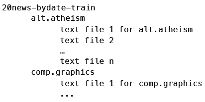

最上层的目录是训练集（20news-bydate-train），其下的子目录代表不同的新闻组（如alt.atheism），子目录中有多个文本文件，即新闻内容。测试集的目录结构也是相同的。因此，分类器的初始化代码要完成以下工作：

1. 读取停词列表；
2. 获取训练集中各目录（分类）的名称；
3. 对于各个分类，调用train方法，统计单词出现的次数；
4. 计算下面的公式：

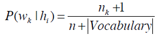

```python
from __future__ import print_function
import os, codecs, math

class BayesText:

    def __init__(self, trainingdir, stopwordlist):
        """朴素贝叶斯分类器
        trainingdir 训练集目录，子目录是分类，子目录中包含若干文本
        stopwordlist 停词列表（一行一个）
        """
        self.vocabulary = {}
        self.prob = {}
        self.totals = {}
        self.stopwords = {}
        f = open(stopwordlist)
        for line in f:
            self.stopwords[line.strip()] = 1
        f.close()
        categories = os.listdir(trainingdir)
        # 将不是目录的元素过滤掉
        self.categories = [filename for filename in categories
                           if os.path.isdir(trainingdir + filename)]
        print("Counting ...")
        for category in self.categories:
            print('    ' + category)
            (self.prob[category],
             self.totals[category]) = self.train(trainingdir, category)
        # 删除出现次数小于3次的单词
        toDelete = []
        for word in self.vocabulary:
            if self.vocabulary[word] < 3:
                # 遍历列表时不能删除元素，因此做一个标记
                toDelete.append(word)
        # 删除
        for word in toDelete:
            del self.vocabulary[word]
        # 计算概率
        vocabLength = len(self.vocabulary)
        print("Computing probabilities:")
        for category in self.categories:
            print('    ' + category)
            denominator = self.totals[category] + vocabLength
            for word in self.vocabulary:
                if word in self.prob[category]:
                    count = self.prob[category][word]
                else:
                    count = 1
                self.prob[category][word] = (float(count + 1)
                                             / denominator)
        print ("DONE TRAINING\n\n")
                    

    def train(self, trainingdir, category):
        """计算分类下各单词出现的次数"""
        currentdir = trainingdir + category
        files = os.listdir(currentdir)
        counts = {}
        total = 0
        for file in files:
            #print(currentdir + '/' + file)
            f = codecs.open(currentdir + '/' + file, 'r', 'iso8859-1')
            for line in f:
                tokens = line.split()
                for token in tokens:
                    # 删除标点符号，并将单词转换为小写
                    token = token.strip('\'".,?:-')
                    token = token.lower()
                    if token != '' and not token in self.stopwords:
                        self.vocabulary.setdefault(token, 0)
                        self.vocabulary[token] += 1
                        counts.setdefault(token, 0)
                        counts[token] += 1
                        total += 1
            f.close()
        return(counts, total)
```

训练结果存储在一个名为prop的字典里，字典的键是分类，值是另一个字典——键是单词，值是概率。

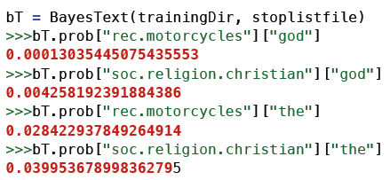

god这个词在rec.motorcycles新闻组中出现的概率是0.00013，而在soc.religion.christian新闻组中出现的概率是0.00424。

训练阶段的另一个产物是分类列表：

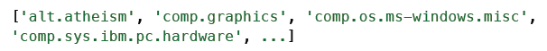


**训练结束了，下面让我们开始进行文本分类吧。**

请尝试编写一个分类器，达成以下效果：

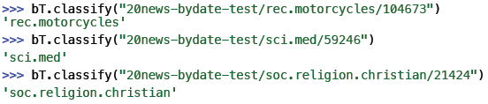

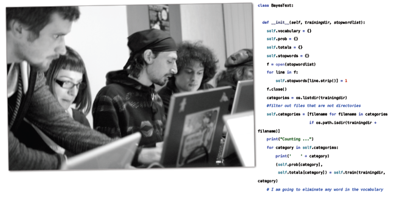

```python
    def classify(self, filename):
        results = {}
        for category in self.categories:
            results[category] = 0
        f = codecs.open(filename, 'r', 'iso8859-1')
        for line in f:
            tokens = line.split()
            for token in tokens:
                #print(token)
                token = token.strip('\'".,?:-').lower()
                if token in self.vocabulary:
                    for category in self.categories:
                        if self.prob[category][token] == 0:
                            print("%s %s" % (category, token))
                        results[category] += math.log(
                            self.prob[category][token])
        f.close()
        results = list(results.items())
        results.sort(key=lambda tuple: tuple[1], reverse = True)
        # 如果要调试，可以打印出整个列表。
        return results[0][0]
```

最后我们编写一个函数对测试集中的所有文档进行分类，并计算准确率：

```python
    def testCategory(self, directory, category):
        files = os.listdir(directory)
        total = 0
        correct = 0
        for file in files:
            total += 1
            result = self.classify(directory + file)
            if result == category:
                correct += 1
        return (correct, total)

    def test(self, testdir):
        """测试集的目录结构和训练集相同"""
        categories = os.listdir(testdir)
        # 过滤掉不是目录的元素
        categories = [filename for filename in categories if
                      os.path.isdir(testdir + filename)]
        correct = 0
        total = 0
        for category in categories:
            print(".", end="")
            (catCorrect, catTotal) = self.testCategory(
                testdir + category + '/', category)
            correct += catCorrect
            total += catTotal
        print("\n\nAccuracy is  %f%%  (%i test instances)" %
              ((float(correct) / total) * 100, total))
```

在不使用停词列表的情况下，这个分类器的效果是：

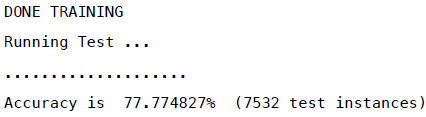


> 准确率77.77%，看起来很不错。如果用了停词列表效果会如何呢？

> 那让我们来测试一下吧！

请自行到网络上查找一些停词列表，并填写以下表格：

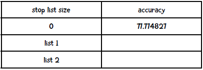

我找到了两个停词列表，分别是包含[25个词](http://nlp.stanford.edu/IR-book/html/htmledition/dropping-common-terms-stop-words-1.html) 和[174个词](http://www.ranks.nl/stopwords) 的列表，结果如下：

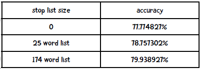

看来第二个停词列表能提升2%的效果，你的结果如何？

## 朴素贝叶斯与情感分析

情感分析的目的是判断作者的态度或意见：


情感分析的例子之一是判断一篇评论是正面的还是反面的，我们可以用朴素贝叶斯算法来实现。我们可以用Pang&Lee 2004的影评数据来测试，这份数据集包含1000个正面和1000个负面的评价，以下是一些示例：

> 本月第二部连环杀人犯电影实在太糟糕了！虽然开头的故事情节和场景布置还可以，但后面就……

> 当我听说罗密欧与朱丽叶又出了一部改编电影后，心想莎士比亚的经典又要被糟蹋了。不过我错了，Baz Luhrman导演的水平还是高的……

你可以从 http://www.cs.cornell.edu/People/pabo/movie-review-data/ 上下载这个数据集，并整理成以下形式：

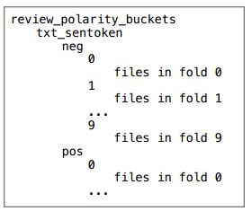

你也可以从[这里](http://guidetodatamining.com/guide/data/reviewPolarityBuckets.zip)下载整理好的数据。

**动手实践**

你可以为上文的朴素贝叶斯分类器增加十折交叉验证的逻辑吗？它的输出结果应该是如下形式：

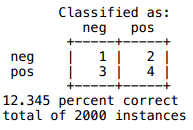

另外，请计算Kappa指标。

**再次声明：只看不练是不行的，就好比你不可能通过阅读乐谱就学会弹奏钢琴。**


**解答**

这是我得到的结果：

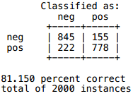

Kappa指标则是：

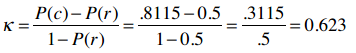

所以我们的分类算法效果是不错的。

[代码链接](code/chapter-7/bayesSentiment.py)
