第八章：聚类
============

原文：http://guidetodatamining.com/chapter-8/

前几章我们学习了如何构建分类系统，使用的是已经标记好类别的数据集进行训练：

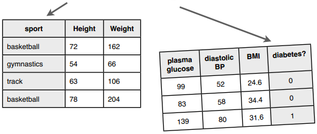

训练完成后我们就可以用来预测了：这个人看起来像是篮球运动员，那个人可能是练体操的；这个人三年内不会患有糖尿病。

可以看到，分类器在训练阶段就已经知道各个类别的名称了。那如果我们不知道呢？如何构建一个能够自动对数据进行分组的系统？比如有1000人，每人有20个特征，我想把这些人分为若干个组。


这个过程叫做聚类：通过物品特征来计算距离，并自动分类到不同的群集或组中。有两种聚类算法比较常用：

**k-means聚类算法**

我们会事先告诉这个算法要将数据分成几个组，比如“请把这1000个人分成5个组”，“将这些网页分成15个组”。这种方法就叫k-means，我们会在后面的章节讨论。

## 层次聚类法

对于层次聚类法，我们不需要预先指定分类的数量，这个算方法会将每条数据都当作是一个分类，每次迭代的时候合并距离最近的两个分类，直到剩下一个分类为止。因此聚类的结果是：顶层有一个大分类，这个分类下有两个子分类，每个子分类下又有两个子分类，依此类推，层次聚类也因此得命。

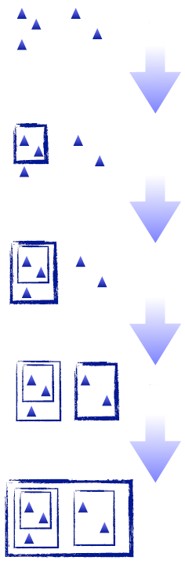

在合并的时候我们会计算两个分类之间的距离，可以采用不同的方法。如下图中的A、B、C三个分类，我们应该将哪两个分类合并起来呢？

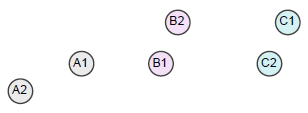

### 单链聚类

在单链聚类中，分类之间的距离由两个分类相距最近的两个元素决定。如上图中分类A和分类B的距离由A1和B1的距离决定，因为这个距离小于A1到B2、A2到B1的距离。这样一来我们会将A和B进行合并。

### 全链聚类

在全链聚类中，分类之间的距离由两个分类相距最远的两个元素决定。因此上图中分类A和B的距离是A2到B2的距离，最后会将分类B和C进行合并。

### 平均链接聚类

在这种聚类方法中，我们通过计算分类之间两两元素的平均距离来判断分类之间的距离，因此上图中会将分类B和C进行合并。


> 下面让我们用单链聚类法举个例子吧！

我们来用狗的高度和重量来进行聚类：

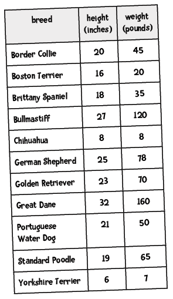


> 在计算距离前我们是不是忘了做件事？


> 标准化！我们先将这些数据转换为修正的标准分。

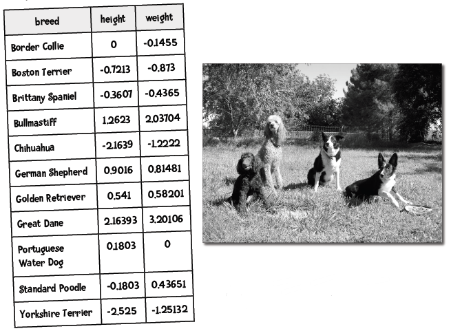

然后我们计算欧几里德距离，图中高亮了一些最短距离：

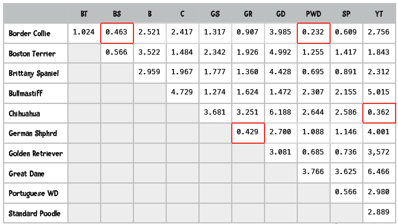

根据下面的图表，你能看出哪两个品种的距离最近吗？

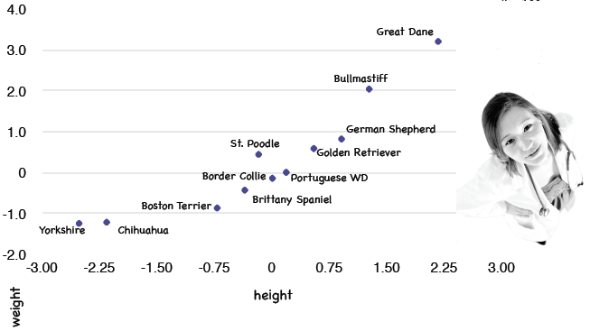

> 如果你看出是Border Collie和Portuguese Water Dog最近，那就对了！

**计算过程**

第一步：我们找到距离最近的两个元素，对他们进行聚类：

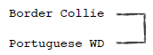

第二步：再找出距离最近的两个元素，进行聚类：

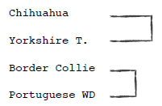

第三步：继续重复上面的步骤：

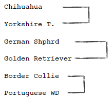

第四步：继续查找距离最近的元素，发现Border Collie已经属于一个分类的，因此进行如下图所示的合并：

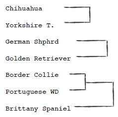

> 这叫树状图，可以用来表示聚类。

**动手实践**

你能在下图的基础上继续完成聚类吗？

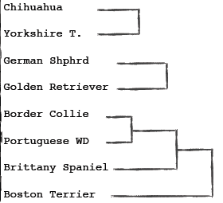


**解答**

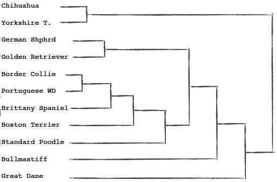

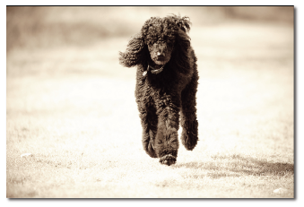

## 编写层次聚类算法


> 我们可以使用优先队列来实现这个聚类算法。

> 什么是优先队列呢？

普通的队列有“先进先出”的规则，比如向队列先后添加Moa、Suzuka、Yui，取出时得到的也是Moa、Suzuka、Yui：

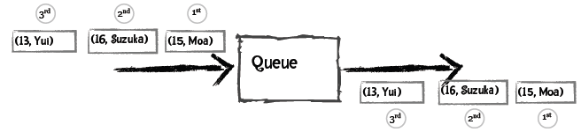

而对于优先队列，每个元素都可以附加一个优先级，从队列中取出时会得到优先级最高的元素。比如说，我们定义年龄越小优先级越高，以下是插入过程：

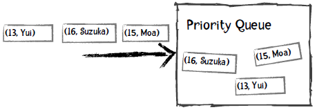

取出的第一个元素是Yui，因为她的年龄最小：

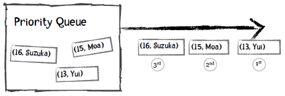

我们看看Python中如何使用优先队列：

```python
>>> from Queue import PriorityQueue           # 加载优先队列类
>>> singersQueue = PriorityQueue()            # 创建对象
>>> singersQueue.put((16, 'Suzuka Nakamoto')) # 插入元素
>>> singersQueue.put((15, 'Moa Kikuchi'))
>>> singersQueue.put((14, 'Yui Mizuno'))
>>> singersQueue.put((17, 'Ayaka Sasaki'))
>>> singersQueue.get() # 获取第一个元素，即最年轻的歌手Yui。
(14, 'Yui Mizuno')
>>> singersQueue.get()
(15, 'Moa Kikuchi')
>>> singersQueue.get()
(16, 'Suzuka Nakamoto')
>>> singersQueue.get()
(17, 'Ayaka Sasaki')
```

在进行聚类时，我们将分类、离它最近的分类、以及距离插入到优先队列中，距离作为优先级。比如上面的犬种示例，Border Collie最近的分类是Portuguese WD，距离是0.232：

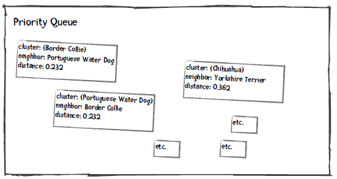

我们将优先队列中距离最小的两个分类取出来，合并成一个分类，并重新插入到优先队列中。比如下图是将Border Collie和Portuguese WD合并后的结果：

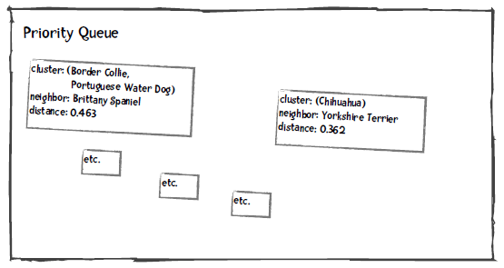

重复这个过程，直到队列中只有一个元素为止。当然，我们插入的数据会复杂一些，请看下面的讲解。

### 从文件中读取数据

数据文件是CSV格式的（以逗号分隔），第一行是列名，第一列是犬种，第二列之后是特征值：

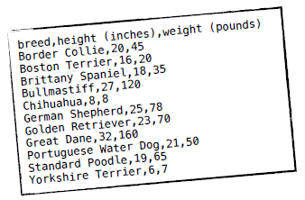

我们用Python的列表结构来存储这些数据，data[0]用来存放所有记录的分类，如data[0][0]是Border Collie，data[0][1]是Boston Terrier。data[1]则是所有记录的高度，data[2]是重量。特征列的数据都会转换成浮点类型，如data[1][0]是20.0，data[2][0]是45.0等。在读取数据时就需要对其进行标准化。此外，我们接下来会使用“下标”这个术语，如第一条记录Border Collie的下标是0，第二条记录Boston Terrier下标是1等。

### 初始化优先队列

以Border Collie为例，我们需要计算它和其它犬种的距离，保存在Python字典里：

```python
{1: ((0, 1), 1.0244),  # Border Collie（下标为0）和Boston Terrier（下标为1）之间的距离为1.0244
 2: ((0, 2), 0.463),   # Border Collie和Brittany Spaniel（下标为2）之间的距离为0.463
 ...
 10: ((0, 10), 2.756)} # Border Collie和Yorkshire Terrier的距离为2.756
```

此外，我们会记录Border Collie最近的分类及距离：这对犬种是(0, 8)，即下标为0的Border Collie和下标为8的Portuguese WD，距离是0.232。

#### 距离相等的问题以及为何要使用元组

你也许注意到了，Portuguese WD和Standard Poodle的距离是0.566，Boston Terrier和Brittany Spaniel的距离也是0.566，如果我们通过最短距离来取，很可能会取出Standard Poodle和Boston Terrier进行组合，这显然是错误的，所以我们才会使用元组来存放这对犬种的下标，以作判断。比如说，Portuguese WD的记录是：

```python
['Portuguese Water Dog', 0.566, (8, 9)]
```

它的近邻Standard Poodle的记录是：

```python
['Standard Poodle', 0.566, (8, 9)]
```

我们可以通过这个元组来判断这两条记录是否是一对。

#### 距离相等的另一个问题

在介绍优先队列时，我用了歌手的年龄举例，如果他们的年龄相等，取出的顺序又是怎样的呢？

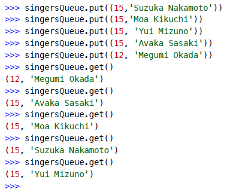

可以看到，如果年龄相等，优先队列会根据记录中的第二个元素进行判断，即歌手的姓名，并按字母顺序返回，如Avaka会比Moa优先返回。

在犬种示例中，我们让距离成为第一优先级，下标成为第二优先级。因此，我们插入到优先队列的一条完整记录是这样的：

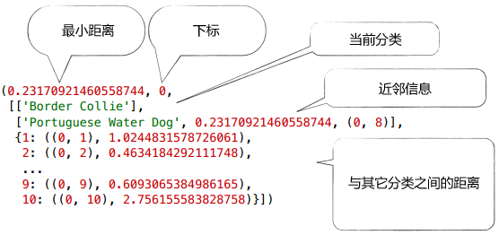

### 重复下述步骤，直到仅剩一个分类

我们从优先队列中取出两个元素，对它们进行合并。如合并Border Collie和Portuguese WD后，会形成一个新的分类：

```python
['Border Collie', 'Portuguese WD']
```

然后我们需要计算新的分类和其它分类之间的距离，方法是对取出的两个分类的距离字典进行合并。如第一个分类的距离字段是distanceDict1，第二个分类的是distanceDict2，新的距离字段是newDistanceDict：

```
初始化newDistanceDict
对于distanceDict1的每一个键值对:
    如果这个键在distanceDict2中存在:
        如果这个键在distanceDict1中的距离要比在distanceDict2中的距离小:
            将distanceDict1中的距离存入newDistanceDict
        否则:
            将distanceDict2中的距离存入newDistanceDict
```

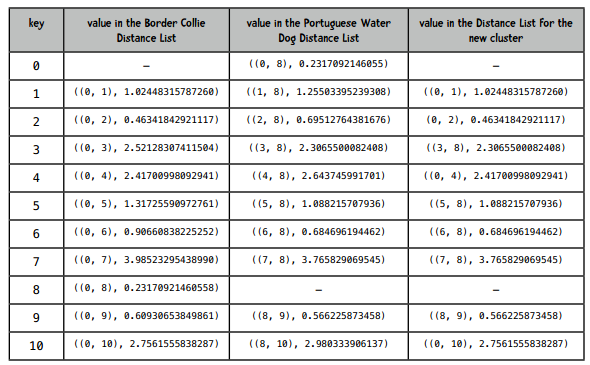

经过计算后，插入到优先队列中的新分类的完整记录是：

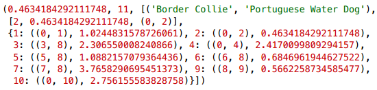

**代码实践**

你能将上面的算法用Python实现吗？你可以从[hierarchicalClustererTemplate.py](code/chapter-8/hierarchicalClustererTemplate.py)这个文件开始，完成以下步骤：

1. 编写init方法，对于每条记录：
    1. 计算该分类和其它分类之间的欧几里得距离；
    2. 找出该分类的近邻；
    3. 将这些信息放到优先队列的中。
2. 编写cluster方法，重复以下步骤，直至剩下一个分类：
    1. 从优先队列中获取两个元素；
    2. 合并；
    3. 将合并后的分类放回优先队列中。


**解答**

> 注意，我的实现并不一定是最好的，你可以写出更好的！

```python
from queue import PriorityQueue
import math

"""
层次聚类示例代码
"""

def getMedian(alist):
    """计算中位数"""
    tmp = list(alist)
    tmp.sort()
    alen = len(tmp)
    if (alen % 2) == 1:
        return tmp[alen // 2]
    else:
        return (tmp[alen // 2] + tmp[(alen // 2) - 1]) / 2

def normalizeColumn(column):
    """计算修正的标准分"""
    median = getMedian(column)
    asd = sum([abs(x - median) for x in column]) / len(column)
    result = [(x - median) / asd for x in column]
    return result

class hClusterer:
    """该聚类器默认数据的第一列是标签，其它列是数值型的特征。"""
    
    def __init__(self, filename):
        file = open(filename)
        self.data = {}
        self.counter = 0
        self.queue = PriorityQueue()
        lines = file.readlines()
        file.close()
        header = lines[0].split(',')
        self.cols = len(header)
        self.data = [[] for i in range(len(header))]
        for line in lines[1:]:
            cells = line.split(',')
            toggle = 0
            for cell in range(self.cols):
                if toggle == 0:
                   self.data[cell].append(cells[cell])
                   toggle = 1
                else:
                    self.data[cell].append(float(cells[cell]))
        # 标准化特征列（即跳过第一列）
        for i in range(1, self.cols):
                self.data[i] = normalizeColumn(self.data[i])

        ###
        ###  数据已经读入内存并做了标准化，对于每一条记录，将执行以下步骤：
        ###     1. 计算该分类和其他分类的距离，如当前分类的下标是1，
        ###        它和下标为2及下标为3的分类之间的距离用以下形式表示：
        ###        {2: ((1, 2), 1.23),  3: ((1, 3), 2.3)... }
        ###     2. 找出距离最近的分类；
        ###     3. 将该分类插入到优先队列中。
        ###

        # 插入队列
        rows = len(self.data[0])              

        for i in range(rows):
            minDistance = 99999
            nearestNeighbor = 0
            neighbors = {}
            for j in range(rows):
                if i != j:
                    dist = self.distance(i, j)
                    if i < j:
                        pair = (i,j)
                    else:
                        pair = (j,i)
                    neighbors[j] = (pair, dist)
                    if dist < minDistance:
                        minDistance = dist
                        nearestNeighbor = j
                        nearestNum = j
            # 记录这两个分类的配对信息
            if i < nearestNeighbor:
                nearestPair = (i, nearestNeighbor)
            else:
                nearestPair = (nearestNeighbor, i)
                
            # 插入优先队列
            self.queue.put((minDistance, self.counter,
                            [[self.data[0][i]], nearestPair, neighbors]))
            self.counter += 1

    def distance(self, i, j):
        sumSquares = 0
        for k in range(1, self.cols):
            sumSquares += (self.data[k][i] - self.data[k][j])**2
        return math.sqrt(sumSquares)

    def cluster(self):
         done = False
         while not done:
             topOne = self.queue.get()
             nearestPair = topOne[2][1]
             if not self.queue.empty():
                 nextOne = self.queue.get()
                 nearPair = nextOne[2][1]
                 tmp = []
                 
                 ##  我从队列中取出了两个元素：topOne和nextOne，
                 ##  检查这两个分类是否是一对，如果不是就继续从优先队列中取出元素，
                 ##  直至找到topOne的配对分类为止。
                 while nearPair != nearestPair:
                     tmp.append((nextOne[0], self.counter, nextOne[2]))
                     self.counter += 1
                     nextOne = self.queue.get()
                     nearPair = nextOne[2][1]
                     
                 ## 将不处理的元素退回给优先队列
                 for item in tmp:
                     self.queue.put(item)
                     
                 if len(topOne[2][0]) == 1:
                     item1 = topOne[2][0][0]
                 else:
                     item1 = topOne[2][0]
                 if len(nextOne[2][0]) == 1:
                     item2 = nextOne[2][0][0]
                 else:
                     item2 = nextOne[2][0]
                 ##  curCluster即合并后的分类
                 curCluster = (item1, item2)

                 ## 对于这个新的分类需要做两件事情：首先找到离它最近的分类，然后合并距离字典。
                 ## 如果item1和元素23的距离是2，item2和元素23的距离是4，我们取较小的那个距离，即单链聚类。
                 minDistance = 99999
                 nearestPair = ()
                 nearestNeighbor = ''
                 merged = {}
                 nNeighbors = nextOne[2][2]
                 for (key, value) in topOne[2][2].items():
                    if key in nNeighbors:
                        if nNeighbors[key][1] < value[1]:
                             dist =  nNeighbors[key]
                        else:
                            dist = value
                        if dist[1] < minDistance:
                             minDistance =  dist[1]
                             nearestPair = dist[0]
                             nearestNeighbor = key
                        merged[key] = dist
                    
                 if merged == {}:
                    return curCluster
                 else:
                    self.queue.put( (minDistance, self.counter,
                                     [curCluster, nearestPair, merged]))
                    self.counter += 1

def printDendrogram(T, sep=3):
    """打印二叉树状图。树的每个节点是一个二元组。这个方法摘自：
    http://code.activestate.com/recipes/139422-dendrogram-drawing/"""
	
    def isPair(T):
        return type(T) == tuple and len(T) == 2
    
    def maxHeight(T):
        if isPair(T):
            h = max(maxHeight(T[0]), maxHeight(T[1]))
        else:
            h = len(str(T))
        return h + sep
        
    activeLevels = {}

    def traverse(T, h, isFirst):
        if isPair(T):
            traverse(T[0], h-sep, 1)
            s = [' ']*(h-sep)
            s.append('|')
        else:
            s = list(str(T))
            s.append(' ')

        while len(s) < h:
            s.append('-')
        
        if (isFirst >= 0):
            s.append('+')
            if isFirst:
                activeLevels[h] = 1
            else:
                del activeLevels[h]
        
        A = list(activeLevels)
        A.sort()
        for L in A:
            if len(s) < L:
                while len(s) < L:
                    s.append(' ')
                s.append('|')

        print (''.join(s))    
        
        if isPair(T):
            traverse(T[1], h-sep, 0)

    traverse(T, maxHeight(T), -1)


filename = '/Users/raz/Dropbox/guide/data/dogs.csv'

hg = hClusterer(filename)
cluster = hg.cluster()
printDendrogram(cluster)
```

运行结果和我们手算的一致：

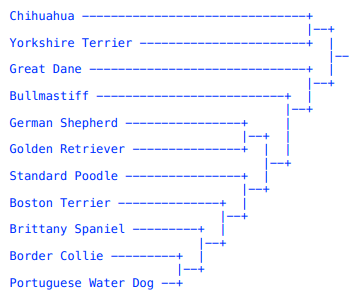

**动手实践**

[这里](code/chapter-8/cereal.csv)提供了77种早餐麦片的营养信息，包括以下几项：

* 麦片名称
* 热量
* 蛋白质
* 脂肪
* 纳
* 纤维
* 碳水化合物
* 糖
* 钾
* 维生素

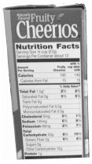

请对这个数据集进行层次聚类：

* 哪种麦片和Trix最相近？
* 与Muesli Raisins & Almonds最相近的是？

> 数据集来自：http://lib.stat.cmu.edu/DASL/Datafiles/Cereals.html

**结果**

我们只需将代码中的文件名替换掉就可以了，结果如下：

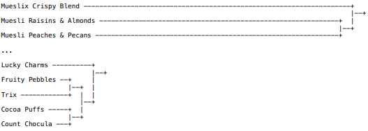

因此Trix和Fruity Pebbles最相似（你可以去买这两种麦片尝尝）。Muesli Raisins & Almonds和Muesli Peaches & Pecans最相似。


> 好了，这就是层次聚类算法，很简单吧！

## k-means聚类算法

使用k-means算法时需要指定分类的数量，这也是算法名称中“k”的由来。


> k-means是Lloyd博士在1957年提出的，虽然这个算法已有50年的历史，但却是当前最流行的聚类算法！

下面让我们来了解一下k-means聚类过程：

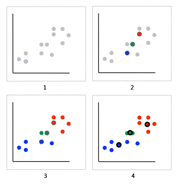

1. 我们想将图中的记录分成三个分类（即k=3），比如上文提到的犬种数据，坐标轴分别是身高和体重。
2. 由于k=3，我们随机选取三个点来作为聚类的起始点（分类的中心点），并用红黄蓝三种颜色标识。
3. 然后，我们根据其它点到中心点的距离来进行分配，这样就能将这些点分成三类了。
4. 计算这些分类的中心点，以此作为下一次计算的起始点。重复这个过程，直到中心点不再变动，或迭代次数超过某个阈值为止。

所以k-means算法可概括为：

1. 随机选取k个元素作为中心点；
2. 根据距离将各个点分配给中心点；
3. 计算新的中心点；
4. 重复2、3，直至满足条件。

我们来看一个示例，将以下点分成两个分类：

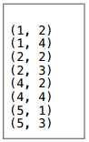

**第一步 随机选取中心点**

我们选取(1, 4)作为分类1的中心点，(4, 2)作为分类2的中心点；

**第二步 将各点分配给中心点**

可以用各类距离计算公式，为简单起见，这里我们使用曼哈顿距离：


聚类结果如下：

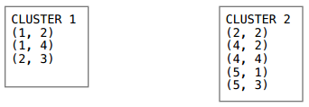

**第三步 更新中心点**

通过计算平均值来更新中心点，如x轴的均值是：

(1 + 1 + 2) / 3 = 4 / 3 = 1.33

y轴是：

(2 + 4 + 3) / 3 = 9 / 3 = 3

因此分类1的中心点是(1.33, 3)。计算得到分类2的中心点是(4, 2.4)。

**第四步 重复前面两步**

两个分类的中心点由(1, 4)、(4, 2)变为了(1.33, 3)、(4, 2.4)，我们使用新的中心点重新计算。

**重复第二步 将各点分配给中心点**

同样是计算曼哈顿距离：

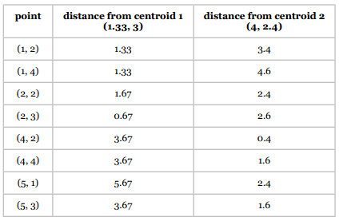

新的聚类结果是：

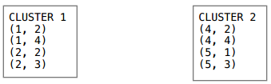

**重复第三步 更新中心点**

* 分类1：(1.5, 2.75)
* 分类2：(4.5, 2.5)

**重复第二步 将各点分配给中心点**


**重复第三步 更新中心点**

* 分类1：(1.5, 2.75)
* 分类2：(4.5, 2.5)

可以看到中心点并没有改变，所以计算也就结束了。


> 当中心点不再变化时，或者说不再有某个点从一个分类转移到另一个分类时，我们就会停止计算。这个时候我们称该算法已经收敛。算法运行过程中，中心点的大幅转移是在前几次迭代中产生的，后面的迭代中变动的幅度就会减小。也就是说，k-means算法的重点是在前期迭代，而后期的迭代只是细微的调整。


> 基于k-means的这种特点，我们可以将“没有点发生转移”弱化成“少于1%的点发生转移”来作为计算停止条件，这也是最普遍的做法。


> k-means好简单呀！

**扩展阅读**

k-means是一种最大期望算法，这类算法会在“期望”和“最大化”两个阶段不断迭代。比如k-means的期望阶段是将各个点分配到它们所“期望”的分类中，然后在最大化阶段重新计算中心点的位置。如果你对此感兴趣，可以前去阅读[维基百科](http://en.wikipedia.org/wiki/Expectation%E2%80%93maximization_algorithm)上的词条。

### 登山式算法

再继续讨论k-means算法之前，我想先介绍一下登山式算法。


假设我们想要登上一座山的顶峰，可以通过以下步骤实现：

1. 在山上随机选取一个点作为开始；
2. 向高处爬一点；
3. 重复第2步，直到没有更高的点。

这种做法看起来很合理，比如对于下图所示的山峰：


无论我们从哪个点开始攀登，最终都可以达到顶峰。

但对于下面这张图：

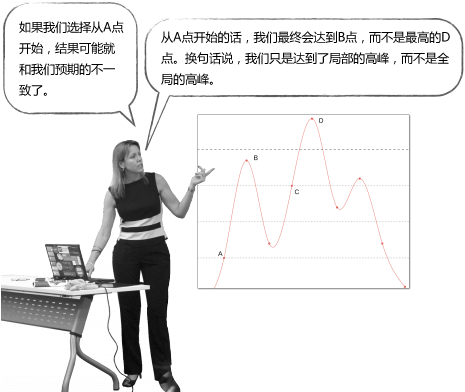

所以说，这种简单的登山式算法并不一定能得到最优解。

k-means就是这样一种算法，它不能保证最终结果是最优的，因为我们一开始选择的中心点是随机的，很有可能就会选到上面的A点，最终获得局部最优解B点。因此，最终的聚类结果和起始点的选择有很大关系。但尽管如此，k-means通常还是能够获得良好的结果的。


> 那我们如何比较不同的聚类结果呢？

### 误差平方和（SSE）

我们可以使用误差平方和（或称离散程度）来评判聚类结果的好坏，它的计算方法是：计算每个点到中心点的距离平方和。

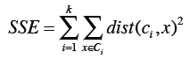

上面的公式中，第一个求和符号是遍历所有的分类，比如i=1时计算第一个分类，i=2时计算第二个分类，直到计算第k个分类；第二个求和符号是遍历分类中所有的点；Dist指代距离计算公式（如曼哈顿距离、欧几里得距离）；计算数据点x和中心点c<sub>i</sub>之间的距离，平方后相加。

假设我们对同一数据集使用了两次k-means聚类，每次选取的起始点不一样，想知道最后得到的聚类结果哪个更优，就可以计算和比较SSE，结果小的效果好。


> 下面让我们开始编程吧！

```python
import math
import random 


"""
K-means算法
"""

def getMedian(alist):
    """计算中位数"""
    tmp = list(alist)
    tmp.sort()
    alen = len(tmp)
    if (alen % 2) == 1:
        return tmp[alen // 2]
    else:
        return (tmp[alen // 2] + tmp[(alen // 2) - 1]) / 2
    

def normalizeColumn(column):
    """计算修正的标准分"""
    median = getMedian(column)
    asd = sum([abs(x - median) for x in column]) / len(column)
    result = [(x - median) / asd for x in column]
    return result


class kClusterer:
    """kMeans聚类算法，第一列是分类，其余列是数值型特征"""
    
    def __init__(self, filename, k):
        """k是分类的数量，该函数完成以下功能：
           1. 读取filename的文件内容
           2. 按列存储到self.data变量中
           3. 计算修正的标准分
           4. 随机选取起始点
           5. 将各个点分配给中心点
        """
        file = open(filename)
        self.data = {}
        self.k = k
        self.counter = 0
        self.iterationNumber = 0
        # 用于跟踪本次迭代有多少点的分类发生了变动
        self.pointsChanged = 0
        # 误差平方和
        self.sse = 0
        #
        # 读取文件
        #
        lines = file.readlines()
        file.close()
        header = lines[0].split(',')
        self.cols = len(header)
        self.data = [[] for i in range(len(header))]
        # 按列存储数据，如self.data[0]是第一列的数据，
        # self.data[0][10]是第一列第十行的数据。
        for line in lines[1:]:
            cells = line.split(',')
            toggle = 0
            for cell in range(self.cols):
                if toggle == 0:
                   self.data[cell].append(cells[cell])
                   toggle = 1
                else:
                    self.data[cell].append(float(cells[cell]))
                    
        self.datasize = len(self.data[1])
        self.memberOf = [-1 for x in range(len(self.data[1]))]
        #
        # 标准化
        #
        for i in range(1, self.cols):
                self.data[i] = normalizeColumn(self.data[i])

        # 随机选取起始点
        random.seed()
        self.centroids = [[self.data[i][r]  for i in range(1, len(self.data))]
                           for r in random.sample(range(len(self.data[0])),
                                                 self.k)]
        self.assignPointsToCluster()

            

    def updateCentroids(self):
        """根据分配结果重新确定聚类中心点"""
        members = [self.memberOf.count(i) for i in range(len(self.centroids))]
        self.centroids = [[sum([self.data[k][i]
                                for i in range(len(self.data[0]))
                                if self.memberOf[i] == centroid])/members[centroid]
                           for k in range(1, len(self.data))]
                          for centroid in range(len(self.centroids))] 
            
        
    
    def assignPointToCluster(self, i):
        """根据距离计算所属中心点"""
        min = 999999
        clusterNum = -1
        for centroid in range(self.k):
            dist = self.euclideanDistance(i, centroid)
            if dist < min:
                min = dist
                clusterNum = centroid
        # 跟踪变动的点
        if clusterNum != self.memberOf[i]:
            self.pointsChanged += 1
        # 计算距离平方和
        self.sse += min**2
        return clusterNum

    def assignPointsToCluster(self):
        """分配所有的点"""
        self.pointsChanged = 0
        self.sse = 0
        self.memberOf = [self.assignPointToCluster(i)
                         for i in range(len(self.data[1]))]
        

        
    def euclideanDistance(self, i, j):
        """计算欧几里得距离"""
        sumSquares = 0
        for k in range(1, self.cols):
            sumSquares += (self.data[k][i] - self.centroids[j][k-1])**2
        return math.sqrt(sumSquares)

    def kCluster(self):
        """开始进行聚类，重复以下步骤：
        1. 更新中心点
        2. 重新分配
        直至变动的点少于1%。
        """
        done = False
 
        while not done:
            self.iterationNumber += 1
            self.updateCentroids()
            self.assignPointsToCluster()
            #
            # 如果变动的点少于1%则停止迭代
            #
            if float(self.pointsChanged) / len(self.memberOf) <  0.01:
                done = True
        print("Final SSE: %f" % self.sse)

    def showMembers(self):
        """输出结果"""
        for centroid in range(len(self.centroids)):
             print ("\n\nClass %i\n========" % centroid)
             for name in [self.data[0][i]  for i in range(len(self.data[0]))
                          if self.memberOf[i] == centroid]:
                 print (name)
        
##
## 对犬种数据进行聚类，令k=3
###
# 请自行修改文件路径
km = kClusterer('../../data/dogs.csv', 3)
km.kCluster()
km.showMembers()
```


> 我们来分析一下这段代码。

犬种数据用表格来展示是这样的，身高和体重都做了标准化：

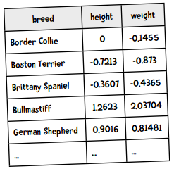

因为需要按列存储，转化后的Python格式是这样的：

```python
data = [['Border Collie', 'Bosten Terrier', 'Brittany Spaniel', ...],
        [0, -0.7213, -0.3607, ...],
        [-0.1455, -0.7213, -0.4365, ...],
        ...]
```

我们在层次聚类中用的也是此法，这样做的好处是能够方便地应用不同的数学函数。比如计算中位数和计算标准分的函数，都是以列表作为参数的：

```python
>>> normalizeColumn([8, 6, 4, 2])
[1.5, 0.5, -0.5, -1.5]
```

`__init__`函数首先将文件读入进来，按列存储，并进行标准化。随后，它会选取k个起始点，并将记录中的点分配给这些中心点。`kCluster`函数则开始迭代计算中心点的新位置，直到少于1%的点发生变动为止。

程序的运行结果如下：

```
Final SSE: 5.243159

Class 0
=======
Bullmastiff
Great Dane

Class 1
=======
Boston Terrier
Chihuahua
Yorkshire Terrier

Class 2
=======
Border Collie
Brittany Spaniel
German Shepherd
Golden Retriever
Portuguese Water Dog
Standard Poodle
```

聚类结果非常棒！

**动手实践**

用上面的聚类程序来对麦片数据集进行聚类，令k=4，并回答以下问题：

1. 甜味麦片都被聚类到一起了吗，如Cap'n'Crunch, Cocoa Puffs, Froot Loops, Lucky Charms？
2. 麸类麦片聚到一起了吗，如100% Bran, All-Bran, All-Bran with Extra Fiber, Bran Chex？
3. Cheerios被分到了哪个类别，是不是一直和Special K一起？

再来对加仑公里数的数据进行聚类，令k=8。运行结果大致令人满意，但有时候会出现记录数为空的分类。


> 我要求聚类成8个分类，但其中一个是空的，肯定代码有问题！

我们用示例来看这个问题，假设需要将以下8个点分成3个类别：

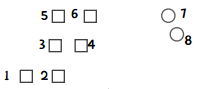

我们选取1、7、8作为起始点，因此第一次聚类的结果是：

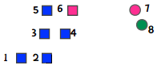

随后，我们重新计算中心点，即下图中的加号：

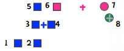

这时，6离蓝色中心点较近，7离绿色中心点较近，因此粉色的分类就为空了。

所以说，虽然我们指定了k的值，但不代表最终结果就会有k个分类。这通常是好事，比如上面的例子中，看起来就应该要分成两类。如果有1000条数据，我们指定k=10，但结果有两个为空，那很有可能这个数据集本来就该分成8个类别，因此可以尝试用k=8来重新计算。

另一方面，如果你要求分类都不为空，那就需要改变一下算法：当发现空的分类时，就重新指定这个分类的中心点。一种做法是选取离这个中心点最远的点，比如上面的例子中，发现粉色分类为空，就将中心点变为点1，因为它离粉色中心点最远。

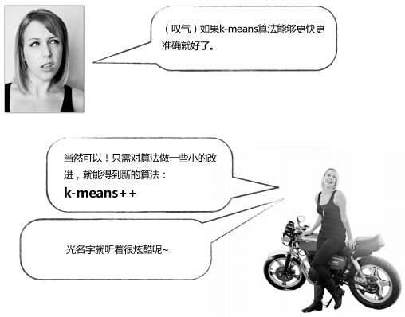

### k-means++

前面我们提到k-means是50年代发明的算法，它的实现并不复杂，但仍是现今最流行的聚类算法。不过它也有一个明显的缺点。在算法一开始需要**随机**选取k个起始点，正是这个随机会有问题。有时选取的点能产生最佳结果，而有时会让结果变得很差。k-means++则改进了起始点的选取过程，其余的和k-means一致。

以下是k-means++选取起始点的过程：

1. 随机选取一个点；
2. 重复以下步骤，直到选完k个点：
    1. 计算每个数据点（dp）到各个中心点的距离（D），选取最小的值，记为D(dp)；
    2. 根据D(dp)的概率来随机选取一个点作为中心点。

我们来讲解一下何为“根据D(dp)的概率来随机选取”。假设选取过程进行到一半，已经选出了两个点，现在需要选第三个。假设还有五个点可供选择，它们离已有的两个中心点的距离是：

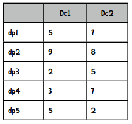

*Dc1表示到中心点1的距离，Dc2表示到中心点2的距离。*

我们选取最小的距离：

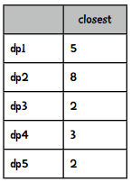

然后将这些数值转化成总和为1的权重值，做法就是将每个距离除以距离的和（20），得到：

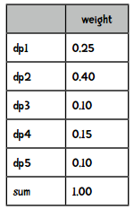

我们可以通过转盘游戏来理解：

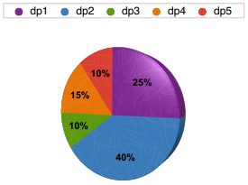

比如我们扔个球到这个转盘里，它停在哪个颜色就选取这个点作为新的中心点。这就叫做“根据D(dp)的概率来随机选取”。

比如我们有以下Python数据：

```python
data = [('dp1', 0.25), ('dp2', 0.4), ('dp3', 0.1),
        ('dp4', 0.15), ('dp5', 0.1)]
```

然后来编写一个函数来完成选取过程：

```python
import random
random.seed()

def roulette(datalist):
    i = 0
    soFar = datalist[0][1]
    ball = random.random()
    while soFar < ball:
        i += 1
        soFar += datalist[i][1]
    return datalist[i][0]
```

如果这个函数运行正确，我们选取100次的话，其中25次应该是dp1，40次是dp2，10次是dp3，15次是dp4，10次是dp5。让我们来测试一下：

```python
import collections
results = collections.defaultdict(int)
for i in range(100):
    results[roulette(data)] += 1
print results

{'dp5': 11, 'dp4': 15, 'dp3': 10, 'dp2': 38, 'dp1': 26}
```

结果是符合预期的！

k-means++选取起始点的方法总结下来就是：第一个点还是随机的，但后续的点就会尽量选择离现有中心点更远的点。


> 好了，下面让我们开始写代码吧！

**代码实践**

你能用Python实现k-means++算法吗？k-means++和k-means的唯一区别就是起始点的选取过程，你需要做的是将下面的代码：

```python
self.centroids = [[self.data[i][r] for i in range(1, len(self.data))]
                   for r in random.sample(range(len(self.data[0])),
                                          self.k)]
```

替换为：

```python
self.selectInitialCentroids()
```

你的任务就是编写这个函数！


**解答**

```python
def distanceToClosestCentroid(self, point, centroidList):
    result = self.eDistance(point, centroidList[0])
    for centroid in centroidList[1:]:
        distance = self.eDistance(point, centroid)
        if distance < result:
            result = distance
    return result

def selectInitialCentroids(self):
    """实现k-means++算法中的起始点选取过程"""
    centroids = []
    total = 0
    # 首先随机选取一个点
    current = random.choice(range(len(self.data[0])))
    centroids.append(current)
    # 开始选取剩余的点
    for i in range(0, self.k - 1):
        # 计算每个点到最近的中心点的距离
        weights = [self.distanceToClosestCentroid(x, centroids) 
                   for x in range(len(self.data[0]))]
        total = sum(weights)
        # 转换为权重
        weights = [x / total for x in weights]
        # 开始随机选取
        num = random.random()
        total = 0
        x = -1
        # 模拟轮盘游戏
        while total < num:
            x += 1
            total += weights[x]
        entroids.append(x)
    self.centroids = [[self.data[i][r]  for i in range(1, len(self.data))]
                      for r in centroids]
```

## 安然事件

你应该还对这件事有些印象吧？安然公司曾是一家超大型企业，有着千亿元的收入和两万名员工（微软只有220亿收入）。由于管理体制的破败和受贿，包括人为制造能源危机致使加州大停电，安然公司最终面临破产，大批人员被判入狱。有一部名为“The Smartest Guys in the Room”的纪录片，读者可以到Netflix或亚马逊上观看。


> 安然事件的确挺有趣的，不过这和数据挖掘有什么关系呢？


> 在调查过程中，美国联邦能源管理委员会收获了60万封公司内部邮件。这些邮件可以从网络上下载：

> http://en.wikipedia.org/wiki/Enron_Corpus

> https://www.cs.cmu.edu/~./enron/

我们来用其中的一小部分数据来举例，下表整理了一些公司人员互通邮件的次数：

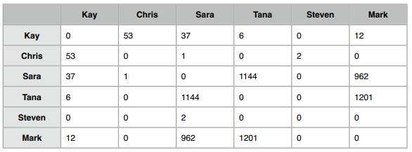

可以在[这里](code/chapter-8/enrondata.txt)下载缩减后的数据集。完整的数据在[这里](http://guidetodatamining.com/guide/data/enronMongoDump.zip)，超过300MB。

**动手实践**

你能使用层次聚类算法将这些人分成若干类别吗？

**解答**

我们会通过两个人收发邮件的对象来计算相似度。比如我经常和Ann、Ben、Clara等人通信，你也一样，那么我俩就是相似的：

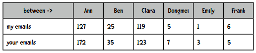

但如果将你我之间的通信也计算进去：

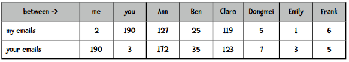

可以看到，你向我发送了190次邮件，而我只向自己发送了2封邮件。用欧几里得距离来计算的话，在不包含me和you这两列时，我们的距离是46，包含后距离是269！因此在计算两人的距离时需要排除这个因素：

```python
def distance(self, i, j):
    # 针对安然数据进行的修正
    sumSquares = 0
    for i in range(1, self.cols):
        if k != i and k != j:
            sumSquares += (self.data[k][i] - self.data[k][j]) ** 2
    return math.sqrt(sumSquares)
```

得到的层次聚类结果是：

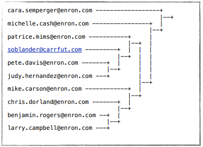

我还用k-means++算法进行了聚类，结果是：

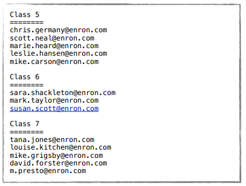

这些结果很有趣，比如分类5中大都是贸易人员，分类7中则多是管理层。


> 安然数据中还能挖掘出很多有趣的模式，去下载完整的数据集进行尝试吧！

> 你也可以对其它数据集进行聚类，看看是否有新的发现。

> 最后，恭喜完成第八章的学习！
